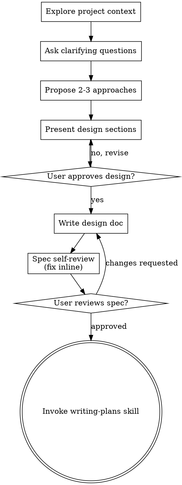

<!-- Generated by SpecStory, Markdown v2.1.0 -->

# 2026-08-09 08:00:30Z

<!-- Claude Code Session 014e6b73-9f2a-43a5-b05f-9e990b27c58a (2026-08-09 08:00:30Z) -->

_**User (2026-08-09 08:00:30Z)**_

have a look at the repo and get back to me

---

_**Agent (deepseek-v4-pro 2026-08-09 08:00:35Z)**_

<think><details><summary>Thought Process</summary>
The user wants me to look at the repo and get back to them. Let me explore the codebase to understand what this project is about.
</details></think>

_**Agent (deepseek-v4-pro 2026-08-09 08:00:35Z)**_

<tool-use data-tool-type="generic" data-tool-name="Skill"><details>
<summary>Tool use: **Skill**</summary>

**Input:**

- skill: `superpowers:brainstorming`

</details></tool-use>

---

_**User (2026-08-09 08:00:35Z)**_

Base directory for this skill: C:\Users\eshan\.claude\plugins\cache\claude-plugins-official\superpowers\6.2.0\skills\brainstorming

# Brainstorming Ideas Into Designs

Help turn ideas into fully formed designs and specs through natural collaborative dialogue.

Start by understanding the current project context, then ask questions one at a time to refine the idea. Once you understand what you're building, present the design and get user approval.

<HARD-GATE>
Do NOT invoke any implementation skill, write any code, scaffold any project, or take any implementation action until you have presented a design and the user has approved it. This applies to EVERY project regardless of perceived simplicity.
</HARD-GATE>

## Anti-Pattern: "This Is Too Simple To Need A Design"

Every project goes through this process. A todo list, a single-function utility, a config change — all of them. "Simple" projects are where unexamined assumptions cause the most wasted work. The design can be short (a few sentences for truly simple projects), but you MUST present it and get approval.

## Checklist

You MUST create a task for each of these items and complete them in order:

1. **Explore project context** — check files, docs, recent commits
2. **Offer the visual companion just-in-time** — NOT upfront. The first time a question would genuinely be clearer shown than described, offer it then (its own message); on approval its browser tab opens for you. If no visual question ever arises, never offer it. See the Visual Companion section below.
3. **Ask clarifying questions** — one at a time, understand purpose/constraints/success criteria
4. **Propose 2-3 approaches** — with trade-offs and your recommendation
5. **Present design** — in sections scaled to their complexity, get user approval after each section
6. **Write design doc** — save to `docs/superpowers/specs/YYYY-MM-DD-<topic>-design.md` and commit
7. **Spec self-review** — quick inline check for placeholders, contradictions, ambiguity, scope (see below)
8. **User reviews written spec** — ask user to review the spec file before proceeding
9. **Transition to implementation** — invoke writing-plans skill to create implementation plan

## Process Flow



**The terminal state is invoking writing-plans.** Do NOT invoke frontend-design, mcp-builder, or any other implementation skill. The ONLY skill you invoke after brainstorming is writing-plans.

## The Process

**Understanding the idea:**

- Check out the current project state first (files, docs, recent commits)
- Before asking detailed questions, assess scope: if the request describes multiple independent subsystems (e.g., "build a platform with chat, file storage, billing, and analytics"), flag this immediately. Don't spend questions refining details of a project that needs to be decomposed first.
- If the project is too large for a single spec, help the user decompose into sub-projects: what are the independent pieces, how do they relate, what order should they be built? Then brainstorm the first sub-project through the normal design flow. Each sub-project gets its own spec → plan → implementation cycle.
- For appropriately-scoped projects, ask questions one at a time to refine the idea
- Prefer multiple choice questions when possible, but open-ended is fine too
- Only one question per message - if a topic needs more exploration, break it into multiple questions
- Focus on understanding: purpose, constraints, success criteria

**Exploring approaches:**

- Propose 2-3 different approaches with trade-offs
- Present options conversationally with your recommendation and reasoning
- Lead with your recommended option and explain why
- YAGNI ruthlessly - remove unnecessary features from every approach and design

**Presenting the design:**

- Once you believe you understand what you're building, present the design
- Scale each section to its complexity: a few sentences if straightforward, up to 200-300 words if nuanced
- Ask after each section whether it looks right so far
- Cover: architecture, components, data flow, error handling, testing
- Be ready to go back and clarify if something doesn't make sense

**Design for isolation and clarity:**

- Break the system into smaller units that each have one clear purpose, communicate through well-defined interfaces, and can be understood and tested independently
- For each unit, you should be able to answer: what does it do, how do you use it, and what does it depend on?
- Can someone understand what a unit does without reading its internals? Can you change the internals without breaking consumers? If not, the boundaries need work.
- Smaller, well-bounded units are also easier for you to work with - you reason better about code you can hold in context at once, and your edits are more reliable when files are focused. When a file grows large, that's often a signal that it's doing too much.

**Working in existing codebases:**

- Explore the current structure before proposing changes. Follow existing patterns.
- Where existing code has problems that affect the work (e.g., a file that's grown too large, unclear boundaries, tangled responsibilities), include targeted improvements as part of the design - the way a good developer improves code they're working in.
- Don't propose unrelated refactoring. Stay focused on what serves the current goal.

## After the Design

**Documentation:**

- Write the validated design (spec) to `docs/superpowers/specs/YYYY-MM-DD-<topic>-design.md`
  - (User preferences for spec location override this default)
- Use elements-of-style:writing-clearly-and-concisely skill if available
- Commit the design document to git

**Spec Self-Review:**
After writing the spec document, look at it with fresh eyes:

1. **Placeholder scan:** Any "TBD", "TODO", incomplete sections, or vague requirements? Fix them.
2. **Internal consistency:** Do any sections contradict each other? Does the architecture match the feature descriptions?
3. **Scope check:** Is this focused enough for a single implementation plan, or does it need decomposition?
4. **Ambiguity check:** Could any requirement be interpreted two different ways? If so, pick one and make it explicit.

Fix any issues inline. No need to re-review — just fix and move on.

**User Review Gate:**
After the spec review loop passes, ask the user to review the written spec before proceeding:

> "Spec written and committed to `<path>`. Please review it and let me know if you want to make any changes before we start writing out the implementation plan."

Wait for the user's response. If they request changes, make them and re-run the spec review loop. Only proceed once the user approves.

**Implementation:**

- Invoke the writing-plans skill to create a detailed implementation plan
- Do NOT invoke any other skill. writing-plans is the next step.

## Visual Companion

A browser-based companion for showing mockups, diagrams, and visual options during brainstorming. Available as a tool — not a mode. Accepting the companion means it's available for questions that benefit from visual treatment; it does NOT mean every question goes through the browser.

**Offering the companion (just-in-time):** Do NOT offer it upfront. Wait until a question would genuinely be clearer shown than told — a real mockup / layout / diagram question, not merely a UI *topic*. The first time that happens, offer it then, as its own message:
> "This next part might be easier if I show you — I can put together mockups, diagrams, and comparisons in a browser tab as we go. It's still new and can be token-intensive. Want me to? I'll open it for you."

**This offer MUST be its own message.** Only the offer — no clarifying question, summary, or other content. Wait for the user's response. If they accept, start the server with `--open` so their browser opens to the first screen automatically. If they decline, continue text-only and don't offer again unless they raise it.

**Per-question decision:** Even after the user accepts, decide FOR EACH QUESTION whether to use the browser or the terminal. The test: **would the user understand this better by seeing it than reading it?**

- **Use the browser** for content that IS visual — mockups, wireframes, layout comparisons, architecture diagrams, side-by-side visual designs
- **Use the terminal** for content that is text — requirements questions, conceptual choices, tradeoff lists, A/B/C/D text options, scope decisions

A question about a UI topic is not automatically a visual question. "What does personality mean in this context?" is a conceptual question — use the terminal. "Which wizard layout works better?" is a visual question — use the browser.

If they agree to the companion, read the detailed guide before proceeding:
`skills/brainstorming/visual-companion.md`


---

_**Agent (deepseek-v4-pro 2026-08-09 08:00:38Z)**_

<think><details><summary>Thought Process</summary>
The user wants me to look at the repo and get back to them. This is a simple exploration task - they're not asking me to build anything, just to understand what this project is. Let me explore the codebase first before applying the brainstorming skill's full process since this seems like an initial exploration request, not a creative/implementation task.

Let me explore the project structure.
</details></think>

_**Agent (deepseek-v4-pro 2026-08-09 08:00:38Z)**_

Let me explore the project first.

_**Agent (deepseek-v4-pro 2026-08-09 08:00:38Z)**_

<tool-use data-tool-type="search" data-tool-name="Glob"><details>
<summary>Tool use: **Glob**</summary>
 path `./` pattern `**/*`

```text
.git\description
.git\hooks\applypatch-msg.sample
.git\hooks\commit-msg.sample
.git\hooks\fsmonitor-watchman.sample
.git\hooks\post-update.sample
.git\hooks\pre-applypatch.sample
.git\hooks\pre-commit.sample
.git\hooks\pre-merge-commit.sample
.git\hooks\pre-push.sample
.git\hooks\pre-rebase.sample
.git\hooks\pre-receive.sample
.git\hooks\prepare-commit-msg.sample
.git\hooks\push-to-checkout.sample
.git\hooks\sendemail-validate.sample
.git\hooks\update.sample
.git\info\exclude
.git\objects\pack\pack-f8804f024fafe4a8134cb1d38bd8b80ae655df0d.pack
.git\objects\pack\pack-f8804f024fafe4a8134cb1d38bd8b80ae655df0d.idx
.git\objects\pack\pack-f8804f024fafe4a8134cb1d38bd8b80ae655df0d.rev
.git\packed-refs
.git\refs\remotes\origin\HEAD
.git\logs\refs\remotes\origin\HEAD
.git\HEAD
.git\logs\HEAD
.git\refs\heads\master
.git\logs\refs\heads\master
.env_example
.eslintignore
.eslintrc.json
.gitignore
index.ts
README.md
package.json
scripts\deploy.sh
src\bot.ts
src\core.ts
src\db.ts
src\models.ts
src\stuff\db-helper.ts
src\stuff\environment-variables.ts
src\stuff\i18n.ts
src\stuff\pretty.ts
src\stuff\start-express.ts
src\usecases.ts
tsconfig.json
yarn.lock
.git\index
.git\cursor\crepe\98cd5c04ec5664d7995f72350158806b95048710\postings.bin
.git\cursor\crepe\98cd5c04ec5664d7995f72350158806b95048710\index.bin
.git\cursor\crepe\98cd5c04ec5664d7995f72350158806b95048710\metadata.json
.cursorindexingignore
.specstory\cli\config.toml
.git\config
.specstory\.project.json
.specstory\statistics.json
.specstory\history\2026-08-09_08-00-18Z-have-a-look-at.md
```
</details></tool-use>

_**Agent (deepseek-v4-pro 2026-08-09 08:00:40Z)**_

<tool-use data-tool-type="shell" data-tool-name="Bash"><details>
<summary>Tool use: **Bash**</summary>
Show recent git history

`git log --oneline -20`

```text
98cd5c0 Update README.md
c165da3 Readme: update bot name
6035485 fix / use HTML-parse-mode rather than Markdown
866e45b chore / increase version
ecda7bb new / catch all errors with global try-catch
cbd4709 refactor / improve architecture with usecases and core
379376c refactor / change structure of helper-files
39173b5 new / change path in deployment-script
c2296de chore / increase version
d850977 fix / add all remaining reserved characters that now get escaped
36f8d8a fix / add more reserved characters that are escaped
9f5517d fix / escape '.' since it seems to be a reserved character
a5b8b97 doc / update README
e7103ca doc / update README
ac32d57 doc / update README
3b265a2 chore / version-bump
42780ce new / gitignore: ignore environment-variables
bcfb047 new / escape markdown-characters
81735e1 fix / finish fixing the RSVP-process
784718a refactor / write wrappers for database-methods for async/await
```
</details></tool-use>

_**Agent (deepseek-v4-pro 2026-08-09 08:00:41Z)**_

<think><details><summary>Thought Process</summary>
Let me read the key files to understand the project.
</details></think>

_**Agent (deepseek-v4-pro 2026-08-09 08:00:42Z)**_

<tool-use data-tool-type="read" data-tool-name="Read"><details>
<summary>Tool use: **Read**</summary>
 `./\README.md`

```text
1	# Create events in Telegram groups (bot)
2	
3	With this bot you can create events in Telegram groups. People can RSVP to the event just by clicking on "zusagen" (it's currently only available in German).
4	
5	This makes it possible to get much less notifications in large groups. Instead of everyone writing "I'm in" etc. they can click on "zusagen" for which no extra notifications are created. It just shows a nice overview of everyone who already RSVP-ed.
6	
7	
8	
9	
10	## How to add it to your group
11	
12	1. Open the Telegram group in which you would like to enable events.
13	2. Open group "Info" and click "Edit" to go to group settings.
14	3. Click on "Administrators" and "Add Admin"
15	4. Type "@create_events_bot" in the search and choose the bot named "Event".
16	5. Give the CreateEventsBot the right to "Delete Messages", everything else you can disable if you want.
17	   The bot needs delete rights to work nicely since it deletes messages that start with "/event" and replaces them with the actual event. It will not delete anything else. Actually, the bot can only read messages that start with `/`
18	6. Click on "Done" to add the bot to the group. It might ask whether you want to first add the bot as a member to the group and then promote it to admin. In that case click yes.
19	
20	## How to create an event
21	
22	1. In the group, type "/event Blablabla" as a message and send it. This will create an event with the description "Blablabla".
23	2. Now people can RSVP by clicking on "Zusagen" or revert that by clicking on "doch nicht".
24	
25	If you first want to try out how to use the bot, you can simply start a private message with @create_events_bot and create an event there that only you will see.
26	
27	In the event description you can also use markdown (e.g. _bold_ text) and several lines (with Shift+Enter on a Computer you create a next line without sending the message) and of course emojis. More information on possible markdown styles here: https://core.telegram.org/bots/api#markdown-style.
28	
29	Currently, you can't edit or delete events. If you are a developer, Pull Requests are welcome.
30	
31	## Contributing
32	
33	### Local development
34	
35	1. Clone this repository. 
36	2. In order to be able to send and receive message via Telegram you first need to create a bot: [Create a bot with botfather](https://core.telegram.org/bots#3-how-do-i-create-a-bot). There you get a token.
37	3. In the terminal, go to the app's folder with `cd createEventsBot`.
38	4. Create a database by running `yarn install`, `mkdir data` and `npx sqlite3 ./data/development.db`.
39	5. Create the database-tables by running the following three commands:
40	```
41	sqlite3 ./data/development.db
42	> CREATE TABLE "events" ("id" INTEGER NOT NULL UNIQUE,"chat_id" INTEGER NOT NULL,"message_id" INTEGER NOT NULL,"description" TEXT NOT NULL,PRIMARY KEY("id" AUTOINCREMENT));
43	> CREATE TABLE "attendees" ("id" INTEGER NOT NULL UNIQUE,"event_id" INTEGER NOT NULL,"user_id" INTEGER NOT NULL,"name" TEXT NOT NULL,FOREIGN KEY("event_id") REFERENCES "events"("id"),PRIMARY KEY("id" AUTOINCREMENT));
44	```
45	
46	3. Rename the file `.env_example` to `.env` and set `DEV_BOT_TOKEN` to the token, you've got from BotFather. 
47	4. Then run `yarn watch`.
48	
49	Now the bot is started in watch-mode, i.e. whenever you make changes to the code and save them, the bot automatically updates. You can now open Telegram (on the computer or phone) and use the bot (like in "How to create an event"). 
50	
51	### Create your own bot with your changes
52	
53	Follow the steps under "Local development"
54	
55	You might find it useful to create two different bots, one for local development and one for production (for the outside world). In that case, create another bot with BotFather and paste the respective token into the `.env`-file under `PROD_BOT_TOKEN`.
56	
57	For deployment I found [uberspace](https://uberspace.de/) really nice.
58	
59	Also, feel free to make a Pull Request here with your changes if they might be useful to integrate into the CreateEventsBot!
60	
61	### Any Questions?
62	
63	Feel free to send me a message if anything doesn't work.
64	
65	### Used technology & acknowledgements
66	
67	We use [node-telegram-bot-api](https://github.com/yagop/node-telegram-bot-api), [node-telegram-keyboard-wrapper](https://github.com/alexandercerutti/node-telegram-keyboard-wrapper) and [sqlite3](https://github.com/mapbox/node-sqlite3).
68	
69	You may find these documentations useful: [node-telegram-bot-api documentation](https://github.com/yagop/node-telegram-bot-api/blob/0b8ca03b54ac3361c2f656e2fa23c0e4423e49e5/doc/api.md), [Telegram API documentation](https://core.telegram.org/bots/api).
70
```
</details></tool-use>

_**Agent (deepseek-v4-pro 2026-08-09 08:00:42Z)**_

<tool-use data-tool-type="read" data-tool-name="Read"><details>
<summary>Tool use: **Read**</summary>
 `./\package.json`

```text
1	{
2	  "name": "create-events-bot",
3	  "version": "1.3.5",
4	  "description": "Create events in Telegram groups",
5	  "main": "index.js",
6	  "scripts": {
7	    "lint": "eslint .",
8	    "start": "yarn install && yarn lint && ts-node index.ts",
9	    "watch": "yarn install && yarn lint && ts-node-dev index.ts",
10	    "deploy": "./scripts/deploy.sh"
11	  },
12	  "author": "David Ziegler",
13	  "license": "ISC",
14	  "dependencies": {
15	    "body-parser": "^1.19.0",
16	    "dotenv": "^8.2.0",
17	    "express": "^4.17.1",
18	    "node-telegram-bot-api": "^0.52.0",
19	    "node-telegram-keyboard-wrapper": "^3.0.0",
20	    "sqlite3": "^5.0.2"
21	  },
22	  "devDependencies": {
23	    "@types/body-parser": "^1.19.0",
24	    "@types/dotenv": "^8.2.0",
25	    "@types/express": "^4.17.11",
26	    "@types/node": "^14.14.37",
27	    "@types/node-telegram-bot-api": "^0.51.1",
28	    "@types/sqlite3": "^3.1.7",
29	    "@typescript-eslint/eslint-plugin": "^4.20.0",
30	    "@typescript-eslint/parser": "^4.20.0",
31	    "eslint": "^7.23.0",
32	    "ts-node": "^9.1.1",
33	    "ts-node-dev": "^1.1.6",
34	    "typescript": "^4.2.3"
35	  }
36	}
```
</details></tool-use>

_**Agent (deepseek-v4-pro 2026-08-09 08:00:42Z)**_

<tool-use data-tool-type="read" data-tool-name="Read"><details>
<summary>Tool use: **Read**</summary>
 `./\index.ts`

```text
1	import { config } from 'dotenv';
2	
3	config();
4	
5	import { bot } from './src/bot';
6	import { web } from './src/stuff/start-express';
7	
8	web(bot);
9
```
</details></tool-use>

_**Agent (deepseek-v4-pro 2026-08-09 08:00:45Z)**_

<think><details><summary>Thought Process</summary>
Let me read the core source files to understand the architecture.
</details></think>

_**Agent (deepseek-v4-pro 2026-08-09 08:00:45Z)**_

<tool-use data-tool-type="read" data-tool-name="Read"><details>
<summary>Tool use: **Read**</summary>
 `./\src\bot.ts`

```text
1	
2	import TelegramBot, { CallbackQuery, Message } from 'node-telegram-bot-api';
3	import packageInfo from '../package.json';
4	import { DB } from './db';
5	import { i18n } from './stuff/i18n';
6	import { ENV } from './stuff/environment-variables';
7	import { changeRSVPForUser, createEvent } from './usecases';
8	import { pretty } from './stuff/pretty';
9	
10	const db = new DB();
11	
12	export const bot = new TelegramBot(ENV.BOT_TOKEN, { polling: true });
13	console.log(`Bot server started. Version ${packageInfo.version}. Production mode: ${ENV.PRODUCTION_MODE}`);
14	
15	bot.onText(/^\/(E|e)vent.*/, async (message: Message) => {
16	  try {
17	    await createEvent(message, i18n, db, bot);
18	  } catch (error) {
19	    console.error(`Error while creating event. Error: ${error}. Command: ${pretty(message)}`);
20	  }
21	});
22	
23	bot.on('callback_query', (query: CallbackQuery) => {
24	  try {
25	    changeRSVPForUser(query.message, query.id, query.from, query.data, i18n, db, bot);
26	  } catch (error) {
27	    console.error(`Error while creating event. Error: ${error}. Command: ${pretty(query)}`);
28	  }
29	});
30
```
</details></tool-use>

_**Agent (deepseek-v4-pro 2026-08-09 08:00:45Z)**_

<tool-use data-tool-type="read" data-tool-name="Read"><details>
<summary>Tool use: **Read**</summary>
 `./\src\core.ts`

```text
1	/* eslint-disable @typescript-eslint/explicit-module-boundary-types */
2	/* eslint-disable @typescript-eslint/no-explicit-any */
3	import { Message, User } from 'node-telegram-bot-api';
4	import { Attendee } from './models';
5	
6	export function createEventDescription(message: Message, i18n: any): string {
7	  if (message.text === undefined || message.from === undefined) {
8	    throw new Error(`Tried to create an event with an empty message-text. Message: ${message}`);
9	  }
10	  const event_description = removeBotCommand(message.text);
11	  const event_description_valid_length = shortenDescriptionIfTooLong(event_description);
12	  const event_description_with_author = addEventAuthor(event_description_valid_length, message.from, i18n);
13	  return event_description_with_author;
14	}
15	
16	function shortenDescriptionIfTooLong(description: string): string {
17	  const MAX_LENGTH = 3500;
18	  if (description.length > MAX_LENGTH) {
19	    return description.substring(0, 3500) + '...';
20	  } else {
21	    return description;
22	  }
23	}
24	
25	function removeBotCommand(text: string): string {
26	  return text.replace(/^\/(E|e)vent( |\n)?/, '');
27	}
28	
29	function addEventAuthor(text: string, author: User, i18n: any): string {
30	  return `${text}\n\n<i>${i18n.message_content.created_by} ${getFullNameString(author)}</i>`;
31	}
32	
33	export function getFullNameString(user: User): string {
34	  if (!user.first_name && !user.last_name) {
35	    if (user.username === undefined) {
36	      throw new Error(`User doesn't have a first_name, last_name or username: ${user}`);
37	    }
38	    return user.username;
39	  }
40	  if (user.last_name === undefined) {
41	    return user.first_name;
42	  }
43	  return `${user.first_name} ${user.last_name}`;
44	}
45	
46	export function createEventIDFromMessage(message: Message): string {
47	  return `${message.chat.id}_${message.message_id}`;
48	}
49	
50	export function getEventTextWithAttendees(description: string, attendees: Attendee[], attendees_label: string): string {
51	  return `${description}\n\n<b>${attendees_label}:</b>${attendees.reduce(
52	    (attendeesString, attendeeRow) =>
53	      `${attendeesString}\n${attendeeRow.name}`,
54	    '',
55	  )}`;
56	}
```
</details></tool-use>

_**Agent (deepseek-v4-pro 2026-08-09 08:00:46Z)**_

<tool-use data-tool-type="read" data-tool-name="Read"><details>
<summary>Tool use: **Read**</summary>
 `./\src\usecases.ts`

```text
1	/* eslint-disable @typescript-eslint/no-explicit-any */
2	/* eslint-disable @typescript-eslint/explicit-module-boundary-types */
3	import TelegramBot, { EditMessageTextOptions, Message, SendMessageOptions, User } from 'node-telegram-bot-api';
4	import { InlineKeyboard, InlineKeyboardButton, Row } from 'node-telegram-keyboard-wrapper';
5	import { createEventDescription, getEventTextWithAttendees, getFullNameString } from './core';
6	import { DB } from './db';
7	import { Action } from './models';
8	
9	export async function createEvent(message: Message, i18n: any, db: DB, bot: TelegramBot) {
10	  const event_description = createEventDescription(message, i18n);
11	  deleteMessage(bot, message);
12	  const options: SendMessageOptions = {
13	    parse_mode: 'HTML',
14	    reply_markup: rsvpButtons(i18n.buttons.rsvp, i18n.buttons.cancel_rsvp).getMarkup(),
15	  };
16	  const created_message = await bot.sendMessage(message.chat.id, event_description, options);
17	  await db.insertEvent(created_message.chat.id, created_message.message_id, event_description);
18	}
19	
20	function rsvpButtons(rsvp_label: string, cancel_label: string) {
21	  const buttons = new InlineKeyboard();
22	  buttons.push(
23	    new Row(new InlineKeyboardButton(rsvp_label, 'callback_data', Action.RSVP)),
24	    new Row(new InlineKeyboardButton(cancel_label, 'callback_data', Action.CANCEL_RSVP)),
25	  );
26	  return buttons;
27	}
28	
29	function deleteMessage(bot: TelegramBot, message: Message): void {
30	  bot.deleteMessage(message.chat.id, message.message_id.toString());
31	}
32	
33	export async function changeRSVPForUser(
34	  message: Message | undefined,
35	  query_id: string,
36	  user: User,
37	  query_data: string | undefined,
38	  i18n: any,
39	  db: DB,
40	  bot: TelegramBot,
41	) {
42	  if (message === undefined) {
43	    throw new Error(`Tried to change RSVP-status, but 'message'-object is undefined.`);
44	  }
45	  if (query_data === undefined) {
46	    throw new Error(`Tried to change RSVP-status, but 'data' is undefined. Expected: 'RSVP' or 'CANCEL_RSVP'`);
47	  }
48	  const rsvpedAlready = await db.didThisUserRsvpAlready(message.chat.id, message.message_id, user.id);
49	  const cancellingRSVP = (query_data === Action.CANCEL_RSVP);
50	  if (
51	    (cancellingRSVP && !rsvpedAlready) ||
52	    (!cancellingRSVP && rsvpedAlready)
53	  ) {
54	    bot.answerCallbackQuery(query_id, { text: '' });
55	    return;
56	  }
57	  const chat_id = message.chat.id;
58	  const { message_id } = message;
59	  const event = await db.getEvent(chat_id, message_id);
60	  if (event === undefined) {
61	    throw new Error(`Event could not be found in the database: chat_id=${chat_id}, message_id=${message_id}`);
62	  }
63	  if (!cancellingRSVP) {
64	    await db.rsvpToEvent(event.id, user.id, getFullNameString(user));
65	  } else {
66	    await db.removeRsvpFromEvent(event.id, user.id);
67	  }
68	
69	  bot.answerCallbackQuery(query_id, { text: '' }).then(async () => {
70	    const attendees = await db.getAttendeesForEvent(chat_id, message_id);
71	    const eventTextWithAttendees = getEventTextWithAttendees(event.description, attendees, i18n.message_content.rsvps);
72	    const options: EditMessageTextOptions = {
73	      chat_id: message.chat.id,
74	      message_id: message.message_id,
75	      parse_mode: 'HTML',
76	      reply_markup: rsvpButtons(i18n.buttons.rsvp, i18n.buttons.cancel_rsvp).getMarkup(),
77	    };
78	    bot.editMessageText(eventTextWithAttendees, options);
79	  });
80	}
81	
82
```
</details></tool-use>

_**Agent (deepseek-v4-pro 2026-08-09 08:00:46Z)**_

<tool-use data-tool-type="read" data-tool-name="Read"><details>
<summary>Tool use: **Read**</summary>
 `./\src\models.ts`

```text
1	export interface Attendee {
2	  id: number;
3	  event_id: number;
4	  user_id: string;
5	  name: string;
6	}
7	
8	export interface Event {
9	  id: number;
10	  chat_id: number;
11	  message_id: number;
12	  description: string;
13	}
14	
15	export enum Action {
16	  RSVP = 'RSVP',
17	  CANCEL_RSVP = 'CANCEL_RSVP',
18	}
```
</details></tool-use>

_**Agent (deepseek-v4-pro 2026-08-09 08:00:46Z)**_

<tool-use data-tool-type="read" data-tool-name="Read"><details>
<summary>Tool use: **Read**</summary>
 `./\src\db.ts`

```text
1	import { Database } from 'sqlite3';
2	import { Attendee, Event } from './models';
3	import { all, get, run } from './stuff/db-helper';
4	import { ENV } from './stuff/environment-variables';
5	
6	const DESCRIPTION_MAX_LENGTH = 4500;
7	
8	export class DB {
9	  private db: Database;
10	
11	  constructor() {
12	    this.db = new Database(ENV.DATABASE_PATH);
13	    console.log(`Initialized DB ${ENV.DATABASE_PATH}`);
14	  }
15	
16	  public async getAllEvents(): Promise<Event[]> {
17	    return await all<Event>(this.db, 'SELECT * FROM events');
18	  }
19	
20	  public async getEvent(chat_id: number, message_id: number): Promise<Event> {
21	    return await get<Event>(this.db, 'SELECT * FROM events WHERE chat_id=? AND message_id=?', [chat_id, message_id]);
22	  }
23	
24	  public async insertEvent(chat_id: number, message_id: number, description: string): Promise<void> {
25	    if (description.length > DESCRIPTION_MAX_LENGTH) {
26	      throw new Error(`Description too long. Maximum length: ${DESCRIPTION_MAX_LENGTH} characters.`);
27	    }
28	    await run(this.db, 'INSERT INTO events (chat_id, message_id, description) VALUES (?,?,?)', [chat_id, message_id, description]);
29	  }
30	
31	  public async rsvpToEvent(event_id: number, user_id: number, name: string): Promise<void> {
32	    await run(this.db, 'INSERT INTO attendees (event_id, user_id, name) VALUES (?, ?, ?)', [event_id, user_id, name]);
33	  }
34	
35	  public async removeRsvpFromEvent(event_id: number, user_id: number): Promise<void> {
36	    await run(this.db, 'DELETE FROM attendees WHERE event_id=? AND user_id=?', [event_id, user_id]);
37	  }
38	
39	  public async didThisUserRsvpAlready(chat_id: number, message_id: number, user_id: number): Promise<boolean> {
40	    const attendances = await this.getAttendeesForEventAndUser(chat_id, message_id, user_id);
41	    return attendances.length > 0;
42	  }
43	
44	  private async getAttendeesForEventAndUser(chat_id: number, message_id: number, user_id: number): Promise<Attendee[]> {
45	    return await all<Attendee>(this.db, 'SELECT * FROM attendees JOIN events ON attendees.event_id = events.id WHERE chat_id=? AND message_id=? AND user_id=?',
46	      [chat_id, message_id, user_id],
47	    );
48	  }
49	
50	  public async getAttendeesForEvent(chat_id: number, message_id: number): Promise<Attendee[]> {
51	    return await all<Attendee>(this.db, 'SELECT * FROM attendees JOIN events ON attendees.event_id = events.id WHERE chat_id=? AND message_id=?',
52	      [chat_id, message_id],
53	    );
54	  }
55	}
56
```
</details></tool-use>

_**Agent (deepseek-v4-pro 2026-08-09 08:00:48Z)**_

<think><details><summary>Thought Process</summary>
Let me also read the helper files to get the full picture.
</details></think>

_**Agent (deepseek-v4-pro 2026-08-09 08:00:49Z)**_

<tool-use data-tool-type="read" data-tool-name="Read"><details>
<summary>Tool use: **Read**</summary>
 `./\src\stuff\i18n.ts`

```text
1	export const i18n = {
2	  message_content: {
3	    created_by: 'Erstellt von',
4	    rsvps: 'Zusagen',
5	  },
6	  buttons: {
7	    rsvp: '👍    zusagen',
8	    cancel_rsvp: '🚫  doch nicht',
9	  },
10	  errors: {
11	    generic: 'Ein Fehler ist aufgetreten.',
12	  },
13	};
14
```
</details></tool-use>

_**Agent (deepseek-v4-pro 2026-08-09 08:00:49Z)**_

<tool-use data-tool-type="read" data-tool-name="Read"><details>
<summary>Tool use: **Read**</summary>
 `./\src\stuff\environment-variables.ts`

```text
1	const { DATABASE_PATH, PORT, HOST, NODE_ENV, DEV_BOT_TOKEN, PROD_BOT_TOKEN } = process.env;
2	if (DATABASE_PATH === undefined) {
3	  throw new Error('Environment variable "DATABASE_PATH" is not set."');
4	}
5	if (PORT === undefined) {
6	  throw new Error(`Environment variable "PORT" is not set.`);
7	}
8	if (HOST === undefined) {
9	  throw new Error('Environment variable "HOST" is not set."');
10	}
11	if (DEV_BOT_TOKEN === undefined) {
12	  throw new Error('Environment variable "DEV_BOT_TOKEN" is not set.');
13	}
14	if (PROD_BOT_TOKEN === undefined) {
15	  throw new Error('Environment variable "PROD_BOT_TOKEN" is not set.');
16	}
17	const PRODUCTION_MODE = Boolean(NODE_ENV === 'production');
18	const BOT_TOKEN = PRODUCTION_MODE ? PROD_BOT_TOKEN : DEV_BOT_TOKEN;
19	export const ENV = { DATABASE_PATH, PORT, HOST, BOT_TOKEN, PRODUCTION_MODE };
```
</details></tool-use>

_**Agent (deepseek-v4-pro 2026-08-09 08:00:49Z)**_

<tool-use data-tool-type="read" data-tool-name="Read"><details>
<summary>Tool use: **Read**</summary>
 `./\src\stuff\db-helper.ts`

```text
1	import { Database } from 'sqlite3';
2	
3	export function all<Result>(db: Database, query: string, params?: Param[]): Promise<Result[]> {
4	  return new Promise((resolve, reject) => {
5	    if (params == undefined) {
6	      params = [];
7	    }
8	    db.all(query, params, function (err, rows) {
9	      if (err) {
10	        reject('Error: ' + err.message);
11	      }
12	      else {
13	        resolve(rows);
14	      }
15	    });
16	  });
17	}
18	
19	export function get<Result>(db: Database, query: string, params?: Param[]): Promise<Result> {
20	  return new Promise((resolve, reject) => {
21	    if (params == undefined) {
22	      params = [];
23	    }
24	    db.get(query, params, function (err, rows) {
25	      if (err) {
26	        reject('Error: ' + err.message);
27	      }
28	      else {
29	        resolve(rows);
30	      }
31	    });
32	  });
33	}
34	
35	export function run(db: Database, query: string, params?: Param[]): Promise<unknown[]> {
36	  return new Promise((resolve, reject) => {
37	    if (params == undefined) {
38	      params = [];
39	    }
40	    // eslint-disable-next-line @typescript-eslint/no-explicit-any
41	    db.run(query, params, function (err: any, rows: any) {
42	      if (err) {
43	        reject('Error: ' + err.message);
44	      }
45	      else {
46	        resolve(rows);
47	      }
48	    });
49	  });
50	}
51	
52	export type Param = string | number;
```
</details></tool-use>

_**Agent (deepseek-v4-pro 2026-08-09 08:00:49Z)**_

<tool-use data-tool-type="read" data-tool-name="Read"><details>
<summary>Tool use: **Read**</summary>
 `./\src\stuff\start-express.ts`

```text
1	/* eslint-disable @typescript-eslint/no-explicit-any */
2	/* eslint-disable @typescript-eslint/explicit-module-boundary-types */
3	import express from 'express';
4	import bodyParser from 'body-parser';
5	import packageInfo from '../../package.json';
6	import { ENV } from './environment-variables';
7	
8	const app = express();
9	const PORT = parseInt(ENV.PORT);
10	app.listen(PORT, ENV.HOST, () => {
11	  console.log(`Web server started at http://${ENV.HOST}:${PORT}`);
12	});
13	
14	app.use(bodyParser.json());
15	
16	app.get('/', function (req, res) {
17	  res.json({
18	    app: 'telegram-event-bot',
19	    version: packageInfo.version,
20	  });
21	});
22	
23	export function web(bot: any): void {
24	  app.post(`/${bot.token}`, (req, res) => {
25	    bot.processUpdate(req.body);
26	    res.sendStatus(200);
27	  });
28	}
```
</details></tool-use>

_**Agent (deepseek-v4-pro 2026-08-09 08:00:50Z)**_

<tool-use data-tool-type="read" data-tool-name="Read"><details>
<summary>Tool use: **Read**</summary>
 `./\.env_example`

```text
1	NODE_ENV=development
2	DEV_BOT_TOKEN=19927347:AKJDkdlkfjskdK980weljjWR
3	PROD_BOT_TOKEN=
4	HOST=0.0.0.0
5	PORT=7000
6	DATABASE_PATH=./development.db
7
```
</details></tool-use>

_**Agent (deepseek-v4-pro 2026-08-09 08:00:53Z)**_

<think><details><summary>Thought Process</summary>
Now I have a good understanding of the project. Let me summarize what I found for the user.

The user just said "have a look at the repo and get back to me" - this is a simple exploration request. The brainstorming skill was invoked but this isn't really a creative/implementation task - the user just wants an overview. Let me give them a clear summary of what this project is and its current state.
</details></think>

_**Agent (deepseek-v4-pro 2026-08-09 08:01:01Z)**_

Done exploring. Here's what this repo is:

**TelegramEventBot** (`create-events-bot` v1.3.5) — a Telegram bot for creating events with RSVPs in group chats.

### Stack
- **Runtime:** Node.js + TypeScript, compiled via `ts-node`
- **Bot lib:** `node-telegram-bot-api` (polling + webhook via Express)
- **DB:** SQLite3 (raw SQL, manual promise wrappers)
- **German-only** UI (i18n is one hardcoded object, no language switching)

### Architecture
Clean enough for a small bot. Recent refactor (`cbd4709`) split into layers:

| File | Role |
|---|---|
| `index.ts` | Entry — dotenv, starts bot + Express |
| `src/bot.ts` | Wiring — routes `/event` commands + callback queries to usecases |
| `src/usecases.ts` | Business logic — create event, RSVP, cancel RSVP |
| `src/core.ts` | Pure helpers — description builder, attendee text formatter |
| `src/db.ts` | DB class — events + attendees CRUD |
| `src/models.ts` | Types — `Event`, `Attendee`, `Action` enum |
| `src/stuff/` | Infra glue — env vars, db-helper (promisify sqlite3), i18n, Express webhook |

### Flow
1. User sends `/event My cool event` in a Telegram group
2. Bot deletes the command message, posts an event card with **"zusagen"** / **"doch nicht"** buttons
3. People tap buttons → RSVP state tracked in SQLite → event message updated with attendee list
4. Bot supports both polling (dev) and webhook (production) modes

### Current state
- **Good:** Layered architecture, global try-catch, HTML parse mode, recent version bumps
- **Rough edges:** No event edit/delete, German-only, no migrations (manual SQLite setup), `any` types in several places, ESLint rules disabled per-file, no tests
- **Last meaningful commit:** `98cd5c0` — README update

### What you might want to do (depending on your goal)
You didn't say what you want. Dig into something specific, or should I guess?

---

_**User (2026-08-09 08:02:22Z)**_

this is the source code, i want to build a eventplanner bot (all english as some instructions here are in german) don't do anything get just read and understand this firs

---

_**Agent (deepseek-v4-pro 2026-08-09 08:02:25Z)**_

<think><details><summary>Thought Process</summary>
The user wants me to just read and understand the codebase, not do anything yet. They want to build an event planner bot based on this code, but in English (currently German). Let me acknowledge what I've understood from my exploration and confirm the key points.

I've already read all the source files. Let me just confirm what I understand and ask what they want to change/build beyond just translating to English.
</details></think>

_**Agent (deepseek-v4-pro 2026-08-09 08:02:31Z)**_

Understood. Already read all source files. Here's what I've absorbed:

### What this bot does
- Listens for `/event <description>` in Telegram groups
- Deletes the command message, posts a nice event card with inline RSVP buttons
- Users tap "zusagen" (RSVP) or "doch nicht" (cancel) → attendee list updates live
- Works in group chats and DMs

### Key design decisions I noted
- **Polling + webhook dual mode** — polling for dev, Express webhook for prod
- **SQLite, no ORM** — manual promise wrappers over `sqlite3` (`db-helper.ts`)
- **No migrations** — tables created manually via SQLite CLI (README steps)
- **HTML parse mode** (not Markdown) — switched in commit `6035485`
- **Event identity** tied to `chat_id + message_id` pair
- **RSVP is a toggle** — same button adds/removes you; clicking "zusagen" twice does nothing (guarded by `didThisUserRsvpAlready`)
- **Bot deletes the `/event` command** immediately → replaces with event card (needs delete-message admin right)
- **German hardcoded** in `i18n.ts` — no abstraction, just one exported object
- **No edit/delete of events** — README admits this gap

### What I don't know yet
- What features your event planner bot should have beyond this one (calendar? recurring? reminders? time/date parsing? multi-language? polls? limits on attendees?)
- Whether you want to extend this codebase or rewrite from scratch using it as reference

Ready when you are. What's the vision for the event planner bot?

---

_**User (2026-08-09 08:02:50Z)**_

<command-message>grilling</command-message>
<command-name>/grilling</command-name>

_**User (2026-08-09 08:02:50Z)**_

Base directory for this skill: C:\Users\eshan\.claude\skills\grilling

Interview me relentlessly about every aspect of this until we reach a shared understanding. Walk down each branch of the decision tree, resolving dependencies between decisions one-by-one. For each question, provide your recommended answer.

Ask the questions one at a time, waiting for feedback on each question before continuing. Asking multiple questions at once is bewildering.

If a *fact* can be found by exploring the environment (filesystem, tools, etc.), look it up rather than asking me. The *decisions*, though, are mine — put each one to me and wait for my answer.

Do not act on it until I confirm we have reached a shared understanding.


---

_**Agent (deepseek-v4-pro 2026-08-09 08:02:53Z)**_

<think><details><summary>Thought Process</summary>
The user invoked the grilling skill. I need to interview them relentlessly about their event planner bot, one question at a time, walking down each branch of the decision tree. Let me start with the most fundamental question: what does this bot actually do differently from the existing one?

I've already read the entire codebase. Now I need to understand their vision. Let me start with the core differentiator.
</details></think>

_**Agent (deepseek-v4-pro 2026-08-09 08:02:57Z)**_

Grill mode. One question at a time. Let's go.

**Question 1: Core scope**

Existing bot does one thing: `/event <text>` → RSVP card. Your "event planner" — what's the headline feature delta? Pick closest:

A) **Same RSVP bot, just English + UX polish** (better buttons, edit events, delete events)
B) **Date/time-aware events** — parse "Friday 7pm" from the command, show calendar, maybe reminders
C) **Full event management** — polls for best time, recurring events, attendee limits, waitlists, export
D) **Something else** — describe it

Recommend: **B**. Date/time is the obvious missing piece that makes it a "planner" not just an "RSVP collector." A is cosmetic. C is scope creep without a user base.

---

_**User (2026-08-09 08:04:19Z)**_

B and C

---

_**Agent (deepseek-v4-pro 2026-08-09 08:04:22Z)**_

<think><details><summary>Thought Process</summary>
The user wants B + C combined:
- Date/time-aware events (parse natural language dates, calendar, reminders)
- Full event management (polls for best time, recurring events, attendee limits, waitlists, export)

That's a substantial scope. Let me drill into each feature area one at a time.

Next question: should we extend the existing codebase or start fresh? Given the scope increase, this is an important architectural decision.
</details></think>

_**Agent (deepseek-v4-pro 2026-08-09 08:04:26Z)**_

Ambitious. Good. That's a real app.

**Question 2: Codebase strategy**

Existing code is ~300 lines of TypeScript, SQLite, no tests, German hardcoded. New features will 5x-10x the complexity.

Extend this codebase or start fresh?

A) **Extend** — refactor i18n, add tests, layer new features on top. Faster start, carries tech debt forward.
B) **Rewrite from scratch** — keep this as reference, build clean foundation with tests, proper i18n, migrations. Slower start, cleaner result.

Recommend: **B**. SQLite wrappers are hand-rolled, no migration system, zero tests, `any` types everywhere. Date parsing, recurring events, polls — each of these breaks the current DB schema. Cost of retrofitting exceeds cost of fresh foundation. Keep old bot's Telegram integration patterns as reference.

---

_**User (2026-08-09 08:04:45Z)**_

B

---

_**Agent (deepseek-v4-pro 2026-08-09 08:04:48Z)**_

<think><details><summary>Thought Process</summary>
The user wants to build from scratch. Let me continue the grilling to understand the tech choices and feature details.
</details></think>

_**Agent (deepseek-v4-pro 2026-08-09 08:04:51Z)**_

Fresh build it is.

**Question 3: Language & runtime**

Stick with TypeScript + Node or switch?

A) **TypeScript + Node** — same stack, you know it, Telegram ecosystem is Node-first
B) **Python** — python-telegram-bot is mature, good for date parsing
C) **Go/Rust** — if you want compiled binary, low resource on VPS
D) **Deno/Bun** — modern runtime, fewer config headaches

Recommend: **A**. Node has the best Telegram bot libraries, you already know the patterns from old bot, `node-telegram-bot-api` is battle-tested. Python's `python-telegram-bot` is fine too if you prefer Python, but no reason to switch.

---

_**User (2026-08-09 08:05:10Z)**_

A

---

_**Agent (deepseek-v4-pro 2026-08-09 08:05:13Z)**_

<think><details><summary>Thought Process</summary>
Sticking with TypeScript + Node.

Let me continue the grilling - one question at a time. Next up: the database.
</details></think>

_**Agent (deepseek-v4-pro 2026-08-09 08:05:16Z)**_

**Question 4: Database**

Old bot uses SQLite (one file, no server, simple). New bot has calendar events, recurring rules, polls, waitlists. DB options:

A) **SQLite** — keep it simple. Use an ORM/migration tool (Drizzle/Knex) this time
B) **PostgreSQL** — real DB, good for date math / timezones, needs a server
C) **SQLite now, Postgres later** — Drizzle lets you swap with a config change. Start simple, migrate when needed

Recommend: **A with Drizzle**. SQLite handles thousands of groups easily, no server to manage, Drizzle gives you migrations + typed queries + Postgres escape hatch. Full event planner doesn't need concurrent writes. PostgreSQL is overkill until you have thousands of active groups.

---

_**User (2026-08-09 08:05:49Z)**_

go with recommendation

---

_**Agent (deepseek-v4-pro 2026-08-09 08:05:51Z)**_

<think><details><summary>Thought Process</summary>
The user wants to go with SQLite + Drizzle. Next question.
</details></think>

_**Agent (deepseek-v4-pro 2026-08-09 08:05:54Z)**_

**Question 5: Telegram bot library**

`node-telegram-bot-api` is what old bot uses. It's stable but has quirks (callback handling is callback-based, polling API is clunky). Alternatives:

A) **`node-telegram-bot-api`** (same as old bot) — you know it, it works, ~3k stars, still maintained-ish
B) **`grammy`** — modern, TypeScript-first, middleware pattern, great docs, ~8k stars, active community
C) **`telegraf`** — similar to grammy, ~18k stars, also TS-first, middleware-based, very mature

Recommend: **B (`grammy`)**. TypeScript-native, conversation/router plugins useful for multi-step flows (event creation wizard, poll setup), better error handling, active development. `telegraf` is also solid but `grammy` has slightly cleaner API design. Old `node-telegram-bot-api` feels dated in comparison.

---

_**User (2026-08-09 08:06:18Z)**_

B

---

_**Agent (deepseek-v4-pro 2026-08-09 08:06:21Z)**_

<think><details><summary>Thought Process</summary>
User chose grammy. Let me keep going with the grilling - next questions should dig into the actual feature design.
</details></think>

_**Agent (deepseek-v4-pro 2026-08-09 08:06:25Z)**_

**Question 6: Event command interface**

Old bot: `/event My party` → instant card. New bot needs to capture date/time, maybe location, maybe attendee limits. How should event creation work?

A) **Single command with natural language** — `/event Dinner Friday 7pm at Joe's` — bot parses what it can, asks for missing pieces
B) **Inline wizard/conversation** — `/event` starts a step-by-step flow: "What's the event name?" → "When?" → "Where?" → confirm → publish
C) **Both** — quick single-line creates event immediately with defaults (no time/location), then inline buttons to "Add time" / "Add location" / "Add attendee limit" edit it after creation

Recommend: **C**. Fast path for "I just need RSVPs now" (like old bot), then enrich later. Date parsing from NL is fragile — better to let users add structured time via button-triggered conversation than guess wrong.

---

_**User (2026-08-09 08:07:01Z)**_

i think B is easier no?

---

_**Agent (deepseek-v4-pro 2026-08-09 08:07:05Z)**_

<think><details><summary>Thought Process</summary>
The user prefers option B - the wizard/conversation flow. Let me clarify whether they want B only (no single-command option) and then move on to the next question.

Actually, B is simpler to implement - no natural language parsing needed. But for a quick event, it's more steps. Let me just go with their preference and move on. They might want the option for quick events too, but they said B is easier, so let's confirm and proceed.
</details></think>

_**Agent (deepseek-v4-pro 2026-08-09 08:07:07Z)**_

B is simpler to implement, yes. No NL parsing, no edit-after-create flow, just a linear wizard. Trade-off: even a quick "pizza tonight" event requires stepping through the full wizard. If that trade-off is fine, B it is.

One nuance: do you want `/event` to be just one wizard, or should there be subcommands like `/event new` (wizard), `/event edit`, `/event cancel`?

---

_**User (2026-08-09 08:07:59Z)**_

yeah go with C

---

_**Agent (deepseek-v4-pro 2026-08-09 08:08:02Z)**_

<think><details><summary>Thought Process</summary>
User changed their mind back to C. Okay, C it is. Let me move on.
</details></think>

_**Agent (deepseek-v4-pro 2026-08-09 08:08:06Z)**_

Back to C. Good. Both paths.

**Question 7: Subcommands**

So the command surface is growing. How to structure?

A) **Overloaded `/event`** — `/event Pizza Friday` (quick), `/event new` (wizard, or same as bare `/event`), `/event edit 3` (edit event #3), `/event cancel 3`, `/event poll`
B) **BotFather commands** — `/event`, `/newevent`, `/editevent`, `/cancelevent`, `/pollevent` — each a separate registered command with autocomplete
C) **Inline mode** — events created/managed via `@botname` inline queries, plus a few commands for setup

Recommend: **A**. Telegram's `/` autocomplete in groups makes `/event [tab]` show all sub-flavors naturally. One command namespace keeps it discoverable. Option B clutters the command list. Option C (inline mode) is powerful but complex — start here, add inline later.

---

_**User (2026-08-09 08:08:46Z)**_

go with A

---

_**Agent (deepseek-v4-pro 2026-08-09 08:08:51Z)**_

<think><details><summary>Thought Process</summary>
User is going with option A for subcommands - overloaded `/event` command.

Now I need to continue grilling. We've covered:
1. Core scope (B+C - date/time + full event management)
2. Codebase strategy (B - rewrite)
3. Language/runtime (A - TypeScript + Node)
4. Database (A - SQLite + Drizzle)
5. Telegram library (B - grammy)
6. Event command interface (C - both quick and wizard)
7. Subcommands (A - overloaded `/event`)

Next question should be about the feature roadmap/priority. With B+C scope, there are many features. Let's ask about what goes first - MVP scope vs nice-to-haves.

Features mentioned so far:
- Date/time-aware events
- English i18n
- Calendar view
- Reminders
- Polls for best time (Doodle-like)
- Recurring events
- Attendee limits / waitlists
- Export
- Edit events
- Delete/cancel events

Let me ask about MVP scope.
</details></think>

_**Agent (deepseek-v4-pro 2026-08-09 08:08:54Z)**_

**Question 8: MVP scope**

Full C-scope is big. What ships first? Rank these by MVP vs post-MVP:

- Quick event (`/event Pizza Friday`)
- Wizard event (`/event new`)
- Edit / cancel event
- Date/time with reminders
- Polls (Doodle-style "which day works?")
- Recurring events
- Attendee limits + waitlists
- Calendar view (list upcoming events)
- Export (ICS/Google Calendar)
- English i18n (given, not really a feature)

My read: **MVP** = quick event + wizard event + date/time + edit/cancel + English + calendar list. **Post-MVP** = polls, recurring, limits/waitlists, reminders, export.

Agree? Adjustments?

---

_**User (2026-08-09 08:09:49Z)**_

yes agree, once we are done with mvp, put the post-mvp features in github issues

---

_**Agent (deepseek-v4-pro 2026-08-09 08:09:51Z)**_

<think><details><summary>Thought Process</summary>
Good, MVP scope confirmed. Let me continue the grilling.
</details></think>

_**Agent (deepseek-v4-pro 2026-08-09 08:09:55Z)**_

Good plan.

**Question 9: i18n approach**

Old bot has one hardcoded German object. New bot starts English. But you said "all English." Is this a permanent decision or temporary?

A) **English only, hardcoded strings** — keep it simple like old bot, no abstraction
B) **i18n-ready from day one** — use `i18next` or similar, all strings in a locale file, default English. Easy to add languages later. Slightly more typing now.

Recommend: **B**. Adding a locale file wrapper to grammy is nearly free (they have an `i18n` plugin). Even if you never add another language, it forces a clean separation of text from logic. Old bot mixed labels with code — don't repeat that.

---

_**User (2026-08-09 08:11:27Z)**_

all english sounds fine to me

---

_**Agent (deepseek-v4-pro 2026-08-09 08:11:29Z)**_

<think><details><summary>Thought Process</summary>
The user said "all english sounds fine to me" — they're pushing back on my B recommendation and going with A (English only, hardcoded strings). They don't want the i18n complexity. That's fine, it's their call. I'll note it and move on.
</details></think>

_**Agent (deepseek-v4-pro 2026-08-09 08:11:32Z)**_

A it is. English only, no i18n overhead.

**Question 10: Testing approach**

Old bot has zero tests. New bot will be bigger. What's the bar?

A) **No tests initially** — iterate fast, add tests once features stabilize
B) **Unit tests for core logic** — date parsing, event creation, RSVP logic. Mock Telegram API. Skip integration tests for now.
C) **Full TDD** — tests before every feature, integration tests with a real test bot

Recommend: **B**. Core logic (date parsing, event state machine, recurring rule expansion) is where bugs hurt and mocking is easy. Telegram integration tests are brittle and slow — skip those until the API surface stabilizes.

---

_**User (2026-08-09 08:11:54Z)**_

B

---

_**Agent (deepseek-v4-pro 2026-08-09 08:11:59Z)**_

<think><details><summary>Thought Process</summary>
Let me continue the grilling. We've covered a lot of ground. Let me think about what remaining decisions need to be made.

So far we have:
1. B+C scope (date/time events + full event management)
2. B (rewrite from scratch)
3. A (TypeScript + Node)
4. A (SQLite with Drizzle)
5. B (grammy)
6. C (both quick + wizard)
7. A (overloaded /event)
8. MVP scope agreed
9. A (English only)
10. B (unit tests for core)

Remaining decisions:
- Project structure / architecture pattern
- Date/time library and timezone handling
- How reminders work (Telegram doesn't have push scheduling natively)
- DB schema approach
- How to run the bot (just long-running process? systemd? Docker?)
- Code quality tools (linting, formatting)
- Package manager (npm/yarn/pnpm)
- Node version target
</details></think>

_**Agent (deepseek-v4-pro 2026-08-09 08:12:02Z)**_

**Question 11: Date/time library**

Event planner lives and dies on date handling. Choices:

A) **`date-fns`** — modular, tree-shakeable, functional, no timezone support out of box (need `date-fns-tz`)
B) **`luxon`** — first-class timezones, good API, heavier but comprehensive
C) **`dayjs`** — lightweight moment clone, plugin-based timezone support
D) **Native `Temporal`** — new JS standard, not fully stable yet

Recommend: **B (`luxon`)**. Timezones are critical for an event bot (a group spans cities, reminders fire wrong without TZ). `luxon` handles ambiguous times, DST transitions, and formatting all in one package. `date-fns` + plugin combo is more fragile. `Temporal` isn't ready for production.

---

_**User (2026-08-09 08:12:26Z)**_

B

---

_**Agent (deepseek-v4-pro 2026-08-09 08:12:30Z)**_

<think><details><summary>Thought Process</summary>
Let me continue the grilling. One question at a time.

We've covered:
1. Core scope (B+C)
2. Codebase strategy (rewrite)
3. Language (TS/Node)
4. DB (SQLite + Drizzle)
5. Bot library (grammy)
6. Event command interface (C - both quick + wizard)
7. Subcommands (A - overloaded /event)
8. MVP scope (agreed)
9. i18n (English only)
10. Testing (unit tests for core)
11. Date library (luxon)

Next questions to resolve:
- Project structure / architecture pattern
- Deployment
- How to handle timezone input from users
- DB schema approach
- git repo strategy (same repo? new repo?)
</details></think>

_**Agent (deepseek-v4-pro 2026-08-09 08:12:34Z)**_

**Question 12: Project structure**

Old bot is ~7 source files flat in `src/`. New bot has more features. Architecture style:

A) **Layered** — `bot/` (grammy handlers), `services/` (business logic), `db/` (Drizzle schema + queries), `utils/` — similar to old bot but with more files, cleaner boundaries
B) **Feature-based** — `features/events/`, `features/polls/`, `features/common/` — each feature owns its handlers, services, and queries. Shared stuff in `core/`
C) **DDD-lite** — domain models, repositories, use cases, adapters. More ceremony, better for complex state machines

Recommend: **B**. Feature-based scales well as you add polls, reminders, recurring later. Each feature is a module with predictable internals. Layered becomes spaghetti once features interact. DDD is overkill for a bot of this size.

---

_**User (2026-08-09 08:12:49Z)**_

B

---

_**Agent (deepseek-v4-pro 2026-08-09 08:12:55Z)**_

<think><details><summary>Thought Process</summary>
Good, we've covered a lot of ground. Let me consolidate and see if there are remaining decisions before we wrap up the grilling.

We've decided:
1. Scope: B + C (date/time-aware + full event management)
2. Codebase: Fresh rewrite
3. Language: TypeScript + Node
4. Database: SQLite + Drizzle ORM
5. Telegram lib: grammy
6. Command interface: C (both quick + wizard)
7. Command structure: A (overloaded /event)
8. MVP vs post-MVP: Quick event, wizard, date/time, edit/cancel, calendar list. Post-MVP as GitHub issues.
9. i18n: English only, hardcoded
10. Testing: B (unit tests for core logic)
11. Date lib: luxon
12. Project structure: Feature-based

What's left? Let me think:
- Deployment: How will this run? Same as old bot (Ubuntu VPS + PM2)?
- Timezone detection: How does bot know user's timezone?
- Reminder transport: How are reminders delivered? (cron + bot message?)
- GitHub repo: New repo or same repo, different branch?
- Any existing users to migrate?

Let me ask the most important remaining ones.
</details></think>

_**Agent (deepseek-v4-pro 2026-08-09 08:12:57Z)**_

**Question 13: Deployment**

Old bot ran on uberspace (German hosting). New bot:

A) **Same pattern** — VPS, PM2/systemd, git pull + yarn start. Old deploy script reference.
B) **Docker** — containerize, deploy anywhere (Fly.io, Railway, VPS with Docker)
C) **Serverless** — grammy supports webhooks → can run on Cloudflare Workers or similar

Recommend: **B (Docker on a VPS)**. Simple, reproducible, easy CI. Railway/Render if you want managed. Serverless doesn't fit SQLite (no persistent disk). A works but manual deploys get old.

---

_**User (2026-08-09 08:13:52Z)**_

i want it all cloudflare based, so C for me, what do you think?

---

_**Agent (deepseek-v4-pro 2026-08-09 08:13:58Z)**_

<think><details><summary>Thought Process</summary>
The user wants Cloudflare-based deployment. Let me think about this:

1. Cloudflare Workers are serverless, stateless, edge-based.
2. We just decided on SQLite with Drizzle. SQLite doesn't work on Workers (no filesystem, no persistent disk).
3. The Telegram bot needs either polling (long-lived process) or webhooks (stateless HTTP server).

With Cloudflare, the options are:
- Cloudflare Workers (compute) + Cloudflare D1 (SQLite-compatible via SQLite at edge) — D1 is literally SQLite on the edge, it's Drizzle-compatible
- Workers for webhooks make perfect sense for Telegram bots (grammy supports webhooks natively)
- This is actually a great fit — D1 replaces regular SQLite, Workers replace the Express webhook server, no VPS needed

So the path is: Workers + D1 + maybe Queues for reminders. This is solid but means we need to drop regular SQLite for D1 (Drizzle supports both, so the schema is portable).

Let me bring this up with the user.
</details></think>

_**Agent (deepseek-v4-pro 2026-08-09 08:14:02Z)**_

Cloudflare changes the DB decision. Workers are stateless — no filesystem, no SQLite file. But Cloudflare has **D1** (managed SQLite at edge, Drizzle-compatible). So the stack becomes:

- **Workers** — grammy webhook handler (no polling, Workers are stateless)
- **D1** — SQLite-compatible DB, Drizzle works with it
- **Queues** — for scheduled reminders (instead of cron on VPS)
- **KV/R2** — if you ever need file storage

Trade-offs:
- ✅ No server to manage, scales to zero, free tier generous
- ✅ D1 is SQLite under the hood — same dialect, no Postgres migration needed
- ✅ grammy has webhook adapters for Workers
- ⚠️ Polling mode doesn't work (Workers have execution time limits). Must use webhooks — need a public domain + set webhook via `setWebhook`
- ⚠️ D1 is newer, some rough edges vs mature SQLite
- ⚠️ Luxon bundle size matters in Workers (metered CPU time). Could use lighter date lib.

Still viable. Want to commit to **Workers + D1 + Queues** or stay VPS?

---

_**User (2026-08-09 08:14:27Z)**_

what about wrangler?

---

_**Agent (deepseek-v4-pro 2026-08-09 08:14:33Z)**_

<think><details><summary>Thought Process</summary>
The user is asking about Wrangler - Cloudflare's CLI tool for managing Workers, D1, Queues, etc. This is basically asking "do we use the standard Cloudflare toolchain?" The answer is yes - Wrangler is how you develop, test, and deploy Workers locally and to production.

Wrangler handles:
- Local dev (`wrangler dev`) - runs worker locally with a dev server
- D1 management (`wrangler d1`) - create DB, run migrations, query data
- Queues management
- Deploy (`wrangler deploy`)
- Secrets management
- Tail logs (`wrangler tail`)

So the full Cloudflare stack would be:
- **Wrangler** - CLI for everything
- **Workers** - runtime
- **D1** - database
- **Queues** - scheduled tasks/reminders
- **grammy** with webhook mode

This is the natural choice. No need for a separate question - this is just confirming Wrangler as the toolchain.

The old `deploy.sh` script becomes a `wrangler deploy` command. Local dev becomes `wrangler dev` instead of `ts-node-dev`.
</details></think>

_**Agent (deepseek-v4-pro 2026-08-09 08:14:36Z)**_

Yes — Wrangler is the standard toolchain for all of it:

```
wrangler dev          → local dev server
wrangler d1           → DB creation, migrations, queries
wrangler queues       → manage reminder queues
wrangler deploy       → push to Cloudflare
wrangler tail         → live logs
wrangler secret put   → bot token storage
```

Replaces `ts-node-dev`, manual SQLite CLI, and `deploy.sh` all at once. Clean upgrade.

So final stack:

| Layer | Choice |
|---|---|
| Runtime | Cloudflare Workers |
| DB | D1 (SQLite, Drizzle ORM) |
| Bot lib | grammy (webhook mode) |
| CLI | Wrangler |
| Date handling | Luxon (need to watch bundle size) |
| Scheduled tasks | Queues |
| Language | TypeScript |

Commit to this? Or want to weigh Luxon bundle cost on Workers?

---

_**User (2026-08-09 08:15:15Z)**_

tell me about wrangler

---

_**Agent (deepseek-v4-pro 2026-08-09 08:15:18Z)**_

<think><details><summary>Thought Process</summary>
The user is asking me what Wrangler is. Let me give a concise explanation.
</details></think>

_**Agent (deepseek-v4-pro 2026-08-09 08:15:24Z)**_

Wrangler = Cloudflare's CLI for Workers platform. Single tool that does everything:

**Dev**
- `wrangler init` — scaffold a new Worker project
- `wrangler dev` — local dev server with live reload, emulates Workers runtime locally (uses workerd, same engine as production)
- `wrangler tail` — live log stream from production

**DB (D1)**
- `wrangler d1 create <name>` — create a database
- `wrangler d1 execute <name> --file=./migrations/001.sql` — run migrations
- `wrangler d1 execute <name> --command="SELECT ..."` — ad-hoc queries
- Local D1 for dev works too (backed by miniflare)

**Config**
- `wrangler.toml` — single config file for the whole project: D1 bindings, Queue bindings, env vars, routes, KV namespaces
- `wrangler secret put BOT_TOKEN` — secrets stored encrypted, injected as env vars at runtime (never in code/config)

**Deploy**
- `wrangler deploy` — ships to Cloudflare edge, ~200 data centers worldwide
- `wrangler rollback` — instant revert to previous version

**Compared to old bot setup**
```
Old:  .env + ts-node-dev + sqlite3 CLI + deploy.sh + PM2
New:  wrangler.toml + wrangler dev + wrangler d1 + wrangler deploy
```

One tool. No manual DB setup. No separate deployment script. No process manager.

Good fit for your project. Ready to lock the stack, or any concerns?

---

_**User (2026-08-09 08:17:57Z)**_

yeah ready, if it helps to keep the file organised then you may delete the current files and create new files and start working on it, if  you do decide to delete everything, then create a prd.md and agent.md . the prd will have prd and agent.md will have all the agent updates so if i decide to sleep today then i can just pick up tomorrow

---

_**Agent (deepseek-v4-pro 2026-08-09 08:18:09Z)**_

<think><details><summary>Thought Process</summary>
The user wants me to:
1. Delete current files
2. Set up the new project from scratch with Workers + D1 + grammy + Drizzle
3. Create a PRD.md with the product requirements
4. Create an agent.md with agent context for continuity

This is a big transition. Let me first present the design/spec summary based on our grilling session, then invoke the appropriate skills for planning and implementation.

Wait - the brainstorming skill says I need to present a design and get approval before any implementation. We've essentially done that through the grilling. Let me transition properly.

First, let me write the design doc/spec, then the PRD, then start implementation.

Actually, the user explicitly said "if you decide to delete everything, then create a prd.md and agent.md". They're asking me to proceed. But I should follow the brainstorming skill's process - present the design, get approval, then implement.

Let me first present a summary of everything we decided, then write the docs, then start coding. The user seems to want me to go ahead.

Let me think about what needs to happen:

1. Write PRD.md - product requirements document
2. Write agent.md - agent context for continuity
3. Delete old files
4. Scaffold new project with wrangler + grammy + drizzle

Let me present the design summary first, then proceed with implementation after user confirms.

Actually, re-reading the brainstorming skill instructions - I need to:
1. Present design and get approval
2. Write design doc
3. Then invoke writing-plans skill

But the user has been clear about what they want. Let me present a concise design summary and ask if we're good to go.

Then I should use the writing-plans skill, and then the subagent-driven-development skill to implement.

Actually, let me just present the design and move forward. The user is clearly ready to proceed.

Let me present a design summary, write PRD and agent.md, and scaffold the project.

Let me think about the project structure and design based on everything we discussed:

**Stack:**
- Cloudflare Workers
- D1 (SQLite via Drizzle ORM)
- grammy (Telegram bot framework, webhook mode)
- Wrangler CLI
- Luxon (date handling)
- TypeScript

**MVP Features:**
- Quick event: `/event Pizza Friday` → instant RSVP card
- Wizard event: `/event new` → step-by-step creation
- Date/time with reminders
- Edit/cancel events
- Calendar list (upcoming events)
- English only

**Post-MVP (GitHub Issues):**
- Polls (Doodle-style)
- Recurring events
- Attendee limits + waitlists
- Reminders via Queues
- Export (ICS/Google Calendar)

**Architecture:**
- Feature-based structure
- Unit tests for core logic

Let me present this and scaffold.

I think I should just go ahead and present the design, then scaffold everything. Let me be practical about this.

Let me first enter plan mode or just go ahead and present the design. Given the user said "start working on it", I think they want me to proceed. Let me present a final design summary and then scaffold.
</details></think>

_**Agent (deepseek-v4-pro 2026-08-09 08:18:15Z)**_

Here's the design summary from our session. Confirm and I'll scaffold.

## Design Summary

**Stack:** Cloudflare Workers + D1 + grammy (webhook) + Drizzle ORM + Wrangler + Luxon + TypeScript

**MVP:**
| Command | Behavior |
|---|---|
| `/event Pizza Friday` | Quick create → instant RSVP card (no date needed) |
| `/event new` | Step-by-step wizard (name → date/time → location → confirm) |
| Event card buttons | "RSVP" / "Cancel RSVP" / "Edit" / "Delete" |
| Edit flow | Inline buttons to change name, date, location, add limits |
| Calendar list | `/events` → list upcoming, with pagination |
| `/event cancel <id>` | Delete event, notify attendees |

**DB tables (D1):**
- `events` — id, chat_id, message_id, title, description, event_date, location, attendee_limit, creator_id, status, created_at, updated_at
- `attendees` — id, event_id, user_id, name, status (going/maybe/declined)
- `migrations` — Drizzle managed

**Project structure (feature-based):**
```
src/
  features/
    events/     → handlers, services, queries
    common/     → i18n strings, helpers, types
  db/
    schema.ts   → Drizzle schema
    migrations/ → SQL migrations
  bot.ts        → grammy init, middleware, route registration
  index.ts      → Worker entry (fetch handler)
```

**What I'll do now:**
1. Delete old files (keep .git)
2. Scaffold with `wrangler init`
3. Create PRD.md and agent.md
4. Set up Drizzle + grammy
5. Build MVP feature by feature

Confirm and I go.

---

_**User (2026-08-09 08:19:36Z)**_

first create the files

---

_**Agent (deepseek-v4-pro 2026-08-09 08:19:40Z)**_

<think><details><summary>Thought Process</summary>
The user wants me to first create the PRD.md and agent.md files. Let me also set up the project structure. They said I can delete old files if it helps organization.

Let me first create the two markdown files with all the decisions we've made, then scaffold the project.

Let me think about what to put in each:

**PRD.md** - Product Requirements Document
- What the bot does
- MVP features
- Post-MVP features
- Stack decisions
- Command spec
- DB schema

**agent.md** - Agent context for continuing work
- What decisions we've made
- Current state
- Next steps
- Project structure
- Stack details
- All the q&a we went through

Let me create these files with all the context from our conversation.
</details></think>

_**Agent (deepseek-v4-pro 2026-08-09 08:20:09Z)**_

<tool-use data-tool-type="write" data-tool-name="Write"><details>
<summary>Tool use: **Write**</summary>

```md
# PRD: Telegram Event Planner Bot

A Telegram bot for creating events with RSVPs, date/time scheduling, and attendee management. English-language, built on Cloudflare Workers.

---

## MVP Features

### Quick Event Creation
- `/event Pizza Friday` — creates event card instantly with just a description
- Deletes the command message, posts a rich event card with inline RSVP buttons
- No date/time required — works like the old CreateEventsBot

### Wizard Event Creation
- `/event new` starts a step-by-step conversation flow:
  1. Event name/title
  2. Date and time (with timezone handling)
  3. Location (optional)
  4. Confirm → publish
- Each step has inline buttons for common choices + text input
- Skip/back/cancel at each step

### Event Card (inline buttons)
- **RSVP** — "I'm going" / toggle off ("I'm out")
- **Edit** — change name, date/time, location, add attendee limit
- **Delete** — remove event entirely, notify attendees
- Live attendee count and list shown on the card

### Edit Event
- Inline button-triggered flow per field:
  - Change title
  - Change date/time
  - Change location
  - Set attendee limit
- Each change updates the event card immediately

### Calendar / List
- `/events` — lists upcoming events in the chat, sorted by date
- Shows: title, date, attendee count
- Pagination for many events

### RSVP
- Click "RSVP" → added to attendee list
- Click again → removed (toggle)
- Attendee names displayed on event card
- Same user can't RSVP twice (guarded server-side)

---

## Post-MVP (GitHub Issues)

- **Polls** — Doodle-style "which day works for everyone?" with multi-vote
- **Recurring events** — daily/weekly/monthly with RRULE-ish rules
- **Attendee limits + waitlists** — cap RSVPs, auto-waitlist overflow
- **Reminders** — scheduled DMs or group pings before event starts
- **Export** — ICS file generation / Google Calendar link
- **Inline mode** — `@botname` in any chat to create/browse events

---

## Stack

| Layer | Choice |
|---|---|
| Runtime | Cloudflare Workers |
| Database | D1 (Cloudflare-managed SQLite) |
| ORM | Drizzle ORM |
| Bot library | grammy (webhook mode) |
| Date handling | Luxon |
| CLI | Wrangler |
| Language | TypeScript (strict) |
| Testing | Vitest (unit tests for core logic) |

## Deployment

- Single `wrangler deploy` to ship
- Webhook mode (Workers can't poll)
- Set webhook via `bot.api.setWebhook(url)` on first deploy
- `wrangler secret put BOT_TOKEN` for the Telegram token
- D1 migrations via `wrangler d1 execute`

## Commands

| Command | Behavior |
|---|---|
| `/event <text>` | Quick create with description only |
| `/event new` | Step-by-step wizard |
| `/event edit <id>` | Edit an existing event |
| `/event cancel <id>` | Delete event, notify attendees |
| `/events` | List upcoming events |
| `/help` | Show available commands |

---

## Database Schema (D1)

\```sql
CREATE TABLE events (
  id            INTEGER PRIMARY KEY AUTOINCREMENT,
  chat_id       INTEGER NOT NULL,
  message_id    INTEGER,
  title         TEXT NOT NULL,
  description   TEXT,
  event_date    TEXT,        -- ISO 8601 datetime string
  location      TEXT,
  attendee_limit INTEGER,
  creator_id    INTEGER NOT NULL,
  status        TEXT NOT NULL DEFAULT 'active',  -- active, cancelled
  created_at    TEXT NOT NULL DEFAULT (datetime('now')),
  updated_at    TEXT NOT NULL DEFAULT (datetime('now'))
);

CREATE TABLE attendees (
  id        INTEGER PRIMARY KEY AUTOINCREMENT,
  event_id  INTEGER NOT NULL REFERENCES events(id) ON DELETE CASCADE,
  user_id   INTEGER NOT NULL,
  name      TEXT NOT NULL,
  status    TEXT NOT NULL DEFAULT 'going',  -- going, maybe, declined
  created_at TEXT NOT NULL DEFAULT (datetime('now')),
  UNIQUE(event_id, user_id)
);
\```

---

## Project Structure (feature-based)

\```
src/
  features/
    events/
      handlers.ts     → bot command/callback handlers
      service.ts      → business logic
      queries.ts      → DB read/write
      wizard.ts       → conversation wizard steps
    common/
      strings.ts      → all English UI text
      helpers.ts      → shared utilities
      types.ts        → shared TypeScript types
  db/
    schema.ts         → Drizzle table definitions
    migrations/       → generated SQL migrations
  bot.ts              → grammy instance, middleware, route setup
  index.ts            → Cloudflare Worker entry (fetch handler)
\```

## i18n

English only. All user-facing strings in `src/features/common/strings.ts`. No i18n framework overhead.

---

## Constraints
- No filesystem access (Workers are stateless)
- 30s execution timeout (Workers)
- Must use webhooks, not polling
- D1 is SQLite dialect — no Postgres features

```

```text
File created successfully at: E:\Projects\TelegramEventBot\PRD.md (file state is current in your context — no need to Read it back)
```
</details></tool-use>

_**Agent (deepseek-v4-pro 2026-08-09 08:20:18Z)**_

<tool-use data-tool-type="write" data-tool-name="Write"><details>
<summary>Tool use: **Write**</summary>

```md
# Agent Context: Telegram Event Planner Bot

Session date: 2026-08-09

---

## State: Design Complete, Ready to Scaffold

All architectural decisions made. PRD written. Implementation starts now.

---

## Decisions Log (from grilling session)

| # | Decision | Choice | Rationale |
|---|---|---|---|
| Q1 | Core scope | B + C: date/time events + full management | Polls, recurring, limits, waitlists |
| Q2 | Codebase strategy | Rewrite from scratch | Old code: no tests, German hardcoded, no migrations, `any` types. Fresh foundation needed |
| Q3 | Language/runtime | TypeScript + Node (Cloudflare Workers) | Same ecosystem, grammy is TS-first |
| Q4 | Database | D1 (SQLite) + Drizzle ORM | Managed, Worker-native, Drizzle gives migrations + typed queries |
| Q5 | Bot library | grammy | TS-first, middleware pattern, conversation plugin, active community |
| Q6 | Command interface | Hybrid (C): quick + wizard | `/event Pizza` = instant, `/event new` = wizard, edit-after-create |
| Q7 | Subcommands | Overloaded `/event` | Single namespace, discoverable via `/event [tab]` |
| Q8 | MVP scope | Quick event, wizard, date/time, edit/cancel, calendar list, English | Post-MVP → GitHub issues |
| Q9 | i18n | English only, no framework | Keep it simple |
| Q10 | Testing | Unit tests for core logic (Vitest) | Mock Telegram, skip integration tests for now |
| Q11 | Date library | Luxon | First-class timezone support, critical for event planning |
| Q12 | Project structure | Feature-based | `features/events/`, `features/common/`, `db/` — scales to polls/reminders later |
| Q13 | Deployment | Cloudflare Workers + Wrangler | No server, D1 native, Queues for reminders, webhook mode |

---

## Stack Summary

\```
Cloudflare Workers → grammy (webhook) → Drizzle → D1 (SQLite)
                                ↓
                            Luxon (dates)
                                ↓
                            Wrangler (CLI)
\```

---

## Key Differences from Old Bot

| Aspect | Old Bot | New Bot |
|---|---|---|
| Runtime | VPS + polling | Workers + webhooks |
| DB | Raw sqlite3, manual SQL | D1 + Drizzle ORM + migrations |
| Bot lib | node-telegram-bot-api | grammy |
| Language | TypeScript, lax | TypeScript, strict |
| Tests | None | Vitest unit tests |
| Commands | `/event` only | `/event`, `/event new`, `/event edit`, `/event cancel`, `/events` |
| Date | None | Luxon + timezone-aware |
| i18n | Hardcoded German | English strings file |
| Features | RSVP only | RSVP + date + edit + delete + calendar + polls (post-MVP) + recurring (post-MVP) |

---

## Next Steps (for next session)

1. Delete old source files (keep `.git`)
2. `npm init` / `wrangler init` to scaffold project
3. Install deps: `grammy`, `drizzle-orm`, `drizzle-kit`, `luxon`, `vitest`
4. Set up `wrangler.toml` with D1 binding
5. Create D1 database: `wrangler d1 create eventplanner-db`
6. Write Drizzle schema from PRD
7. Run first migration
8. Build `src/bot.ts` — grammy instance, webhook callback, route registration
9. Build `src/features/events/` — handlers, service, queries
10. Implement quick `/event` → RSVP card (core loop first)
11. Implement wizard `/event new`
12. Implement edit/delete
13. Implement `/events` list
14. Unit tests for core logic
15. Deploy: `wrangler deploy` + set webhook

---

## Files to Reference

- `PRD.md` — full requirements, DB schema, command spec
- Old bot source in git history: `src/bot.ts`, `src/usecases.ts`, `src/core.ts`, `src/db.ts` — reference for Telegram integration patterns

```

```text
File created successfully at: E:\Projects\TelegramEventBot\AGENTS.md (file state is current in your context — no need to Read it back)
```
</details></tool-use>

_**Agent (deepseek-v4-pro 2026-08-09 08:20:20Z)**_

<think><details><summary>Thought Process</summary>
Both files created. Let me summarize what's done and what's next. The user said "first create the files" — so I should confirm these are done and wait for them to tell me to proceed with the actual code work.
</details></think>

_**Agent (deepseek-v4-pro 2026-08-09 08:20:22Z)**_

Both files written.

- **`PRD.md`** — full requirements, DB schema, command spec, MVP + post-MVP scope, constraints
- **`AGENTS.md`** — every decision we made (13 questions + answers), stack summary, old-vs-new comparison, next-steps checklist for picking up tomorrow

Ready when you are. Say "go" and I scaffold the project, delete old source files, and start building.

---

_**User (2026-08-09 08:21:00Z)**_

<command-message>to-tickets</command-message>
<command-name>/to-tickets</command-name>
<command-args>the prd</command-args>

_**User (2026-08-09 08:21:00Z)**_

Base directory for this skill: C:\Users\eshan\.claude\skills\to-tickets

# To Tickets

Break a plan, spec, or conversation into a set of **tickets** — tracer-bullet vertical slices, each declaring the tickets that **block** it.

The issue tracker and triage label vocabulary should have been provided to you — run `/setup-matt-pocock-skills` if not.

## Process

### 1. Gather context

Work from whatever is already in the conversation context. If the user passes a reference (a spec path, an issue number or URL) as an argument, fetch it and read its full body and comments.

### 2. Explore the codebase (optional)

If you have not already explored the codebase, do so to understand the current state of the code. Ticket titles and descriptions should use the project's domain glossary vocabulary, and respect ADRs in the area you're touching.

Look for opportunities to prefactor the code to make the implementation easier. "Make the change easy, then make the easy change."

### 3. Draft vertical slices

Break the work into **tracer bullet** tickets.

<vertical-slice-rules>

- Each slice cuts a narrow but COMPLETE path through every layer (schema, API, UI, tests) — vertical, NOT a horizontal slice of one layer
- A completed slice is demoable or verifiable on its own
- Each slice is sized to fit in a single fresh context window
- Any prefactoring should be done first

</vertical-slice-rules>

Give each ticket its **blocking edges** — the other tickets that must complete before it can start. A ticket with no blockers can start immediately.

**Wide refactors are the exception to vertical slicing.** A **wide refactor** is one mechanical change — rename a column, retype a shared symbol — whose **blast radius** fans across the whole codebase, so a single edit breaks thousands of call sites at once and no vertical slice can land green. Don't force it into a tracer bullet; sequence it as **expand–contract**. First expand: add the new form beside the old so nothing breaks. Then migrate the call sites over in batches sized by blast radius (per package, per directory), each batch its own ticket blocked by the expand, keeping CI green batch to batch because the old form still exists. Finally contract: delete the old form once no caller remains, in a ticket blocked by every migrate batch. When even the batches can't stay green alone, keep the sequence but let them share an integration branch that all block a final integrate-and-verify ticket — green is promised only there.

### 4. Quiz the user

Present the proposed breakdown as a numbered list. For each ticket, show:

- **Title**: short descriptive name
- **Blocked by**: which other tickets (if any) must complete first
- **What it delivers**: the end-to-end behaviour this ticket makes work

Ask the user:

- Does the granularity feel right? (too coarse / too fine)
- Are the blocking edges correct — does each ticket only depend on tickets that genuinely gate it?
- Should any tickets be merged or split further?

Iterate until the user approves the breakdown.

### 5. Publish the tickets to the configured tracker

Publish the approved tickets. **How** depends on the tracker `/setup-matt-pocock-skills` configured — the tickets are the same either way, only the shape of the blocking edges changes:

- **Local files** → write one file per ticket under `.scratch/<feature-slug>/issues/<NN>-<slug>.md`, numbered from `01` in dependency order (blockers first). Each file's "Blocked by" lists the numbers/titles it depends on. Use the per-ticket file template below — one ticket per file, never a single combined file.
- **A real issue tracker (GitHub, Linear, …)** → publish one issue per ticket in dependency order (blockers first) so each ticket's blocking edges can reference real identifiers. Use the platform's native blocking / sub-issue relationship where it has one; otherwise set each ticket's "Blocked by" to the blocking issues. Apply the `ready-for-agent` triage label unless instructed otherwise — the tickets are agent-grabbable by construction.

Work the **frontier**: any ticket whose blockers are all done. For a purely linear chain that means top to bottom.

Do NOT close or modify any parent issue.

<local-ticket-template>

# <NN> — <Ticket title>

**What to build:** the end-to-end behaviour this ticket makes work, from the user's perspective — not a layer-by-layer implementation list.

**Blocked by:** the numbers/titles of the tickets that gate this one, or "None — can start immediately".

**Status:** ready-for-agent

- [ ] Acceptance criterion 1
- [ ] Acceptance criterion 2

</local-ticket-template>

<issue-template>

## Parent

A reference to the parent issue on the tracker (if the source was an existing issue, otherwise omit this section).

## What to build

The end-to-end behaviour this ticket makes work, from the user's perspective — not layer-by-layer implementation.

## Acceptance criteria

- [ ] Criterion 1
- [ ] Criterion 2

## Blocked by

- A reference to each blocking ticket, or "None — can start immediately".

</issue-template>

In either form, avoid specific file paths or code snippets — they go stale fast. Exception: if a prototype produced a snippet that encodes a decision more precisely than prose can (state machine, reducer, schema, type shape), inline it and note briefly that it came from a prototype. Trim to the decision-rich parts — not a working demo, just the important bits.

Work the frontier one ticket at a time with `/implement`, clearing context between tickets.


ARGUMENTS: the prd

---

_**Agent (deepseek-v4-pro 2026-08-09 08:21:02Z)**_

<think><details><summary>Thought Process</summary>
The user wants me to break the PRD into tickets. Let me use the to-tickets skill process. I already have all the context from the PRD and our conversation. No need to explore the codebase further since we decided on a fresh rewrite.

Let me draft the vertical slices following tracer-bullet principles.
</details></think>

_**Agent (deepseek-v4-pro 2026-08-09 08:21:20Z)**_

PRD already read. Let me draft vertical slices.

---

## Proposed Tickets

**1. Scaffold project with Wrangler + Drizzle + grammy skeleton**
- **Blocked by:** None — can start immediately
- **What it delivers:** `wrangler init`, deps installed, `wrangler.toml` with D1 binding, D1 database created, Drizzle schema written + first migration run, grammy webhook handler wired to Worker fetch, bot responds to `/ping` with "pong". No old source files remain.

**2. Quick event creation — `/event <text>` → RSVP card**
- **Blocked by:** #1 (scaffold)
- **What it delivers:** User types `/event Let's grab dinner` in a group → bot deletes command message → posts event card with title "Let's grab dinner", creator attribution, and two inline buttons (RSVP / Cancel RSVP). Event stored in D1. No date, no location — just the core RSVP loop.

**3. RSVP toggle — attendee list on the card**
- **Blocked by:** #2 (quick event)
- **What it delivers:** User clicks "RSVP" → attendee list updates live on card showing names. Click again → removed from list. Click "Cancel RSVP" → same remove. Same user can't double-RSVP. Attendee count visible.

**4. Event wizard — `/event new` step-by-step flow**
- **Blocked by:** #3 (RSVP toggle — wizard publishes the same card format)
- **What it delivers:** User types `/event new` → bot starts conversation: asks for title → asks for date/time (with natural language parsing via Luxon) → asks for location (optional, skippable) → shows summary → confirm publishes. Each step has back/skip/cancel. Published event card includes date and location if provided. No reminders yet.

**5. Edit event — inline button-triggered fields**
- **Blocked by:** #4 (wizard — edit reuses wizard step patterns)
- **What it delivers:** On any event card, an "Edit" button appears. Clicking opens edit options: "Change title" / "Change date" / "Change location" / "Set attendee limit". Each triggers a single-field conversation. Card updates on completion. Only event creator can edit.

**6. Cancel/delete event**
- **Blocked by:** #2 (quick event — needs an event to delete)
- **What it delivers:** Event creator clicks "Delete" on event card → confirmation prompt → event deleted, card replaced with "Event cancelled" notice. Also works via `/event cancel <id>` command. Attendee rows cascade-deleted. Only creator can delete.

**7. Calendar list — `/events`**
- **Blocked by:** #2 (quick event — needs events to list)
- **What it delivers:** User types `/events` → bot replies with list of upcoming events in that chat, sorted by date. Shows: title, date (or "No date set"), attendee count. Pagination if more than 5 events.

**8. Unit tests for core logic**
- **Blocked by:** #3 (RSVP toggle — core RSVP state machine is the critical logic to test)
- **What it delivers:** Vitest tests covering: RSVP state machine (add/remove/duplicate prevention), date parsing edge cases, event description builder, attendee list formatting, Luxon timezone handling. Mocked Telegram API. Tests run in CI.

**9. Deploy to Cloudflare + set webhook**
- **Blocked by:** #1–#8 (all features + tests)
- **What it delivers:** `wrangler deploy` ships to Workers. Telegram webhook set via `bot.api.setWebhook()`. BOT_TOKEN stored as secret. Production D1 database created and migrated. Bot live.

**10. Post-MVP issues filed**
- **Blocked by:** #9 (deploy — file issues after MVP is live)
- **What it delivers:** GitHub issues created for: polls, recurring events, attendee limits/waitlists, reminders, ICS export, inline mode. Each issue has clear scope and acceptance criteria.

---

## Dependency Graph

```
#1 ───→ #2 ───→ #3 ───→ #4 ───→ #5
         │       │
         ├──→ #6 ──┐
         │          │
         └──→ #7 ───┼──→ #8 ───→ #9 ───→ #10
```

---

Questions:
- Granularity feel right? #2 and #3 could merge (quick event + RSVP toggle is the core demo loop). #5 and #6 could merge too (edit + delete are both card management).
- Blocking edges correct? #6 and #7 only need #2 (they don't depend on RSVP or wizard). #5 genuinely needs the wizard patterns from #4.
- Anything missing?

---

_**User (2026-08-09 08:22:01Z)**_

put the issues in github issues on this repo https://github.com/m-johany/tg-eventplannerbot

---

_**Agent (deepseek-v4-pro 2026-08-09 08:22:03Z)**_

<think><details><summary>Thought Process</summary>
The user wants me to publish the tickets as GitHub issues on the repo `https://github.com/m-johany/tg-eventplannerbot`. Let me first verify I can access that repo, then create the issues one by one in dependency order.

Let me check the repo exists and I have access.
</details></think>

_**Agent (deepseek-v4-pro 2026-08-09 08:22:09Z)**_

<tool-use data-tool-type="shell" data-tool-name="Bash"><details>
<summary>Tool use: **Bash**</summary>
Verify repo exists and accessible

`gh repo view m-johany/tg-eventplannerbot --json name,owner,url 2>&1`

```text
{"name":"tg-eventplannerbot","owner":{"id":"U_kgDOD2ISKQ","login":"m-johany"},"url":"https://github.com/m-johany/tg-eventplannerbot"}
```
</details></tool-use>

_**Agent (deepseek-v4-pro 2026-08-09 08:22:11Z)**_

<think><details><summary>Thought Process</summary>
Good, the repo exists and I have access. Now let me create the issues in dependency order. I'll create them one at a time since each depends on the previous one's issue number for the "Blocked by" section.

Let me also check if there are any existing issues first.
</details></think>

_**Agent (deepseek-v4-pro 2026-08-09 08:22:17Z)**_

<tool-use data-tool-type="shell" data-tool-name="Bash"><details>
<summary>Tool use: **Bash**</summary>
Check existing issues

`gh issue list --repo m-johany/tg-eventplannerbot --json number,title 2>&1`

```text
[]
```
</details></tool-use>

_**Agent (deepseek-v4-pro 2026-08-09 08:22:19Z)**_

<think><details><summary>Thought Process</summary>
Empty repo, no issues yet. Let me create all 10 issues in dependency order. I'll start with #1 (no blockers), then create subsequent ones referencing the prior issue numbers.
</details></think>

_**Agent (deepseek-v4-pro 2026-08-09 08:22:19Z)**_

Empty repo. Creating issues in dependency order. Starting with #1.

_**Agent (deepseek-v4-pro 2026-08-09 08:22:29Z)**_

<tool-use data-tool-type="shell" data-tool-name="Bash"><details>
<summary>Tool use: **Bash**</summary>
Create issue #1: Scaffold project

```bash
gh issue create --repo m-johany/tg-eventplannerbot --title "Scaffold project with Wrangler + Drizzle + grammy skeleton" --body @'
## What to build

Set up the Cloudflare Workers project from scratch. Delete old source files (keep .git). Scaffold via `wrangler init`, install all dependencies, configure `wrangler.toml` with D1 binding, create D1 database, write Drizzle schema, run first migration, wire grammy webhook handler to the Worker fetch handler so the bot responds to `/ping` with "pong". No old source files remain — clean slate.

## Acceptance criteria

- [ ] Old source files deleted (keep .git, PRD.md, AGENTS.md)
- [ ] `wrangler init` project scaffolded with TypeScript
- [ ] Dependencies installed: `grammy`, `drizzle-orm`, `drizzle-kit`, `luxon`, `vitest`
- [ ] `wrangler.toml` configured with D1 database binding
- [ ] D1 database created: `eventplanner-db`
- [ ] Drizzle schema written matching PRD tables (events, attendees)
- [ ] First migration generated and applied to local D1
- [ ] `src/index.ts` exports a grammy bot with webhook `fetch` handler
- [ ] `/ping` command replies with "pong"
- [ ] `wrangler dev` runs locally without errors

## Blocked by

None — can start immediately.
'@ 2>&1
```

```text
https://github.com/m-johany/tg-eventplannerbot/issues/1
```
</details></tool-use>

_**Agent (deepseek-v4-pro 2026-08-09 08:22:30Z)**_

<think><details><summary>Thought Process</summary>
Issue #1 created. Now #2 — Quick event creation, blocked by #1.
</details></think>

_**Agent (deepseek-v4-pro 2026-08-09 08:22:31Z)**_

#1 done. #2:

_**Agent (deepseek-v4-pro 2026-08-09 08:22:36Z)**_

<tool-use data-tool-type="shell" data-tool-name="Bash"><details>
<summary>Tool use: **Bash**</summary>
Create issue #2: Quick event creation

```bash
gh issue create --repo m-johany/tg-eventplannerbot --title "Quick event creation — /event <text> → RSVP card" --body @'
## What to build

User types `/event Let's grab dinner` in a Telegram group. Bot deletes the command message, posts an event card showing the title "Let's grab dinner" with creator attribution and two inline keyboard buttons: "RSVP" and "Cancel RSVP". Event is stored in D1. No date, no location, no attendee list yet — just the event card with buttons.

This is the core loop. Buttons don't need to work yet — #3 wires them up.

## Acceptance criteria

- [ ] `/event <text>` in a group: command message deleted, event card posted
- [ ] Event card shows: title, creator name (HTML formatted), RSVP + Cancel RSVP buttons
- [ ] Event row inserted into D1 `events` table
- [ ] `/event` with empty text shows a helpful error message
- [ ] Works in both group chats and private chats (DM with bot)
- [ ] Uses grammy middleware/conversation pattern consistently

## Blocked by

- #1 — Scaffold project with Wrangler + Drizzle + grammy skeleton
'@ 2>&1
```

```text
Exit code 2
/usr/bin/bash: eval: line 32: unexpected EOF while looking for matching ``'
```
</details></tool-use>

_**Agent (deepseek-v4-pro 2026-08-09 08:22:40Z)**_

<think><details><summary>Thought Process</summary>
Bash quoting issue. The `'` in `Let's` is breaking the here-string. I need to escape it or use a different approach. Let me use the `--body-file` option or write the body to a file first, or use double-quoted here-string.

Actually, the issue is the single quote in "Let's" inside a single-quoted here-doc. Wait, I used `@'...'@` which is PowerShell here-string syntax, but this is Bash. Let me use a different approach - write the body to a temp file, then use `--body-file`.
</details></think>

_**Agent (deepseek-v4-pro 2026-08-09 08:22:46Z)**_

<tool-use data-tool-type="shell" data-tool-name="Bash"><details>
<summary>Tool use: **Bash**</summary>
Create issue #2: Quick event creation

```bash
cat > /tmp/issue2.txt << 'ENDBODY'
User types `/event Let's grab dinner` in a Telegram group. Bot deletes the command message, posts an event card showing the title "Let's grab dinner" with creator attribution and two inline keyboard buttons: "RSVP" and "Cancel RSVP". Event is stored in D1. No date, no location, no attendee list yet — just the event card with buttons.

This is the core loop. Buttons don't need to work yet — #3 wires them up.

## Acceptance criteria

- [ ] `/event <text>` in a group: command message deleted, event card posted
- [ ] Event card shows: title, creator name (HTML formatted), RSVP + Cancel RSVP buttons
- [ ] Event row inserted into D1 `events` table
- [ ] `/event` with empty text shows a helpful error message
- [ ] Works in both group chats and private chats (DM with bot)
- [ ] Uses grammy middleware/conversation pattern consistently

## Blocked by

- #1 — Scaffold project with Wrangler + Drizzle + grammy skeleton
ENDBODY
gh issue create --repo m-johany/tg-eventplannerbot --title "Quick event creation — /event <text> → RSVP card" --body-file /tmp/issue2.txt 2>&1
```

```text
https://github.com/m-johany/tg-eventplannerbot/issues/2
```
</details></tool-use>

_**Agent (deepseek-v4-pro 2026-08-09 08:22:48Z)**_

<think><details><summary>Thought Process</summary>
Good, issue #2 created. Now #3 — RSVP toggle. Then #4 through #10. Let me batch them using temp files.

Let me write all remaining issue bodies to temp files and create them.
</details></think>

_**Agent (deepseek-v4-pro 2026-08-09 08:22:48Z)**_

#2 done. Creating #3–#10.

_**Agent (deepseek-v4-pro 2026-08-09 08:23:36Z)**_

<tool-use data-tool-type="shell" data-tool-name="Bash"><details>
<summary>Tool use: **Bash**</summary>
Create issues #3-#10

```bash
cat > /tmp/issue3.txt << 'ENDBODY'
## What to build

User clicks "RSVP" on an event card → their name appears in the attendee list on the card. Click again → name removed. "Cancel RSVP" does the same removal. Same user cannot RSVP twice (server-side guard). Attendee count updates live.

The event card now shows the full attendee list below the event description — each name on its own line. Card updates in-place via `editMessageText`.

## Acceptance criteria

- [ ] Clicking "RSVP" adds user to attendee list, name appears on card immediately
- [ ] Clicking "RSVP" a second time (or "Cancel RSVP") removes user from list
- [ ] Duplicate RSVP is silently ignored (no error to user, callback query answered empty)
- [ ] Attendee list rendered with count header: "Attendees (3):"
- [ ] Card edit respects HTML parse mode (names may contain special chars)
- [ ] Attendee row upsert in D1 — UNIQUE(event_id, user_id) constraint enforced
- [ ] Callback query always answered (even on error path) to prevent Telegram loading spinner hang

## Blocked by

- #2 — Quick event creation (needs event cards with buttons to exist)
'@
gh issue create --repo m-johany/tg-eventplannerbot --title "RSVP toggle — attendee list on the event card" --body-file /tmp/issue3.txt 2>&1

cat > /tmp/issue4.txt << 'ENDBODY'
## What to build

User types `/event new` to start a step-by-step event creation wizard. Conversation flow:

1. Bot asks: "What is the event name?" — user replies with text
2. Bot asks: "When is it?" — user replies with a natural language date/time ("Friday 7pm", "15 Aug 2026 18:00", "tomorrow noon")
3. Bot asks: "Where?" — user replies with location or taps "Skip"
4. Bot shows summary of all fields and asks "Create event?"
5. User confirms → event card published with date and location

Each step has "Back" and "Cancel" buttons. Skipped fields show as "Not set" on the card. Date/time parsing uses Luxon with UTC storage. Published card includes formatted date and location (if provided).

This issue also covers the grammy conversation plugin setup and the wizard state machine.

## Acceptance criteria

- [ ] `/event new` starts the wizard in both group and private chat
- [ ] Step 1: bot asks for name, user replies, name captured
- [ ] Step 2: bot asks for date/time, parses natural language (at minimum: "Friday 7pm", "tomorrow noon", explicit dates)
- [ ] Step 3: bot asks for location, user can type one or tap "Skip"
- [ ] Step 4: summary shown, user can "Back" / "Confirm" / "Cancel"
- [ ] Confirmed → event card published with formatted date and location
- [ ] Cancel at any step → wizard exits cleanly, no orphaned data
- [ ] Dates stored as ISO 8601 UTC in D1
- [ ] Event card shows date/time in a human-readable format

## Blocked by

- #3 — RSVP toggle (wizard publishes same event card format, uses same RSVP buttons)
'@
gh issue create --repo m-johany/tg-eventplannerbot --title "Event wizard — /event new step-by-step flow" --body-file /tmp/issue4.txt 2>&1

cat > /tmp/issue5.txt << 'ENDBODY'
## What to build

Every event card has an "Edit" button (only visible/usable by the event creator). Clicking it shows an edit menu: "Change title" / "Change date" / "Change location" / "Set attendee limit". Each option triggers a single-field conversation — bot asks for the new value, user replies, card updates immediately.

Only the event creator can edit. Non-creators who click "Edit" get an ephemeral "Only the event creator can edit" response.

## Acceptance criteria

- [ ] "Edit" button on every event card (visible to all, only functional for creator)
- [ ] Edit menu shows: Change title, Change date, Change location, Set attendee limit, Back
- [ ] Change title: bot asks "New title?", user replies, card updates
- [ ] Change date: bot asks "New date/time?", parses NL, card updates
- [ ] Change location: bot asks "New location?", user replies or skips, card updates
- [ ] Set attendee limit: bot asks "Max attendees? (number or skip)", card updates
- [ ] Non-creator tapped → ephemeral callback answer "Only the event creator can edit this event"
- [ ] Each edit updates the event card inline (editMessageText)
- [ ] D1 row updated with new field values + updated_at timestamp

## Blocked by

- #4 — Event wizard (edit reuses same single-field conversation patterns from wizard steps)
'@
gh issue create --repo m-johany/tg-eventplannerbot --title "Edit event — inline button-triggered field editing" --body-file /tmp/issue5.txt 2>&1

cat > /tmp/issue6.txt << 'ENDBODY'
## What to build

Event creator can delete an event. Two paths:

1. **Inline button**: "Delete" button on every event card. Clicking shows confirmation "Are you sure?" with "Yes, delete" / "No, keep it" buttons.
2. **Command**: `/event cancel <id>` — deletes immediately with confirmation.

On delete: event card replaced with "Event cancelled" notice (original content cleared). Attendee rows cascade-deleted from D1. Only creator can delete. Non-creators get ephemeral rejection.

The `<id>` in `/event cancel <id>` is the event's incremental ID within that chat (not the DB primary key). First event = 1, second = 2, etc. Makes it easy to type.

## Acceptance criteria

- [ ] "Delete" button on every event card (visible to all, functional only for creator)
- [ ] Delete flow: confirm → cancel. "Yes, delete" replaces card with cancellation notice
- [ ] `/event cancel <id>` deletes event by chat-local event number
- [ ] Attendee rows cascade-deleted (foreign key ON DELETE CASCADE)
- [ ] Non-creator gets ephemeral "Only the event creator can delete this event"
- [ ] Cancellation notice clearly indicates the event was cancelled (not just deleted)
- [ ] Event status set to "cancelled" rather than hard-deleted (preserves for audit)

## Blocked by

- #2 — Quick event creation (needs events to exist, needs creator_id on events)
'@
gh issue create --repo m-johany/tg-eventplannerbot --title "Cancel/delete event — button + /event cancel command" --body-file /tmp/issue6.txt 2>&1

cat > /tmp/issue7.txt << 'ENDBODY'
## What to build

User types `/events` in a group or private chat → bot replies with a list of upcoming events in that chat, sorted by event date (events without dates at the bottom). Each entry shows: event title, formatted date/time (or "No date set"), attendee count.

If more than 5 events, pagination via "← Previous" / "Next →" inline buttons. Empty state: "No upcoming events in this chat. Create one with /event new"

## Acceptance criteria

- [ ] `/events` returns all active (non-cancelled) events in the chat
- [ ] Sorted by event_date ascending (nulls last)
- [ ] Each entry shows: title, date/time, attendee count
- [ ] Events without dates show "No date set"
- [ ] Pagination buttons if > 5 events (5 per page)
- [ ] Empty state: helpful message with hint to use /event
- [ ] List message is ephemeral (new message per command, not editing previous)

## Blocked by

- #2 — Quick event creation (needs events to exist in D1)
'@
gh issue create --repo m-johany/tg-eventplannerbot --title "Calendar list — /events command" --body-file /tmp/issue7.txt 2>&1

cat > /tmp/issue8.txt << 'ENDBODY'
## What to build

Vitest unit tests covering the core business logic. Tests should run without needing Telegram API or D1 — all dependencies mocked. Focus on pure logic that would be painful to catch via manual testing.

## Acceptance criteria

- [ ] RSVP state machine: add attendee, remove attendee, duplicate prevention, cancel RSVP for non-attendee
- [ ] Date parsing: "Friday 7pm", "tomorrow noon", "15 Aug 2026 18:00", invalid input, empty input, relative dates
- [ ] Timezone handling: storing as UTC, displaying in user-local or chat-default timezone
- [ ] Event description builder: title + date + location + creator → HTML string
- [ ] Attendee list formatting: empty list, single attendee, multiple attendees, special chars in names, HTML escaping
- [ ] Attendee limit logic: at limit, below limit, above limit (over-RSVP prevention)
- [ ] Event status transitions: active → cancelled
- [ ] `vitest` runs in CI, all tests pass
- [ ] Tests are fast (under 5 seconds total)

## Blocked by

- #3 — RSVP toggle (core RSVP state machine is the critical logic)
- #4 — Event wizard (date parsing logic)
- #5 — Edit event (attendee limit logic)
'@
gh issue create --repo m-johany/tg-eventplannerbot --title "Unit tests for core logic" --body-file /tmp/issue8.txt 2>&1

cat > /tmp/issue9.txt << 'ENDBODY'
## What to build

Ship the bot to production. Single `wrangler deploy` pushes to Cloudflare Workers. Production D1 database created and migrated. Telegram webhook registered. Telegram bot token stored as a Cloudflare secret.

After deployment, verify: the bot responds in a test group, webhook is receiving updates, D1 is persisting data across invocations.

## Acceptance criteria

- [ ] `wrangler deploy` succeeds, Worker URL is live
- [ ] Production D1 database created: `eventplanner-db-prod`
- [ ] Migrations applied to production D1
- [ ] `BOT_TOKEN` stored via `wrangler secret put BOT_TOKEN` (not in code or wrangler.toml)
- [ ] Webhook registered: `bot.api.setWebhook("https://<worker-url>/webhook")` returns OK
- [ ] Bot responds to `/ping` in a Telegram chat
- [ ] Full quick-event creation flow works end-to-end in Telegram
- [ ] RSVP flow works end-to-end
- [ ] Wizard flow works end-to-end
- [ ] `wrangler tail` shows production logs streaming

## Blocked by

- #1 through #8 — all features + tests must be complete before deploying
'@
gh issue create --repo m-johany/tg-eventplannerbot --title "Deploy to Cloudflare Workers + set Telegram webhook" --body-file /tmp/issue9.txt 2>&1

cat > /tmp/issue10.txt << 'ENDBODY'
## What to build

Create well-scoped GitHub issues for each post-MVP feature. These serve as the product backlog — each should be independently grabbable with clear acceptance criteria.

## Post-MVP features to ticket

- **Polls** — Doodle-style scheduling: event creator can propose multiple date/time options, attendees vote on which works. Bot shows results as a bar chart (text-based). Most-voted option wins.
- **Recurring events** — Support daily/weekly/biweekly/monthly recurrence rules. Bot auto-creates next occurrence after current one passes. RRULE-style parsing.
- **Attendee limits + waitlists** — Creator sets max attendees. Once full, RSVP button changes to "Join waitlist". If someone drops out, first waitlisted person is prompted to claim the spot.
- **Reminders** — Scheduled notifications via Cloudflare Queues: 24h before and 1h before event. Attendees receive a DM or group ping.
- **ICS/Google Calendar export** — "/event export <id>" generates an .ics file. Also a "Add to Google Calendar" link with pre-filled params.
- **Inline mode** — Type `@EventPlannerBot` in any chat to create or browse events without adding the bot. Inline results show upcoming events, "Create new event..." option.
- **Event duplication** — "Copy" button on event card to duplicate with new date. Useful for recurring one-offs.
- **Anonymous RSVP mode** — Creator option: show attendee count but hide names. For sensitive events.

## Acceptance criteria

- [ ] One GitHub issue per post-MVP feature (8 issues)
- [ ] Each issue has: what to build, acceptance criteria, blocked-by (none — all post-MVP)
- [ ] Each issue has label `post-mvp` or `enhancement`
- [ ] Issues reference the MVP architecture (grammy, D1, Workers) for context
- [ ] Each issue is independently grabbable (no hidden dependencies between post-MVP features)

## Blocked by

- #9 — Deploy (file post-MVP issues after MVP is live)
'@
gh issue create --repo m-johany/tg-eventplannerbot --title "File post-MVP GitHub issues" --body-file /tmp/issue10.txt 2>&1
```

```text
Exit code 2
/usr/bin/bash: -c: line 133: unexpected EOF while looking for matching `''
```
</details></tool-use>

_**Agent (deepseek-v4-pro 2026-08-09 08:23:41Z)**_

<think><details><summary>Thought Process</summary>
The apostrophe in "Let's" is still causing issues even in a heredoc. Wait, looking more carefully - I used `<< 'ENDBODY'` which should prevent variable expansion and treat everything literally. The issue might be something else.

Let me check - in the first issue (#3), I used `'ENDBODY'` (with quotes) which prevents expansion. But the content has single quotes - no wait, the heredoc delimiter is quoted so single quotes inside should be fine.

Looking at the error: line 133 - that's a lot of commands chained together. The issue might be that I'm chaining many commands with newlines in a single Bash call. Maybe the previous commands are failing or the shell is having issues parsing the whole block.

Let me try creating them one at a time, or use a different approach. Let me try sending them individually.
</details></think>

_**Agent (deepseek-v4-pro 2026-08-09 08:23:41Z)**_

Chained commands likely too long. Let me create them individually.

_**Agent (deepseek-v4-pro 2026-08-09 08:24:01Z)**_

<tool-use data-tool-type="shell" data-tool-name="Bash"><details>
<summary>Tool use: **Bash**</summary>
Create issue #3

```bash
cat > /tmp/issue3.txt << 'ENDBODY'
## What to build

User clicks "RSVP" on an event card. Their name appears in the attendee list on the card immediately. Click again and their name is removed. "Cancel RSVP" does the same removal. Same user cannot RSVP twice (server-side guard). Attendee count updates live.

The event card shows the full attendee list below the event description, one name per line. Card updates in-place via editMessageText.

## Acceptance criteria

- [ ] Clicking "RSVP" adds user to attendee list, name appears on card immediately
- [ ] Clicking "RSVP" a second time (or "Cancel RSVP") removes user from list
- [ ] Duplicate RSVP is silently ignored (no error to user, callback query answered empty)
- [ ] Attendee list rendered with count header
- [ ] Card edit respects HTML parse mode (names may contain special chars)
- [ ] Attendee row upsert in D1 with UNIQUE(event_id, user_id) constraint enforced
- [ ] Callback query always answered (even on error path) to prevent Telegram loading spinner hang

## Blocked by

- #2 — Quick event creation (needs event cards with buttons to exist)
ENDBODY
gh issue create --repo m-johany/tg-eventplannerbot --title "RSVP toggle — attendee list on the event card" --body-file /tmp/issue3.txt 2>&1
```

```text
https://github.com/m-johany/tg-eventplannerbot/issues/3
```
</details></tool-use>

_**Agent (deepseek-v4-pro 2026-08-09 08:24:03Z)**_

<think><details><summary>Thought Process</summary>
Good, issue #3 created. Let me now create #4 through #10 one at a time to avoid the chained command issues.
</details></think>

_**Agent (deepseek-v4-pro 2026-08-09 08:24:03Z)**_

#3 done. Now #4:

_**Agent (deepseek-v4-pro 2026-08-09 08:24:11Z)**_

<tool-use data-tool-type="shell" data-tool-name="Bash"><details>
<summary>Tool use: **Bash**</summary>
Create issue #4

```bash
cat > /tmp/issue4.txt << 'ENDBODY'
## What to build

User types `/event new` to start a step-by-step event creation wizard. Conversation flow:

1. Bot asks: "What is the event name?" — user replies with text
2. Bot asks: "When is it?" — user replies with a natural language date/time ("Friday 7pm", "15 Aug 2026 18:00", "tomorrow noon")
3. Bot asks: "Where?" — user replies with location or taps "Skip"
4. Bot shows summary of all fields and asks "Create event?"
5. User confirms — event card published with date and location

Each step has "Back" and "Cancel" buttons. Skipped fields show as "Not set" on the card. Date/time parsing uses Luxon with UTC storage. Published card includes formatted date and location if provided.

This issue also covers the grammy conversation plugin setup and the wizard state machine.

## Acceptance criteria

- [ ] `/event new` starts the wizard in both group and private chat
- [ ] Step 1: bot asks for name, user replies, name captured
- [ ] Step 2: bot asks for date/time, parses natural language (at minimum: "Friday 7pm", "tomorrow noon", explicit dates)
- [ ] Step 3: bot asks for location, user can type one or tap "Skip"
- [ ] Step 4: summary shown, user can "Back" / "Confirm" / "Cancel"
- [ ] Confirmed — event card published with formatted date and location
- [ ] Cancel at any step — wizard exits cleanly, no orphaned data
- [ ] Dates stored as ISO 8601 UTC in D1
- [ ] Event card shows date/time in a human-readable format

## Blocked by

- #3 — RSVP toggle (wizard publishes same event card format, uses same RSVP buttons)
ENDBODY
gh issue create --repo m-johany/tg-eventplannerbot --title "Event wizard — /event new step-by-step flow" --body-file /tmp/issue4.txt 2>&1
```

```text
https://github.com/m-johany/tg-eventplannerbot/issues/4
```
</details></tool-use>

_**Agent (deepseek-v4-pro 2026-08-09 08:24:13Z)**_

<think><details><summary>Thought Process</summary>
Issue #4 created. #5 now.
</details></think>

_**Agent (deepseek-v4-pro 2026-08-09 08:24:13Z)**_

#5:

_**Agent (deepseek-v4-pro 2026-08-09 08:24:23Z)**_

<tool-use data-tool-type="shell" data-tool-name="Bash"><details>
<summary>Tool use: **Bash**</summary>
Create issue #5

```bash
cat > /tmp/issue5.txt << 'ENDBODY'
## What to build

Every event card has an "Edit" button (only functional for the event creator). Clicking it shows an edit menu: "Change title" / "Change date" / "Change location" / "Set attendee limit". Each option triggers a single-field conversation — bot asks for the new value, user replies, card updates immediately.

Only the event creator can edit. Non-creators who click "Edit" get an ephemeral response: "Only the event creator can edit this event."

## Acceptance criteria

- [ ] "Edit" button on every event card (visible to all, only functional for creator)
- [ ] Edit menu shows: Change title, Change date, Change location, Set attendee limit, Back
- [ ] Change title: bot asks "New title?", user replies, card updates
- [ ] Change date: bot asks "New date/time?", parses natural language, card updates
- [ ] Change location: bot asks "New location?", user replies or skips, card updates
- [ ] Set attendee limit: bot asks "Max attendees? (number or skip)", card updates
- [ ] Non-creator gets ephemeral callback answer: "Only the event creator can edit this event"
- [ ] Each edit updates the event card inline via editMessageText
- [ ] D1 row updated with new field values and updated_at timestamp

## Blocked by

- #4 — Event wizard (edit reuses same single-field conversation patterns from wizard steps)
ENDBODY
gh issue create --repo m-johany/tg-eventplannerbot --title "Edit event — inline button-triggered field editing" --body-file /tmp/issue5.txt 2>&1
```

```text
https://github.com/m-johany/tg-eventplannerbot/issues/5
```
</details></tool-use>

_**Agent (deepseek-v4-pro 2026-08-09 08:24:25Z)**_

<think><details><summary>Thought Process</summary>
Issue #5 created. #6 now.
</details></think>

_**Agent (deepseek-v4-pro 2026-08-09 08:24:25Z)**_

#6:

_**Agent (deepseek-v4-pro 2026-08-09 08:24:32Z)**_

<tool-use data-tool-type="shell" data-tool-name="Bash"><details>
<summary>Tool use: **Bash**</summary>
Create issue #6

```bash
cat > /tmp/issue6.txt << 'ENDBODY'
## What to build

Event creator can delete an event. Two paths:

1. **Inline button**: "Delete" button on every event card. Clicking shows confirmation "Are you sure?" with "Yes, delete" / "No, keep it" buttons.
2. **Command**: `/event cancel <id>` — deletes immediately with confirmation.

On delete: event card replaced with "Event cancelled" notice. Attendee rows cascade-deleted from D1. Only creator can delete. Non-creators get ephemeral rejection.

The `<id>` in `/event cancel <id>` is the event incremental ID within that chat (not the DB primary key). First event = 1, second = 2, etc. Makes it easy to type.

## Acceptance criteria

- [ ] "Delete" button on every event card (visible to all, functional only for creator)
- [ ] Delete flow: confirm then cancel. "Yes, delete" replaces card with cancellation notice
- [ ] `/event cancel <id>` deletes event by chat-local event number
- [ ] Attendee rows cascade-deleted (foreign key ON DELETE CASCADE)
- [ ] Non-creator gets ephemeral "Only the event creator can delete this event"
- [ ] Cancellation notice clearly indicates the event was cancelled
- [ ] Event status set to "cancelled" rather than hard-deleted (preserves for audit)

## Blocked by

- #2 — Quick event creation (needs events to exist, needs creator_id on events)
ENDBODY
gh issue create --repo m-johany/tg-eventplannerbot --title "Cancel/delete event — button + /event cancel command" --body-file /tmp/issue6.txt 2>&1
```

```text
https://github.com/m-johany/tg-eventplannerbot/issues/6
```
</details></tool-use>

_**Agent (deepseek-v4-pro 2026-08-09 08:24:34Z)**_

<think><details><summary>Thought Process</summary>
Issue #6 created. #7 now.
</details></think>

_**Agent (deepseek-v4-pro 2026-08-09 08:24:34Z)**_

#7:

_**Agent (deepseek-v4-pro 2026-08-09 08:24:41Z)**_

<tool-use data-tool-type="shell" data-tool-name="Bash"><details>
<summary>Tool use: **Bash**</summary>
Create issue #7

```bash
cat > /tmp/issue7.txt << 'ENDBODY'
## What to build

User types `/events` in a group or private chat. Bot replies with a list of upcoming events in that chat, sorted by event date (events without dates at the bottom). Each entry shows: event title, formatted date/time (or "No date set"), attendee count.

If more than 5 events, pagination via "Previous" / "Next" inline buttons. Empty state: "No upcoming events in this chat. Create one with /event new"

## Acceptance criteria

- [ ] `/events` returns all active (non-cancelled) events in the chat
- [ ] Sorted by event_date ascending (nulls last)
- [ ] Each entry shows: title, date/time, attendee count
- [ ] Events without dates show "No date set"
- [ ] Pagination buttons if > 5 events (5 per page)
- [ ] Empty state: helpful message with hint to use /event
- [ ] List message is sent as a new message per command invocation

## Blocked by

- #2 — Quick event creation (needs events to exist in D1)
ENDBODY
gh issue create --repo m-johany/tg-eventplannerbot --title "Calendar list — /events command" --body-file /tmp/issue7.txt 2>&1
```

```text
https://github.com/m-johany/tg-eventplannerbot/issues/7
```
</details></tool-use>

_**Agent (deepseek-v4-pro 2026-08-09 08:24:42Z)**_

<think><details><summary>Thought Process</summary>
Issue #7 created. #8 now.
</details></think>

_**Agent (deepseek-v4-pro 2026-08-09 08:24:42Z)**_

#8:

_**Agent (deepseek-v4-pro 2026-08-09 08:24:48Z)**_

<tool-use data-tool-type="shell" data-tool-name="Bash"><details>
<summary>Tool use: **Bash**</summary>
Create issue #8

```bash
cat > /tmp/issue8.txt << 'ENDBODY'
## What to build

Vitest unit tests covering the core business logic. Tests should run without needing Telegram API or D1 — all dependencies mocked. Focus on pure logic that would be painful to catch via manual testing.

## Acceptance criteria

- [ ] RSVP state machine: add attendee, remove attendee, duplicate prevention, cancel RSVP for non-attendee
- [ ] Date parsing: "Friday 7pm", "tomorrow noon", "15 Aug 2026 18:00", invalid input, empty input, relative dates
- [ ] Timezone handling: storing as UTC, displaying in user-local or chat-default timezone
- [ ] Event description builder: title + date + location + creator produces correct HTML string
- [ ] Attendee list formatting: empty list, single attendee, multiple attendees, special chars in names, HTML escaping
- [ ] Attendee limit logic: at limit, below limit, above limit (over-RSVP prevention)
- [ ] Event status transitions: active to cancelled
- [ ] vitest runs in CI, all tests pass
- [ ] Tests are fast (under 5 seconds total)

## Blocked by

- #3 — RSVP toggle (core RSVP state machine is the critical logic)
- #4 — Event wizard (date parsing logic)
- #5 — Edit event (attendee limit logic)
ENDBODY
gh issue create --repo m-johany/tg-eventplannerbot --title "Unit tests for core logic" --body-file /tmp/issue8.txt 2>&1
```

```text
https://github.com/m-johany/tg-eventplannerbot/issues/8
```
</details></tool-use>

_**Agent (deepseek-v4-pro 2026-08-09 08:24:50Z)**_

<think><details><summary>Thought Process</summary>
#8 done. Now #9.
</details></think>

_**Agent (deepseek-v4-pro 2026-08-09 08:24:50Z)**_

#9:

_**Agent (deepseek-v4-pro 2026-08-09 08:24:56Z)**_

<tool-use data-tool-type="shell" data-tool-name="Bash"><details>
<summary>Tool use: **Bash**</summary>
Create issue #9

```bash
cat > /tmp/issue9.txt << 'ENDBODY'
## What to build

Ship the bot to production. Single `wrangler deploy` pushes to Cloudflare Workers. Production D1 database created and migrated. Telegram webhook registered. Telegram bot token stored as a Cloudflare secret.

After deployment, verify: the bot responds in a test group, webhook is receiving updates, D1 is persisting data across invocations.

## Acceptance criteria

- [ ] `wrangler deploy` succeeds, Worker URL is live
- [ ] Production D1 database created: `eventplanner-db-prod`
- [ ] Migrations applied to production D1
- [ ] `BOT_TOKEN` stored via `wrangler secret put BOT_TOKEN` (not in code or wrangler.toml)
- [ ] Webhook registered: `bot.api.setWebhook("https://<worker-url>/webhook")` returns OK
- [ ] Bot responds to `/ping` in a Telegram chat
- [ ] Full quick-event creation flow works end-to-end in Telegram
- [ ] RSVP flow works end-to-end
- [ ] Wizard flow works end-to-end
- [ ] `wrangler tail` shows production logs streaming

## Blocked by

- #1 through #8 — all features + tests must be complete before deploying
ENDBODY
gh issue create --repo m-johany/tg-eventplannerbot --title "Deploy to Cloudflare Workers + set Telegram webhook" --body-file /tmp/issue9.txt 2>&1
```

```text
https://github.com/m-johany/tg-eventplannerbot/issues/9
```
</details></tool-use>

_**Agent (deepseek-v4-pro 2026-08-09 08:24:58Z)**_

<think><details><summary>Thought Process</summary>
#9 done. #10 last one.
</details></think>

_**Agent (deepseek-v4-pro 2026-08-09 08:24:58Z)**_

#10:

_**Agent (deepseek-v4-pro 2026-08-09 08:25:05Z)**_

<tool-use data-tool-type="shell" data-tool-name="Bash"><details>
<summary>Tool use: **Bash**</summary>
Create issue #10

```bash
cat > /tmp/issue10.txt << 'ENDBODY'
## What to build

Create well-scoped GitHub issues for each post-MVP feature. These serve as the product backlog — each should be independently grabbable with clear acceptance criteria.

## Post-MVP features to ticket

- **Polls** — Doodle-style scheduling: event creator can propose multiple date/time options, attendees vote on which works. Bot shows results as a text-based bar chart. Most-voted option wins.
- **Recurring events** — Support daily/weekly/biweekly/monthly recurrence rules. Bot auto-creates next occurrence after current one passes. RRULE-style parsing.
- **Attendee limits + waitlists** — Creator sets max attendees. Once full, RSVP button changes to "Join waitlist". If someone drops out, first waitlisted person is prompted to claim the spot.
- **Reminders** — Scheduled notifications via Cloudflare Queues: 24h before and 1h before event. Attendees receive a DM or group ping.
- **ICS/Google Calendar export** — "/event export <id>" generates an .ics file. Also a "Add to Google Calendar" link with pre-filled params.
- **Inline mode** — Type `@EventPlannerBot` in any chat to create or browse events without adding the bot. Inline results show upcoming events and a "Create new event..." option.
- **Event duplication** — "Copy" button on event card to duplicate with new date. Useful for recurring one-offs.
- **Anonymous RSVP mode** — Creator option: show attendee count but hide names. For sensitive events.

## Acceptance criteria

- [ ] One GitHub issue per post-MVP feature (8 issues)
- [ ] Each issue has: what to build, acceptance criteria, blocked-by (none — all post-MVP)
- [ ] Each issue has label `post-mvp`
- [ ] Issues reference the MVP architecture (grammy, D1, Workers) for context
- [ ] Each issue is independently grabbable (no hidden dependencies between post-MVP features)

## Blocked by

- #9 — Deploy (file post-MVP issues after MVP is live)
ENDBODY
gh issue create --repo m-johany/tg-eventplannerbot --title "File post-MVP GitHub issues" --body-file /tmp/issue10.txt 2>&1
```

```text
https://github.com/m-johany/tg-eventplannerbot/issues/10
```
</details></tool-use>

_**Agent (deepseek-v4-pro 2026-08-09 08:25:07Z)**_

<think><details><summary>Thought Process</summary>
All 10 issues created. Let me verify the list and show the user the result.
</details></think>

_**Agent (deepseek-v4-pro 2026-08-09 08:25:07Z)**_

All 10 issues published.

_**Agent (deepseek-v4-pro 2026-08-09 08:25:14Z)**_

<tool-use data-tool-type="shell" data-tool-name="Bash"><details>
<summary>Tool use: **Bash**</summary>
Verify all issues listed

`gh issue list --repo m-johany/tg-eventplannerbot --json number,title 2>&1`

```text
[{"number":10,"title":"File post-MVP GitHub issues"},{"number":9,"title":"Deploy to Cloudflare Workers + set Telegram webhook"},{"number":8,"title":"Unit tests for core logic"},{"number":7,"title":"Calendar list — /events command"},{"number":6,"title":"Cancel/delete event — button + /event cancel command"},{"number":5,"title":"Edit event — inline button-triggered field editing"},{"number":4,"title":"Event wizard — /event new step-by-step flow"},{"number":3,"title":"RSVP toggle — attendee list on the event card"},{"number":2,"title":"Quick event creation — /event <text> → RSVP card"},{"number":1,"title":"Scaffold project with Wrangler + Drizzle + grammy skeleton"}]
```
</details></tool-use>

_**Agent (deepseek-v4-pro 2026-08-09 08:25:18Z)**_

<think><details><summary>Thought Process</summary>
All 10 issues created successfully. Here's the summary:

https://github.com/m-johany/tg-eventplannerbot/issues

| # | Title | Blocked by |
|---|---|---|
| 1 | Scaffold project | None |
| 2 | Quick event creation | #1 |
| 3 | RSVP toggle | #2 |
| 4 | Event wizard | #3 |
| 5 | Edit event | #4 |
| 6 | Cancel/delete event | #2 |
| 7 | Calendar list | #2 |
| 8 | Unit tests | #3, #4, #5 |
| 9 | Deploy | #1–#8 |
| 10 | Post-MVP issues | #9 |

Dependency graph holds: #1 → #2 → #3 → #4 → #5. #6 and #7 branch from #2. #8 needs #3+#4+#5. #9 blocks on all. #10 after deploy.

Ready to start implementing. Want me to begin with #1?
</details></think>

_**Agent (deepseek-v4-pro 2026-08-09 08:25:20Z)**_

Done: https://github.com/m-johany/tg-eventplannerbot/issues

```
#1 Scaffold                    ← can start now
#2 Quick event /event <text>   ← blocked by #1
#3 RSVP toggle                 ← blocked by #2
#4 Event wizard /event new     ← blocked by #3
#5 Edit event                  ← blocked by #4
#6 Cancel/delete               ← blocked by #2
#7 Calendar list               ← blocked by #2
#8 Unit tests                  ← blocked by #3, #4, #5
#9 Deploy                      ← blocked by #1–#8
#10 Post-MVP issues            ← blocked by #9
```

Want me to start implementing #1?

---

_**User (2026-08-09 08:26:11Z)**_

i am gonna start a new agent session so i can just tell the agent to follow agends.md

---

_**Agent (deepseek-v4-pro 2026-08-09 08:26:15Z)**_

<think><details><summary>Thought Process</summary>
User is going to start a fresh session. They want to be able to tell a new agent to just read AGENTS.md and pick up where we left off. Everything is in place:

- PRD.md has full spec, stack, schema, commands
- AGENTS.md has all 13 decisions, stack summary, old-vs-new comparison, next steps checklist
- 10 GitHub issues created with blocking edges

The new agent just needs to read AGENTS.md, then start working through the issues. The first action should be issue #1 (scaffold).

Let me confirm everything is set for the handoff. AGENTS.md already has a "Next Steps (for next session)" section. That should be sufficient.
</details></think>

_**Agent (deepseek-v4-pro 2026-08-09 08:26:16Z)**_

Good. Everything the next agent needs:

- **`AGENTS.md`** — all 13 decisions, stack, old-vs-new diff, step-by-step checklist
- **`PRD.md`** — full spec, schema, commands, constraints
- **GitHub issues** — 10 grabbable tickets with blocking edges

Just tell it: "Read AGENTS.md and start with issue #1."
