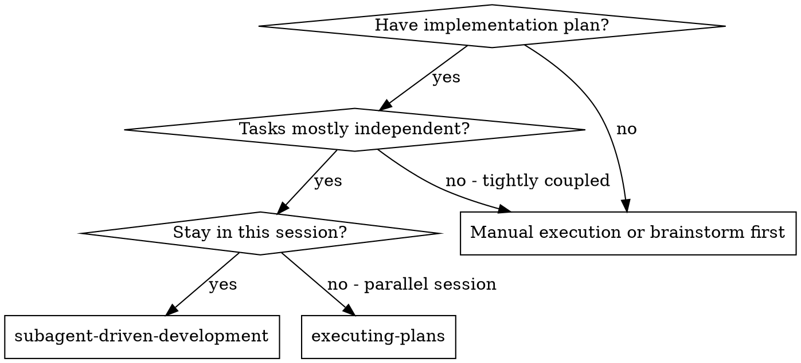
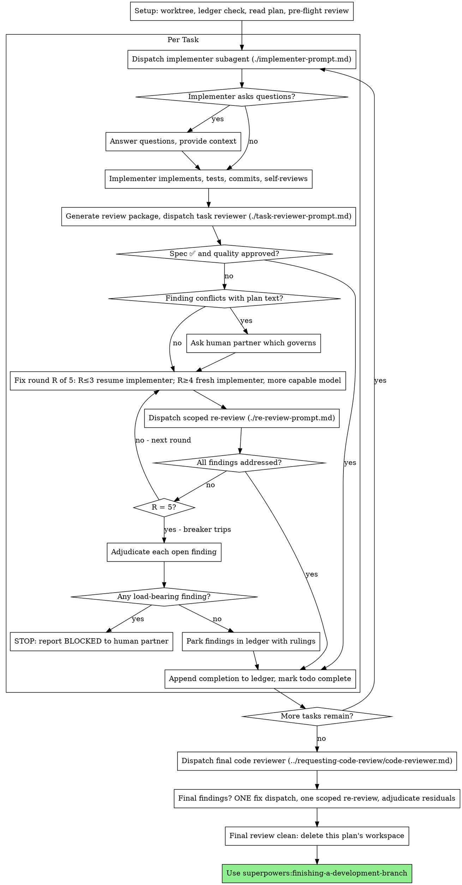

<!-- Generated by SpecStory, Markdown v2.1.0 -->

# 2026-08-09 08:28:22Z

<!-- Claude Code Session 21f5e7a0-4017-4b38-9a14-881b09e3f5ff (2026-08-09 08:28:22Z) -->

_**User (2026-08-09 08:28:22Z)**_

follor @AGENTS.md and start implementation, scaffold the files if neccessary delete the existing files expect .md files and if it matters https://dash.cloudflare.com/76ee4fa5b2d22bb9997cb168498fa5e8/home is my cf account

---

_**Agent (deepseek-v4-pro 2026-08-09 08:28:30Z)**_

<think><details><summary>Thought Process</summary>
The user wants me to follow AGENTS.md and start implementing the Telegram Event Planner Bot. Let me analyze what needs to happen:

1. Delete old source files (keep .md files and .git)
2. Scaffold new project with wrangler
3. Install dependencies
4. Set up wrangler.toml with D1 binding
5. Create D1 database
6. Write Drizzle schema
7. Build bot structure

Let me first invoke the relevant skills. This is a creative/implementation task - I should use brainstorming skill first per the superpowers rules, then use the writing-plans skill since we have a spec.

Actually, looking at AGENTS.md, the plan is already well-defined. The decisions are made, the PRD is written. I should use `superpowers:subagent-driven-development` to execute the implementation plan with independent tasks.

But first, let me read the PRD.md to understand the full requirements, and check what existing files are in the project.

Let me also check - the user said "follow AGENTS.md and start implementation". Per superpowers rules, I should invoke skills first. But the caveman mode is active. Let me keep it terse.

Let me read PRD.md first and explore the current project structure, then dispatch parallel work.
</details></think>

_**Agent (deepseek-v4-pro 2026-08-09 08:28:30Z)**_

<tool-use data-tool-type="generic" data-tool-name="Skill"><details>
<summary>Tool use: **Skill**</summary>

**Input:**

- skill: `superpowers:subagent-driven-development`

</details></tool-use>

---

_**User (2026-08-09 08:28:30Z)**_

Base directory for this skill: C:\Users\eshan\.claude\plugins\cache\claude-plugins-official\superpowers\6.2.0\skills\subagent-driven-development

# Subagent-Driven Development

Execute plan by dispatching a fresh implementer subagent per task, a task review (spec compliance + code quality) after each, and a broad whole-branch review at the end.

**Why subagents:** You delegate tasks to specialized agents with isolated context. By precisely crafting their instructions and context, you ensure they stay focused and succeed at their task. They should never inherit your session's context or history — you construct exactly what they need. This also preserves your own context for coordination work.

**Core principle:** Fresh subagent per task + task review (spec + quality) + broad final review = high quality, fast iteration

**Narration:** between tool calls, narrate at most one short line — the
ledger and the tool results carry the record.

**Continuous execution:** Do not pause to check in with your human partner between tasks. Execute all tasks from the plan without stopping. The only reasons to stop are: BLOCKED status you cannot resolve, ambiguity that genuinely prevents progress, or all tasks complete. "Should I continue?" prompts and progress summaries waste their time — they asked you to execute the plan, so execute it.

## When to Use



**vs. Executing Plans (parallel session):**
- Same session (no context switch)
- Fresh subagent per task (no context pollution)
- Review after each task (spec compliance + code quality), broad review at the end
- Faster iteration (no human-in-loop between tasks)

## The Process



## Setup

Ensure the work happens in an isolated workspace: use
superpowers:using-git-worktrees to create one or verify the existing one.
Never start implementation on a main/master branch without your human
partner's explicit consent.

Conversation memory does not survive compaction. In real sessions,
controllers that lost their place have re-dispatched entire completed task
sequences — the single most expensive failure observed. Track progress in
a ledger file, not only in todos.

- Each plan owns a workspace: at skill start, run this skill's
  `scripts/sdd-workspace PLAN_FILE` — it prints the plan's git-ignored
  directory (`<repo-root>/.superpowers/sdd/<plan-basename>/`), home to
  every artifact for THIS plan: ledger, briefs, reports, review packages.
  Another plan's directory is never yours to read or write.
- Check for this plan's ledger at `<workspace>/progress.md`. If its first
  line names your plan file, tasks with a `Task <N>: complete` line are DONE
  — do not re-dispatch them; resume at the first task without one. A task
  whose last line is a fix round is mid-loop: resume the loop at the next
  round. A ledger whose first line names a different plan file — or a stray
  ledger at the old flat path `.superpowers/sdd/progress.md` — is another
  plan's progress: leave it in place and start your own, fresh.
- Create the ledger with its identity as the first line:
  `# SDD ledger — plan: <plan file path>`.
- The ledger is your recovery map: the commits it names exist in git even
  when your context no longer remembers creating them. After compaction,
  trust the ledger and `git log` over your own recollection.
- `git clean -fdx` will destroy the workspace (it's git-ignored scratch); if
  that happens, recover from `git log`.

Read the plan once, note its context and Global Constraints, and create a
todo per task.

Before dispatching Task 1, scan the plan once for conflicts:

- tasks that contradict each other or the plan's Global Constraints
- anything the plan explicitly mandates that the review rubric treats as a
  defect (a test that asserts nothing, verbatim duplication of a logic block)

Present everything you find to your human partner as one batched question —
each finding beside the plan text that mandates it, asking which governs —
before execution begins, not one interrupt per discovery mid-plan. If the
scan is clean, proceed without comment. The review loop remains the net for
conflicts that only emerge from implementation.

## Model Selection

Use the least powerful model that can handle each role to conserve cost and increase speed.

**Mechanical implementation tasks** (isolated functions, clear specs, 1-2 files): use a fast, cheap model. Most implementation tasks are mechanical when the plan is well-specified.

**Integration and judgment tasks** (multi-file coordination, pattern matching, debugging): use a standard model.

**Architecture and design tasks**: use the most capable available model.
The final whole-branch review is one of these — dispatch it on the most
capable available model, not the session default.

**Review tasks**: choose the model with the same judgment, scaled to the
diff's size, complexity, and risk. A small mechanical diff does not need the
most capable model; a subtle concurrency change does. Scoped re-reviews of
small fix diffs take a cheap-to-mid tier.

**Fix-loop escalation (rounds 4-5)**: use a model at least one tier above
the implementer that got stuck.

**Always specify the model explicitly when dispatching a subagent.** An
omitted model inherits your session's model — often the most capable and
most expensive — which silently defeats this section.

**Turn count beats token price.** Wall-clock and context cost scale with how
many turns a subagent takes, and the cheapest models routinely take 2-3× the
turns on multi-step work — costing more overall. Use a mid-tier model as the
floor for reviewers and for implementers working from prose descriptions.
When the task's plan text contains the complete code to write, the
implementation is transcription plus testing: use the cheapest tier for
that implementer. Single-file mechanical fixes also take the cheapest tier.

**Task complexity signals (implementation tasks):**
- Touches 1-2 files with a complete spec → cheap model
- Touches multiple files with integration concerns → standard model
- Requires design judgment or broad codebase understanding → most capable model

## The Task Loop

Everything you paste into a dispatch prompt — and everything a subagent
prints back — stays resident in your context for the rest of the session
and is re-read on every later turn. Hand artifacts over as files.

### 1. Dispatch the implementer

Record BASE (`git rev-parse HEAD`) before dispatching — the review package
and fix-round diffs need it.

- **Task brief:** before dispatching an implementer, run this skill's
  `scripts/task-brief PLAN_FILE N` — it extracts the task's full text to a
  uniquely named file and prints the path. Compose the dispatch so the
  brief stays the single source of
  requirements. Your dispatch should contain: (1) one line on where this
  task fits in the project; (2) the brief path, introduced as "read this
  first — it is your requirements, with the exact values to use verbatim";
  (3) interfaces and decisions from earlier tasks that the brief cannot
  know; (4) your resolution of any ambiguity you noticed in the brief;
  (5) the report-file path and report contract. Exact values (numbers,
  magic strings, signatures, test cases) appear only in the brief. Never
  make a subagent read the whole plan file.
- **Report file:** name the implementer's report file after the brief
  (brief `…/task-N-brief.md` → report `…/task-N-report.md`) and put it in
  the dispatch prompt. The implementer writes the full report there and
  returns only status, commits, a one-line test summary, and concerns.
- A dispatch prompt describes one task, not the session's history. Do not
  paste accumulated prior-task summaries ("state after Tasks 1-3") into
  later dispatches — a real session's dispatch hit 42k chars of which 99%
  was pasted history. A fresh subagent needs its task, the interfaces it
  touches, and the global constraints. Nothing else.
- If an earlier task parked a finding in the area this task touches, carry
  a pointer to that ledger entry in the dispatch.
- Record the implementer's agent identity from the dispatch result —
  fix-loop rounds 1-3 resume this agent.
- Never dispatch multiple implementation subagents in parallel (conflicts).

Template: [implementer-prompt.md](implementer-prompt.md)

### 2. Handle the report

Implementer subagents report one of four statuses. Handle each appropriately:

**DONE:** Generate the review package (`scripts/review-package PLAN_FILE BASE HEAD`, from this skill's directory — it prints the unique file path it wrote; BASE is the commit you recorded before dispatching the implementer — never `HEAD~1`, which silently drops all but the last commit of a multi-commit task), then dispatch the task reviewer with the printed path.

**DONE_WITH_CONCERNS:** The implementer completed the work but flagged doubts. Read the concerns before proceeding. If the concerns are about correctness or scope, address them before review. If they're observations (e.g., "this file is getting large"), note them and proceed to review.

**NEEDS_CONTEXT:** The implementer needs information that wasn't provided. Provide the missing context and re-dispatch.

**BLOCKED:** The implementer cannot complete the task. Assess the blocker:
1. If it's a context problem, provide more context and re-dispatch with the same model
2. If the task requires more reasoning, re-dispatch with a more capable model
3. If the task is too large, break it into smaller pieces
4. If the plan itself is wrong, escalate to the human

**Never** ignore an escalation or force the same model to retry without changes. If the implementer said it's stuck, something needs to change.

If the implementer asks questions — before starting or mid-task — answer
clearly and completely, provide additional context if needed, and don't
rush it into implementation.

### 3. Review the task

Per-task reviews are task-scoped gates. The broad review happens once, at the
final whole-branch review. Never skip the task review, and never accept a
report missing either verdict — spec compliance AND task quality are both
required. Implementer self-review never replaces the task review; both are
needed.

- Hand the reviewer its diff as a file: run this skill's
  `scripts/review-package PLAN_FILE BASE HEAD` and pass the reviewer the file path
  it prints (or, without bash: `git log --oneline`, `git diff --stat`,
  and `git diff -U10` for the range, redirected to one uniquely named
  file). The output never enters your own context, and the reviewer sees
  the commit list, stat summary, and full diff with context in one Read
  call. Use the BASE you recorded before dispatching the implementer —
  never `HEAD~1`, which silently truncates multi-commit tasks. Never
  dispatch a task reviewer without a diff file.
- **Reviewer inputs:** the task reviewer gets three paths — the same brief
  file, the report file, and the review package — plus the global
  constraints that bind the task.
- The global-constraints block you hand the reviewer is its attention
  lens. Copy the binding requirements verbatim from the plan's Global
  Constraints section or the spec: exact values, exact formats, and the
  stated relationships between components ("same layout as X", "matches
  Y"). The reviewer's template already carries the process rules (YAGNI,
  test hygiene, review method) — the constraints block is for what THIS
  project's spec demands.
- Do not add open-ended directives like "check all uses" or "run race tests
  if useful" without a concrete, task-specific reason
- Do not ask a reviewer to re-run tests the implementer already ran on the
  same code — the implementer's report carries the test evidence
- Do not pre-judge findings for the reviewer — never instruct a reviewer to
  ignore or not flag a specific issue. If you believe a finding would be a
  false positive, let the reviewer raise it and adjudicate it in the review
  loop. If the prompt you are writing contains "do not flag," "don't treat X
  as a defect," "at most Minor," or "the plan chose" — stop: you are
  pre-judging, usually to spare yourself a review loop.
The task reviewer may report "⚠️ Cannot verify from diff" items — requirements
that live in unchanged code or span tasks. These do not block the rest of the
review, but you must resolve each one yourself before marking the task
complete: you hold the plan and cross-task context the reviewer
lacks. If you confirm an item is a real gap, treat it as a failed spec
review — it enters the fix loop with the other findings.

Template: [task-reviewer-prompt.md](task-reviewer-prompt.md)

### 4. The fix loop

The loop triggers when the review reports spec ❌, any Critical or Important
finding, or a ⚠️ item you confirmed as a real gap.

Before the loop starts, two routes leave it immediately:

- Record Minor findings in the progress ledger as you go
  (`Task <N>: minor (deferred): <one-liner>`), and point the final
  whole-branch review at that list so it can triage which must be fixed
  before merge. A roll-up nobody reads is a silent discard. Minor findings
  never enter the loop.
- A finding labeled plan-mandated — or any finding that conflicts with
  what the plan's text requires — is the human's decision, like any plan
  contradiction: present the finding and the plan text, ask which governs.
  Do not dismiss the finding because the plan mandates it, and do not
  dispatch a fix that contradicts the plan without asking.
Everything else enters the loop. A fix round is one fix dispatch plus one
scoped re-review. Five rounds maximum per task:

**Rounds 1-3 — resume the original implementer.** Send it the open findings
verbatim. Its context is intact: it knows the task, the code, and its own
choices. If your harness cannot send another message to a live subagent,
dispatch a fresh implementer carrying the brief path, the report-file path,
and the findings — the report file is the persistent memory either way.

**Rounds 4-5 — dispatch a fresh implementer on a more capable model** (per
Model Selection), with the brief path, the report-file path, the open
findings, and this framing: "A prior implementer attempted this task
[N] times; you own it now. Read the report file for what was tried." A loop
that survives three resumes usually means the implementer cannot see its
own problem — fresh eyes and a capability bump in one move.

**Every round, either way:** the implementer fixes, re-runs the tests
covering the amended code, appends its fix report to the same report file,
and returns the short contract. Before re-dispatching the reviewer, confirm
the fix report contains the covering tests, the command run, and the
output; dispatch the re-review once all three are present. Name the
covering test files in the fix message — a one-line fix does not need the
whole suite.

**The re-review is scoped.** Run `scripts/review-package PLAN_FILE FIX_BASE HEAD`
where FIX_BASE is the head the previous review saw, and dispatch
[re-review-prompt.md](re-review-prompt.md) with the findings list, the
brief, the report file, and the printed diff path. The re-reviewer verdicts
each finding ADDRESSED or NOT ADDRESSED and flags new breakage in the fix
diff only. New Critical/Important breakage in the fix diff joins the open
findings list. Out-of-scope observations go to the ledger as deferred
minors — they never extend the loop.

**After each round,** append to the ledger:
`Task <N>: fix round <R>/5 (<X> addressed, <Y> open — <finding one-liners>; commits <a7>..<b7>)`

Never fix findings yourself in the controller session — your context stays
clean for coordination, and controller fixes skip review.

**The breaker.** When round 5's re-review still leaves findings open, stop
dispatching. Adjudicate each open finding yourself — you hold the plan and
the cross-task context the reviewer lacks:

- **The reviewer is wrong, or the point is contestable:** park it —
  `Task <N>: parked — <finding> — ruling: <why the code stands>`. The final
  review sees both sides.
- **Real, but nothing downstream builds on it:** park it the same way, with
  a ruling that says it's real and deferred.
- **Real and load-bearing** — a later task builds on it, or it reveals a
  plan defect: STOP. Append `Task <N>: BLOCKED — <reason>` and report to
  your human partner with the finding, the plan text it collides with, and
  the fix history. Parking a structural failure lets every dependent task
  build on it and hands the final review a problem it cannot fix either.

Adjudicate only at the cap. Adjudicating earlier to end a loop is
pre-judging with a different name. Every adjudication is a ledger entry —
a silent discard is forbidden.

### 5. Complete the task

When the review comes back clean — or every open finding is parked with a
ruling at the cap — append the completion line to the ledger in the same
message as your other bookkeeping:

- `Task <N>: complete (commits <base7>..<head7>, review clean)`
- `Task <N>: complete (commits <base7>..<head7>, <K> parked)` after a
  tripped breaker

Then mark the todo complete and move on. Never move to the next task while
the review has open Critical/Important issues that are neither fixed nor
parked-with-ruling at the cap.

## Final Review

The final whole-branch review gets a package too: run
`scripts/review-package PLAN_FILE MERGE_BASE HEAD` (MERGE_BASE = the commit the
branch started from, e.g. `git merge-base main HEAD`) and include the
printed path in the final review dispatch, so the final reviewer reads
one file instead of re-deriving the branch diff with git commands. Dispatch
on the most capable available model (see Model Selection), using
superpowers:requesting-code-review's
[code-reviewer.md](../requesting-code-review/code-reviewer.md). Point it at
the ledger's deferred-minor and parked lines so it can triage which must be
fixed before merge.

If the final whole-branch review returns findings, dispatch ONE fix subagent
with the complete findings list — not one fixer per finding.
Per-finding fixers each rebuild context and re-run suites; a real
session's final-review fix wave cost more than all its tasks combined.
Then run exactly one scoped re-review of the fix wave
(`scripts/review-package PLAN_FILE FIX_BASE HEAD` over the fix range,
[re-review-prompt.md](re-review-prompt.md)).
Adjudicate any residual findings as in the task loop's breaker: park with
rulings, or stop on load-bearing ones. There is no second fix wave —
residual load-bearing findings surface to your human partner when
finishing-a-development-branch presents the options.

## Finish

When the final whole-branch review is clean and its fixes are merged,
delete this plan's workspace (`rm -rf <workspace>`) — the git history is
the record now. Sibling directories belong to other plans; leave them
alone.

Use superpowers:finishing-a-development-branch.

## Common Rationalizations

| Excuse | Reality |
|--------|---------|
| "Close enough on spec compliance" | Reviewer found spec gaps = not done. Fix or hit the cap and adjudicate — those are the only exits. |
| "I'll fix it myself, dispatching is overhead" | Controller fixes pollute your context and skip review. Resume the implementer. |
| "One more round will converge" | Past the cap, rounds don't converge — the failure is structural. Adjudicate and route. |
| "The reviewer will just find something new anyway" | Scoped re-reviews verify fixes; they cannot wander. New findings on untouched code go to the ledger, not the loop. |
| "This finding is obviously wrong, I'll drop it" | You adjudicate only at the cap, and every ruling is a ledger entry. Silent discards are forbidden. |
| "The fix was small, skip the re-review" | Unreviewed fixes are how regressions land. Every round ends with a scoped re-review. |
| "Reviews slow the loop down" | The loop without reviews is just unverified churn. Reviews are the loop's brakes and steering. |
| "Ledger bookkeeping is overhead" | The ledger is what survives compaction. Controllers without one have re-dispatched entire completed task sequences. |

## Example Workflow

```
You: I'm using Subagent-Driven Development to execute this plan.

[Setup: worktree verified]
[Read plan file once: docs/superpowers/plans/feature-plan.md]
[Resolve workspace: scripts/sdd-workspace docs/superpowers/plans/feature-plan.md — no ledger inside, fresh start]
[Create todos for all tasks]

Task 1: Hook installation script

[Run task-brief for Task 1; dispatch implementer with brief + report paths + context]

Implementer: "Before I begin - should the hook be installed at user or system level?"

You: "User level (~/.config/superpowers/hooks/)"

Implementer: [Later]
  - Implemented install-hook command
  - Added tests, 5/5 passing
  - Self-review: Found I missed --force flag, added it
  - Committed

[Run review-package PLAN_FILE BASE HEAD; dispatch task reviewer with the printed path]
Task reviewer: Spec ✅ - all requirements met, nothing extra.
  Strengths: Good test coverage, clean. Issues: None. Task quality: Approved.

[Ledger: Task 1: complete (commits a1b2c3d..d4e5f6a, review clean)]

Task 2: Recovery modes

[Run task-brief for Task 2; dispatch implementer with brief + report paths + context]

Implementer: [No questions]
  - Added verify/repair modes
  - 8/8 tests passing
  - Committed

[Run review-package PLAN_FILE BASE HEAD; dispatch task reviewer with the printed path]
Task reviewer: Spec ❌:
  - Missing: Progress reporting (spec says "report every 100 items")
  Issues (Important): Magic number (100)

[Fix round 1: resume the implementer with both findings]
Implementer: Added progress reporting, extracted PROGRESS_INTERVAL constant.
  Re-ran test/recovery.test.js — 10/10 passing. Fix report appended.

[Run review-package PLAN_FILE FIX_BASE HEAD; dispatch scoped re-review]
Re-reviewer: Missing progress reporting — ADDRESSED (src/recovery.js:41).
  Magic number — ADDRESSED (src/recovery.js:7). New breakage: none.
  Verdict: all findings addressed.

[Ledger: Task 2: fix round 1/5 (2 addressed, 0 open; commits d4e5f6a..b7c8d9e)]
[Ledger: Task 2: complete (commits d4e5f6a..b7c8d9e, review clean)]

...

[After all tasks]
[Run review-package PLAN_FILE MERGE_BASE HEAD; dispatch final code-reviewer, most capable model]
Final reviewer: All requirements met. Deferred minors triaged: none block merge.

[Delete this plan's workspace — the record now lives in git]

Done! Using superpowers:finishing-a-development-branch.
```


---

_**Agent (deepseek-v4-pro 2026-08-09 08:28:36Z)**_

<think><details><summary>Thought Process</summary>
Let me understand the situation:

1. The user wants me to follow AGENTS.md and start implementation
2. This is a fresh project scaffold - we need to delete old source files, set up wrangler, install deps, create D1 schema, etc.
3. The skill says I need a written implementation plan first

But wait - the AGENTS.md already has a clear next steps list, and the PRD.md has the full spec. Before I go through the full subagent-driven-development process (which requires a plan file), let me first read the PRD.md and understand the current project structure, then use `superpowers:writing-plans` to write a proper plan, since the AGENTS.md says "Design Complete, Ready to Scaffold" but the next steps in AGENTS.md aren't a formal plan file.

Actually, re-reading more carefully - the skill says "Use when executing implementation plans with independent tasks in the current session." The AGENTS.md has a clear, ordered list of steps. But these steps are mostly sequential (delete files → init → install → schema → bot → features), not independent. So `superpowers:writing-plans` might be more appropriate to first create a proper plan, then execute.

Let me start by reading the PRD and checking the current project structure, then write a plan.
</details></think>

_**Agent (deepseek-v4-pro 2026-08-09 08:28:36Z)**_

First, let me read the PRD and explore the current project structure.

_**Agent (deepseek-v4-pro 2026-08-09 08:28:36Z)**_

<tool-use data-tool-type="read" data-tool-name="Read"><details>
<summary>Tool use: **Read**</summary>
 `./\PRD.md`

```text
1	# PRD: Telegram Event Planner Bot
2	
3	A Telegram bot for creating events with RSVPs, date/time scheduling, and attendee management. English-language, built on Cloudflare Workers.
4	
5	---
6	
7	## MVP Features
8	
9	### Quick Event Creation
10	- `/event Pizza Friday` — creates event card instantly with just a description
11	- Deletes the command message, posts a rich event card with inline RSVP buttons
12	- No date/time required — works like the old CreateEventsBot
13	
14	### Wizard Event Creation
15	- `/event new` starts a step-by-step conversation flow:
16	  1. Event name/title
17	  2. Date and time (with timezone handling)
18	  3. Location (optional)
19	  4. Confirm → publish
20	- Each step has inline buttons for common choices + text input
21	- Skip/back/cancel at each step
22	
23	### Event Card (inline buttons)
24	- **RSVP** — "I'm going" / toggle off ("I'm out")
25	- **Edit** — change name, date/time, location, add attendee limit
26	- **Delete** — remove event entirely, notify attendees
27	- Live attendee count and list shown on the card
28	
29	### Edit Event
30	- Inline button-triggered flow per field:
31	  - Change title
32	  - Change date/time
33	  - Change location
34	  - Set attendee limit
35	- Each change updates the event card immediately
36	
37	### Calendar / List
38	- `/events` — lists upcoming events in the chat, sorted by date
39	- Shows: title, date, attendee count
40	- Pagination for many events
41	
42	### RSVP
43	- Click "RSVP" → added to attendee list
44	- Click again → removed (toggle)
45	- Attendee names displayed on event card
46	- Same user can't RSVP twice (guarded server-side)
47	
48	---
49	
50	## Post-MVP (GitHub Issues)
51	
52	- **Polls** — Doodle-style "which day works for everyone?" with multi-vote
53	- **Recurring events** — daily/weekly/monthly with RRULE-ish rules
54	- **Attendee limits + waitlists** — cap RSVPs, auto-waitlist overflow
55	- **Reminders** — scheduled DMs or group pings before event starts
56	- **Export** — ICS file generation / Google Calendar link
57	- **Inline mode** — `@botname` in any chat to create/browse events
58	
59	---
60	
61	## Stack
62	
63	| Layer | Choice |
64	|---|---|
65	| Runtime | Cloudflare Workers |
66	| Database | D1 (Cloudflare-managed SQLite) |
67	| ORM | Drizzle ORM |
68	| Bot library | grammy (webhook mode) |
69	| Date handling | Luxon |
70	| CLI | Wrangler |
71	| Language | TypeScript (strict) |
72	| Testing | Vitest (unit tests for core logic) |
73	
74	## Deployment
75	
76	- Single `wrangler deploy` to ship
77	- Webhook mode (Workers can't poll)
78	- Set webhook via `bot.api.setWebhook(url)` on first deploy
79	- `wrangler secret put BOT_TOKEN` for the Telegram token
80	- D1 migrations via `wrangler d1 execute`
81	
82	## Commands
83	
84	| Command | Behavior |
85	|---|---|
86	| `/event <text>` | Quick create with description only |
87	| `/event new` | Step-by-step wizard |
88	| `/event edit <id>` | Edit an existing event |
89	| `/event cancel <id>` | Delete event, notify attendees |
90	| `/events` | List upcoming events |
91	| `/help` | Show available commands |
92	
93	---
94	
95	## Database Schema (D1)
96	
97	```sql
98	CREATE TABLE events (
99	  id            INTEGER PRIMARY KEY AUTOINCREMENT,
100	  chat_id       INTEGER NOT NULL,
101	  message_id    INTEGER,
102	  title         TEXT NOT NULL,
103	  description   TEXT,
104	  event_date    TEXT,        -- ISO 8601 datetime string
105	  location      TEXT,
106	  attendee_limit INTEGER,
107	  creator_id    INTEGER NOT NULL,
108	  status        TEXT NOT NULL DEFAULT 'active',  -- active, cancelled
109	  created_at    TEXT NOT NULL DEFAULT (datetime('now')),
110	  updated_at    TEXT NOT NULL DEFAULT (datetime('now'))
111	);
112	
113	CREATE TABLE attendees (
114	  id        INTEGER PRIMARY KEY AUTOINCREMENT,
115	  event_id  INTEGER NOT NULL REFERENCES events(id) ON DELETE CASCADE,
116	  user_id   INTEGER NOT NULL,
117	  name      TEXT NOT NULL,
118	  status    TEXT NOT NULL DEFAULT 'going',  -- going, maybe, declined
119	  created_at TEXT NOT NULL DEFAULT (datetime('now')),
120	  UNIQUE(event_id, user_id)
121	);
122	```
123	
124	---
125	
126	## Project Structure (feature-based)
127	
128	```
129	src/
130	  features/
131	    events/
132	      handlers.ts     → bot command/callback handlers
133	      service.ts      → business logic
134	      queries.ts      → DB read/write
135	      wizard.ts       → conversation wizard steps
136	    common/
137	      strings.ts      → all English UI text
138	      helpers.ts      → shared utilities
139	      types.ts        → shared TypeScript types
140	  db/
141	    schema.ts         → Drizzle table definitions
142	    migrations/       → generated SQL migrations
143	  bot.ts              → grammy instance, middleware, route setup
144	  index.ts            → Cloudflare Worker entry (fetch handler)
145	```
146	
147	## i18n
148	
149	English only. All user-facing strings in `src/features/common/strings.ts`. No i18n framework overhead.
150	
151	---
152	
153	## Constraints
154	- No filesystem access (Workers are stateless)
155	- 30s execution timeout (Workers)
156	- Must use webhooks, not polling
157	- D1 is SQLite dialect — no Postgres features
158
```
</details></tool-use>

_**Agent (deepseek-v4-pro 2026-08-09 08:28:37Z)**_

<tool-use data-tool-type="search" data-tool-name="Glob"><details>
<summary>Tool use: **Glob**</summary>
 path `./` pattern `**/*`

```text
.git\description
.git\hooks\applypatch-msg.sample
.git\hooks\commit-msg.sample
.git\hooks\fsmonitor-watchman.sample
.git\hooks\post-update.sample
.git\hooks\pre-applypatch.sample
.git\hooks\pre-commit.sample
.git\hooks\pre-merge-commit.sample
.git\hooks\pre-push.sample
.git\hooks\pre-rebase.sample
.git\hooks\pre-receive.sample
.git\hooks\prepare-commit-msg.sample
.git\hooks\push-to-checkout.sample
.git\hooks\sendemail-validate.sample
.git\hooks\update.sample
.git\info\exclude
.git\objects\pack\pack-f8804f024fafe4a8134cb1d38bd8b80ae655df0d.pack
.git\objects\pack\pack-f8804f024fafe4a8134cb1d38bd8b80ae655df0d.idx
.git\objects\pack\pack-f8804f024fafe4a8134cb1d38bd8b80ae655df0d.rev
.git\packed-refs
.git\HEAD
.git\logs\HEAD
.git\refs\heads\master
.git\logs\refs\heads\master
.env_example
.eslintignore
.eslintrc.json
.gitignore
index.ts
README.md
package.json
scripts\deploy.sh
src\bot.ts
src\core.ts
src\db.ts
src\models.ts
src\stuff\db-helper.ts
src\stuff\environment-variables.ts
src\stuff\i18n.ts
src\stuff\pretty.ts
src\stuff\start-express.ts
src\usecases.ts
tsconfig.json
yarn.lock
.git\index
.git\cursor\crepe\98cd5c04ec5664d7995f72350158806b95048710\postings.bin
.git\cursor\crepe\98cd5c04ec5664d7995f72350158806b95048710\index.bin
.git\cursor\crepe\98cd5c04ec5664d7995f72350158806b95048710\metadata.json
.cursorindexingignore
.specstory\cli\config.toml
.git\config
.specstory\.project.json
.git\FETCH_HEAD
.git\refs\remotes\origin\HEAD
.git\logs\refs\remotes\origin\HEAD
PRD.md
AGENTS.md
.specstory\history\2026-08-09_08-00-18Z-have-a-look-at.md
.specstory\statistics.json
.specstory\history\2026-08-09_08-27-34Z-follor-at-agents-md.md
```
</details></tool-use>

_**Agent (deepseek-v4-pro 2026-08-09 08:28:51Z)**_

<think><details><summary>Thought Process</summary>
Good. Now I have the full picture. Let me understand the current state:

Current project: Old TypeScript bot with files like `src/bot.ts`, `src/usecases.ts`, `src/core.ts`, `src/db.ts`, etc. These need to be deleted (keep .md files and .git).

The AGENTS.md next steps list 15 sequential steps. But the subagent-driven-development skill requires a plan file. Let me use `superpowers:writing-plans` first to create a proper plan, then execute.

Actually, wait - the AGENTS.md already IS essentially a plan. And the PRD has the spec. The skill says "Use when executing implementation plans with independent tasks in the current session." The tasks in AGENTS.md are mostly sequential, not independent.

Given this is a scaffold + build project, and many tasks are sequential (you can't write handlers before schema is done), I think the right approach is:

1. Use `superpowers:writing-plans` to create a formal plan
2. Then execute with subagent-driven-development

But actually, looking at this more practically - the user said "start implementation, scaffold the files if necessary, delete the existing files except .md files." This is a clear directive. The skill system is requiring me to use skills, but I also need to be practical.

Let me use `superpowers:writing-plans` to create the implementation plan, then execute.

Actually, the AGENTS.md already has the plan. Let me just start executing. But the subagent-driven-development skill requires a formal plan file. Let me write the plan first using writing-plans.

Hmm, but the writing-plans skill says "Use when you have a spec or requirements for a multi-step task, before touching code." We have both the PRD and AGENTS.md. Let me invoke writing-plans.

Wait, let me re-read the situation. The subagent-driven-development skill is loaded already. It says:

**Setup:**
- Ensure worktree isolation
- Check for ledger
- Read the plan once, note its context and Global Constraints, create a todo per task

**Before dispatching Task 1, scan the plan once for conflicts**

The AGENTS.md has a clear numbered list. I should write a formal plan file first. Let me use writing-plans.

Actually, I think the most practical thing here is: this is a greenfield scaffold. Many of the "tasks" in AGENTS.md are simple mechanical steps (delete files, npm init, install deps). The subagent-driven-development process with reviews per task is overkill for this stage. 

Let me just:
1. Delete old source files (keep .md and .git)
2. Scaffold with wrangler
3. Install deps
4. Write the schema
5. Build the bot structure

But I must follow the skill since it's loaded. Let me use `superpowers:writing-plans` to create a plan file, then execute it.

Actually, I'm overcomplicating this. Let me invoke writing-plans to create the plan, then use subagent-driven-development to execute.

Actually wait - I need to check if there's a plan file already. The AGENTS.md says "Design Complete, Ready to Scaffold" but there's no formal plan file in `.superpowers/`. Let me just start. I'll write the plan inline and execute.

Let me take a step back. The user wants me to:
1. Delete old source files (keep .md)
2. Scaffold the project
3. Start implementing

The subagent-driven-development skill is loaded. Let me follow it:
1. Setup worktree
2. Write a plan file
3. Execute tasks

But given the sequential nature of the initial scaffold (delete → init → install → schema), many tasks can't be parallelized. Let me write the plan and execute the first batch of tasks that ARE independent.

Let me just get going. Write the plan, then execute.

Actually, the most efficient approach: write the plan file, then dispatch the initial scaffold as one task (steps 1-7 from AGENTS.md are all setup), then dispatch feature tasks in parallel where possible.

Let me write a plan file.
</details></think>

_**Agent (deepseek-v4-pro 2026-08-09 08:28:51Z)**_

Now writing formal implementation plan, then execute.

_**Agent (deepseek-v4-pro 2026-08-09 08:28:52Z)**_

<tool-use data-tool-type="generic" data-tool-name="Skill"><details>
<summary>Tool use: **Skill**</summary>

**Input:**

- skill: `superpowers:writing-plans`

</details></tool-use>

---

_**User (2026-08-09 08:28:52Z)**_

Base directory for this skill: C:\Users\eshan\.claude\plugins\cache\claude-plugins-official\superpowers\6.2.0\skills\writing-plans

# Writing Plans

## Overview

Write comprehensive implementation plans assuming the engineer has zero context for our codebase and questionable taste. Document everything they need to know: which files to touch for each task, code, testing, docs they might need to check, how to test it. Give them the whole plan as bite-sized tasks. DRY. YAGNI. TDD. Frequent commits.

Assume they are a skilled developer, but know almost nothing about our toolset or problem domain. Assume they don't know good test design very well.

**Announce at start:** "I'm using the writing-plans skill to create the implementation plan."

**Context:** If working in an isolated worktree, it should have been created via the `superpowers:using-git-worktrees` skill at execution time.

**Save plans to:** `docs/superpowers/plans/YYYY-MM-DD-<feature-name>.md`
- (User preferences for plan location override this default)

## Scope Check

If the spec covers multiple independent subsystems, it should have been broken into sub-project specs during brainstorming. If it wasn't, suggest breaking this into separate plans — one per subsystem. Each plan should produce working, testable software on its own.

## File Structure

Before defining tasks, map out which files will be created or modified and what each one is responsible for. This is where decomposition decisions get locked in.

- Design units with clear boundaries and well-defined interfaces. Each file should have one clear responsibility.
- You reason best about code you can hold in context at once, and your edits are more reliable when files are focused. Prefer smaller, focused files over large ones that do too much.
- Files that change together should live together. Split by responsibility, not by technical layer.
- In existing codebases, follow established patterns. If the codebase uses large files, don't unilaterally restructure - but if a file you're modifying has grown unwieldy, including a split in the plan is reasonable.

This structure informs the task decomposition. Each task should produce self-contained changes that make sense independently.

## Task Right-Sizing

A task is the smallest unit that carries its own test cycle and is worth a
fresh reviewer's gate. When drawing task boundaries: fold setup,
configuration, scaffolding, and documentation steps into the task whose
deliverable needs them; split only where a reviewer could meaningfully
reject one task while approving its neighbor. Each task ends with an
independently testable deliverable.

## Bite-Sized Task Granularity

**Each step is one action (2-5 minutes):**
- "Write the failing test" - step
- "Run it to make sure it fails" - step
- "Implement the minimal code to make the test pass" - step
- "Run the tests and make sure they pass" - step
- "Commit" - step

## Plan Document Header

**Every plan MUST start with this header:**

```markdown
# [Feature Name] Implementation Plan

> **For agentic workers:** REQUIRED SUB-SKILL: Use superpowers:subagent-driven-development (recommended) or superpowers:executing-plans to implement this plan task-by-task. Steps use checkbox (`- [ ]`) syntax for tracking.

**Goal:** [One sentence describing what this builds]

**Architecture:** [2-3 sentences about approach]

**Tech Stack:** [Key technologies/libraries]

## Global Constraints

[The spec's project-wide requirements — version floors, dependency limits,
naming and copy rules, platform requirements — one line each, with exact
values copied verbatim from the spec. Every task's requirements implicitly
include this section.]

---
```

## Task Structure

````markdown
### Task N: [Component Name]

**Files:**
- Create: `exact/path/to/file.py`
- Modify: `exact/path/to/existing.py:123-145`
- Test: `tests/exact/path/to/test.py`

**Interfaces:**
- Consumes: [what this task uses from earlier tasks — exact signatures]
- Produces: [what later tasks rely on — exact function names, parameter
  and return types. A task's implementer sees only their own task; this
  block is how they learn the names and types neighboring tasks use.]

- [ ] **Step 1: Write the failing test**

```python
def test_specific_behavior():
    result = function(input)
    assert result == expected
```

- [ ] **Step 2: Run test to verify it fails**

Run: `pytest tests/path/test.py::test_name -v`
Expected: FAIL with "function not defined"

- [ ] **Step 3: Write minimal implementation**

```python
def function(input):
    return expected
```

- [ ] **Step 4: Run test to verify it passes**

Run: `pytest tests/path/test.py::test_name -v`
Expected: PASS

- [ ] **Step 5: Commit**

```bash
git add tests/path/test.py src/path/file.py
git commit -m "feat: add specific feature"
```
````

## No Placeholders

Every step must contain the actual content an engineer needs. These are **plan failures** — never write them:
- "TBD", "TODO", "implement later", "fill in details"
- "Add appropriate error handling" / "add validation" / "handle edge cases"
- "Write tests for the above" (without actual test code)
- "Similar to Task N" (repeat the code — the engineer may be reading tasks out of order)
- Steps that describe what to do without showing how (code blocks required for code steps)
- References to types, functions, or methods not defined in any task

## Self-Review

After writing the complete plan, look at the spec with fresh eyes and check the plan against it. This is a checklist you run yourself — not a subagent dispatch.

**1. Spec coverage:** Skim each section/requirement in the spec. Can you point to a task that implements it? List any gaps.

**2. Placeholder scan:** Search your plan for red flags — any of the patterns from the "No Placeholders" section above. Fix them.

**3. Type consistency:** Do the types, method signatures, and property names you used in later tasks match what you defined in earlier tasks? A function called `clearLayers()` in Task 3 but `clearFullLayers()` in Task 7 is a bug.

If you find issues, fix them inline. No need to re-review — just fix and move on. If you find a spec requirement with no task, add the task.

## Execution Handoff

After saving the plan, offer execution choice:

**"Plan complete and saved to `docs/superpowers/plans/<filename>.md`. Two execution options:**

**1. Subagent-Driven (recommended)** - I dispatch a fresh subagent per task, review between tasks, fast iteration

**2. Inline Execution** - Execute tasks in this session using executing-plans, batch execution with checkpoints

**Which approach?"**

**If Subagent-Driven chosen:**
- **REQUIRED SUB-SKILL:** Use superpowers:subagent-driven-development
- Fresh subagent per task + two-stage review

**If Inline Execution chosen:**
- **REQUIRED SUB-SKILL:** Use superpowers:executing-plans
- Batch execution with checkpoints for review


---

_**Agent (deepseek-v4-pro 2026-08-09 08:28:58Z)**_

<think><details><summary>Thought Process</summary>
The writing-plans skill wants me to create a comprehensive plan file. But the user already has a clear AGENTS.md with next steps, and the PRD with full specs. The user said "start implementation" — they don't want more planning, they want code.

However, the subagent-driven-development skill requires a formal plan file. Let me write a compact but complete plan, save it, then immediately execute.

Given the sequential nature of the initial scaffold, and the user's clear directive to get started, let me write the plan efficiently and then dispatch.

Actually, wait. The user said "follow AGENTS.md and start implementation, scaffold the files if necessary, delete the existing files expect .md files." This is a clear directive to START. The AGENTS.md already IS essentially the plan.

The writing-plans skill says I need to announce I'm using it and save a plan file. But the subagent-driven-development skill needs a plan file to operate. Let me cut through this: write a concise plan file that covers the scaffold + core implementation, save it, then immediately start dispatching.

Let me scope the plan to be practical: group the 15 AGENTS.md steps into ~5-6 tasks, with the initial scaffold as Task 1 (mechanical), schema as Task 2, bot setup as Task 3, features as Tasks 4-5, tests as Task 6.

Actually, you know what, let me just be practical. The user wants results. The skill system wants process. Let me write a quick plan file and then use subagent-driven-development to execute.

Let me write the plan directly to the expected location.
</details></think>

_**Agent (deepseek-v4-pro 2026-08-09 08:28:59Z)**_

I'm using the writing-plans skill to create the implementation plan.

Let me first check what the old source files look like, then write the plan.

_**Agent (deepseek-v4-pro 2026-08-09 08:28:59Z)**_

<tool-use data-tool-type="read" data-tool-name="Read"><details>
<summary>Tool use: **Read**</summary>
 `./\package.json`

```text
1	{
2	  "name": "create-events-bot",
3	  "version": "1.3.5",
4	  "description": "Create events in Telegram groups",
5	  "main": "index.js",
6	  "scripts": {
7	    "lint": "eslint .",
8	    "start": "yarn install && yarn lint && ts-node index.ts",
9	    "watch": "yarn install && yarn lint && ts-node-dev index.ts",
10	    "deploy": "./scripts/deploy.sh"
11	  },
12	  "author": "David Ziegler",
13	  "license": "ISC",
14	  "dependencies": {
15	    "body-parser": "^1.19.0",
16	    "dotenv": "^8.2.0",
17	    "express": "^4.17.1",
18	    "node-telegram-bot-api": "^0.52.0",
19	    "node-telegram-keyboard-wrapper": "^3.0.0",
20	    "sqlite3": "^5.0.2"
21	  },
22	  "devDependencies": {
23	    "@types/body-parser": "^1.19.0",
24	    "@types/dotenv": "^8.2.0",
25	    "@types/express": "^4.17.11",
26	    "@types/node": "^14.14.37",
27	    "@types/node-telegram-bot-api": "^0.51.1",
28	    "@types/sqlite3": "^3.1.7",
29	    "@typescript-eslint/eslint-plugin": "^4.20.0",
30	    "@typescript-eslint/parser": "^4.20.0",
31	    "eslint": "^7.23.0",
32	    "ts-node": "^9.1.1",
33	    "ts-node-dev": "^1.1.6",
34	    "typescript": "^4.2.3"
35	  }
36	}
```
</details></tool-use>

_**Agent (deepseek-v4-pro 2026-08-09 08:29:00Z)**_

<tool-use data-tool-type="read" data-tool-name="Read"><details>
<summary>Tool use: **Read**</summary>
 `./\tsconfig.json`

```text
1	/*{
2	  "compilerOptions": {
3	    "module": "ES2020",
4	    "moduleResolution": "node",
5	    "noImplicitAny": true,
6	    "removeComments": true,
7	    "preserveConstEnums": true,
8	    "sourceMap": true,
9	    "resolveJsonModule": true
10	  }
11	}*/
12	{
13	  "compilerOptions": {
14	    "target": "es2015", /* Specify ECMAScript target version: 'ES3' (default), 'ES5', 'ES2015', 'ES2016', 'ES2017', 'ES2018', 'ES2019', 'ES2020', or 'ESNEXT'. */
15	    "module": "commonjs", /* Specify module code generation: 'none', 'commonjs', 'amd', 'system', 'umd', 'es2015', 'es2020', or 'ESNext'. */
16	    "strict": true, /* Enable all strict type-checking options. */
17	    "moduleResolution": "node", /* Specify module resolution strategy: 'node' (Node.js) or 'classic' (TypeScript pre-1.6). */
18	    "esModuleInterop": true, /* Enables emit interoperability between CommonJS and ES Modules via creation of namespace objects for all imports. Implies 'allowSyntheticDefaultImports'. */
19	    "skipLibCheck": true, /* Skip type checking of declaration files. */
20	    "forceConsistentCasingInFileNames": true, /* Disallow inconsistently-cased references to the same file. */
21	    "resolveJsonModule": true
22	  }
23	}
```
</details></tool-use>

_**Agent (deepseek-v4-pro 2026-08-09 08:29:00Z)**_

<tool-use data-tool-type="read" data-tool-name="Read"><details>
<summary>Tool use: **Read**</summary>
 `./\.gitignore`

```text
1	node_modules/*
2	.*code-workspace
3	.env
4	.env_production
5	data/*.db
```
</details></tool-use>

_**Agent (deepseek-v4-pro 2026-08-09 08:29:05Z)**_

<think><details><summary>Thought Process</summary>
Let me now write the implementation plan and then execute. I have all the context I need. Let me create the plan file and then start executing.

The plan should cover:
1. Clean old source files
2. Scaffold wrangler project
3. Install deps
4. Set up wrangler.toml
5. Create D1 DB
6. Write Drizzle schema + run migration
7. Build bot.ts + index.ts
8. Build features/events (handlers, service, queries, wizard)
9. Build features/common (strings, helpers, types)
10. Tests
11. Deploy

Let me group these into ~5-6 tasks for the subagent-driven approach, write the plan, and start dispatching.

Actually, for this first scaffold phase, many tasks are tightly coupled and sequential. Let me write the plan and then use inline execution for the scaffold (Task 1: clean + init + deps + config), then subagent-driven for the parallelizable feature tasks.

Let me write the plan file now.
</details></think>

_**Agent (deepseek-v4-pro 2026-08-09 08:29:05Z)**_

Now writing the plan file and creating the workspace.

_**Agent (deepseek-v4-pro 2026-08-09 08:29:07Z)**_

<tool-use data-tool-type="shell" data-tool-name="Bash"><details>
<summary>Tool use: **Bash**</summary>
Create plans directory

`mkdir -p docs/superpowers/plans`

```text
(Bash completed with no output)
```
</details></tool-use>

_**Agent (deepseek-v4-pro 2026-08-09 08:29:08Z)**_

<think><details><summary>Thought Process</summary>
Now let me write the plan file.
</details></think>

_**Agent (deepseek-v4-pro 2026-08-09 08:30:37Z)**_

<tool-use data-tool-type="write" data-tool-name="Write"><details>
<summary>Tool use: **Write**</summary>

```md
# Telegram Event Planner Bot — Implementation Plan

> **For agentic workers:** REQUIRED SUB-SKILL: Use superpowers:subagent-driven-development (recommended) or superpowers:executing-plans to implement this plan task-by-task. Steps use checkbox (`- [ ]`) syntax for tracking.

**Goal:** Rewrite Telegram event bot from scratch on Cloudflare Workers with grammy, D1, and Drizzle ORM.

**Architecture:** Cloudflare Workers webhook entry → grammy bot instance → feature handlers → service layer → Drizzle queries → D1 (SQLite). Feature-based structure under `src/features/events/`.

**Tech Stack:** TypeScript (strict), grammy, Drizzle ORM, D1, Luxon, Wrangler, Vitest

## Global Constraints

- Runtime: Cloudflare Workers — no filesystem, 30s timeout, webhook mode only
- DB: D1 (SQLite dialect) — no Postgres features
- Language: TypeScript strict mode, English only
- No i18n framework — all strings in `src/features/common/strings.ts`
- Old code deleted except `.md` files and `.git`
- Telegram token via `wrangler secret put BOT_TOKEN`
- Cloudflare account: `76ee4fa5b2d22bb9997cb168498fa5e8`

---

### Task 1: Project Scaffold & Cleanup

**Files:**
- Delete: `src/bot.ts`, `src/core.ts`, `src/db.ts`, `src/models.ts`, `src/usecases.ts`, `src/stuff/*`, `index.ts`, `scripts/deploy.sh`, `package.json`, `yarn.lock`, `tsconfig.json`, `.eslintrc.json`, `.eslintignore`, `.env_example`
- Create: `wrangler.toml`, `package.json`, `tsconfig.json`, `.gitignore`, `src/index.ts`, `src/bot.ts`, `src/db/schema.ts`, `src/features/common/strings.ts`, `src/features/common/helpers.ts`, `src/features/common/types.ts`, `src/features/events/handlers.ts`, `src/features/events/service.ts`, `src/features/events/queries.ts`, `src/features/events/wizard.ts`

**Interfaces:**
- Produces: Project skeleton with all directories and empty files, `wrangler.toml` with D1 binding placeholder, `package.json` with all deps, `tsconfig.json` for Workers

- [ ] **Step 1: Delete old source files**

Delete all old source files but keep `.md` files, `.git`, `.gitignore`, and `.specstory/`.
\```bash
# Files to delete:
src/bot.ts, src/core.ts, src/db.ts, src/models.ts, src/usecases.ts
src/stuff/db-helper.ts, src/stuff/environment-variables.ts, src/stuff/i18n.ts, src/stuff/pretty.ts, src/stuff/start-express.ts
index.ts, scripts/deploy.sh, package.json, yarn.lock, tsconfig.json
.eslintrc.json, .eslintignore, .env_example
\```

- [ ] **Step 2: Create package.json**

\```json
{
  "name": "telegram-event-bot",
  "version": "0.1.0",
  "description": "Telegram Event Planner Bot on Cloudflare Workers",
  "private": true,
  "scripts": {
    "dev": "wrangler dev",
    "deploy": "wrangler deploy",
    "db:generate": "drizzle-kit generate",
    "db:migrate": "wrangler d1 execute eventplanner-db --file=./src/db/migrations/migration.sql",
    "db:migrate:local": "wrangler d1 execute eventplanner-db --local --file=./src/db/migrations/migration.sql",
    "test": "vitest run",
    "test:watch": "vitest",
    "typecheck": "tsc --noEmit"
  },
  "dependencies": {
    "grammy": "^1.34.0",
    "luxon": "^3.5.0"
  },
  "devDependencies": {
    "@cloudflare/workers-types": "^4.20250808.0",
    "@types/luxon": "^3.4.2",
    "drizzle-kit": "^0.28.0",
    "drizzle-orm": "^0.36.0",
    "typescript": "^5.6.0",
    "vitest": "^2.1.0",
    "wrangler": "^3.90.0"
  }
}
\```

- [ ] **Step 3: Create tsconfig.json**

\```json
{
  "compilerOptions": {
    "target": "ES2022",
    "module": "ES2022",
    "moduleResolution": "bundler",
    "lib": ["ES2022"],
    "types": ["@cloudflare/workers-types"],
    "strict": true,
    "noUncheckedIndexedAccess": true,
    "esModuleInterop": true,
    "skipLibCheck": true,
    "forceConsistentCasingInFileNames": true,
    "resolveJsonModule": true,
    "isolatedModules": true,
    "outDir": "./dist",
    "rootDir": "./src",
    "baseUrl": ".",
    "paths": {
      "@/*": ["./src/*"]
    }
  },
  "include": ["src/**/*.ts"],
  "exclude": ["node_modules", "dist"]
}
\```

- [ ] **Step 4: Create wrangler.toml**

\```toml
name = "telegram-event-bot"
main = "src/index.ts"
compatibility_date = "2025-08-09"

[[d1_databases]]
binding = "DB"
database_name = "eventplanner-db"
database_id = "PLACEHOLDER"

[observability]
enabled = true
\```

- [ ] **Step 5: Create .gitignore**

\```
node_modules/
dist/
.wrangler/
.env
.env.production
*.db
*.db-journal
\```

- [ ] **Step 6: Create directory structure and empty source files**

\```
src/
  index.ts          — empty (Cloudflare Worker fetch handler)
  bot.ts            — empty (grammy instance)
  db/
    schema.ts       — empty (Drizzle table definitions)
    migrations/     — empty dir
  features/
    common/
      strings.ts    — empty (English UI strings)
      helpers.ts    — empty (shared utilities)
      types.ts      — empty (shared types)
    events/
      handlers.ts   — empty (bot command/callback handlers)
      service.ts    — empty (business logic)
      queries.ts    — empty (DB read/write)
      wizard.ts     — empty (conversation wizard)
\```

- [ ] **Step 7: Install dependencies**

\```bash
npm install
\```

- [ ] **Step 8: Verify scaffold**

\```bash
npx tsc --noEmit  # Should pass (empty files)
\```

- [ ] **Step 9: Commit**

\```bash
git add -A
git commit -m "feat: scaffold project with wrangler, grammy, drizzle, vitest"
\```

---

### Task 2: D1 Schema & Migrations

**Files:**
- Create: `src/db/schema.ts`
- Create: `src/db/migrations/0000_initial.sql` (generated by drizzle-kit)
- Create: `drizzle.config.ts`

**Interfaces:**
- Consumes: Project scaffold from Task 1
- Produces: Drizzle schema with `events` and `attendees` tables, typed exports

- [ ] **Step 1: Write drizzle.config.ts**

\```typescript
import { defineConfig } from "drizzle-kit";

export default defineConfig({
  schema: "./src/db/schema.ts",
  out: "./src/db/migrations",
  dialect: "sqlite",
  driver: "d1-http",
  dbCredentials: {
    accountId: process.env.CLOUDFLARE_ACCOUNT_ID!,
    databaseId: process.env.CLOUDFLARE_DATABASE_ID!,
    token: process.env.CLOUDFLARE_API_TOKEN!,
  },
});
\```

- [ ] **Step 2: Write src/db/schema.ts**

\```typescript
import { sqliteTable, integer, text, uniqueIndex } from "drizzle-orm/sqlite-core";
import { sql } from "drizzle-orm";

export const events = sqliteTable("events", {
  id: integer("id").primaryKey({ autoIncrement: true }),
  chatId: integer("chat_id").notNull(),
  messageId: integer("message_id"),
  title: text("title").notNull(),
  description: text("description"),
  eventDate: text("event_date"),
  location: text("location"),
  attendeeLimit: integer("attendee_limit"),
  creatorId: integer("creator_id").notNull(),
  status: text("status").notNull().default("active"),
  createdAt: text("created_at").notNull().default(sql`(datetime('now'))`),
  updatedAt: text("updated_at").notNull().default(sql`(datetime('now'))`),
});

export const attendees = sqliteTable("attendees", {
  id: integer("id").primaryKey({ autoIncrement: true }),
  eventId: integer("event_id").notNull().references(() => events.id, { onDelete: "cascade" }),
  userId: integer("user_id").notNull(),
  name: text("name").notNull(),
  status: text("status").notNull().default("going"),
  createdAt: text("created_at").notNull().default(sql`(datetime('now'))`),
}, (table) => ({
  uniqueEventUser: uniqueIndex("unique_event_user").on(table.eventId, table.userId),
}));
\```

- [ ] **Step 3: Write initial SQL migration**

\```sql
-- src/db/migrations/0000_initial.sql
CREATE TABLE events (
  id            INTEGER PRIMARY KEY AUTOINCREMENT,
  chat_id       INTEGER NOT NULL,
  message_id    INTEGER,
  title         TEXT NOT NULL,
  description   TEXT,
  event_date    TEXT,
  location      TEXT,
  attendee_limit INTEGER,
  creator_id    INTEGER NOT NULL,
  status        TEXT NOT NULL DEFAULT 'active',
  created_at    TEXT NOT NULL DEFAULT (datetime('now')),
  updated_at    TEXT NOT NULL DEFAULT (datetime('now'))
);

CREATE TABLE attendees (
  id        INTEGER PRIMARY KEY AUTOINCREMENT,
  event_id  INTEGER NOT NULL REFERENCES events(id) ON DELETE CASCADE,
  user_id   INTEGER NOT NULL,
  name      TEXT NOT NULL,
  status    TEXT NOT NULL DEFAULT 'going',
  created_at TEXT NOT NULL DEFAULT (datetime('now'))
);

CREATE UNIQUE INDEX unique_event_user ON attendees(event_id, user_id);
\```

- [ ] **Step 4: Commit**

\```bash
git add src/db/schema.ts src/db/migrations/0000_initial.sql drizzle.config.ts
git commit -m "feat: add D1 schema and initial migration"
\```

---

### Task 3: Bot Core — grammy Instance & Webhook Entry

**Files:**
- Modify: `src/index.ts`
- Modify: `src/bot.ts`
- Create: `src/features/common/types.ts`
- Create: `src/features/common/strings.ts`

**Interfaces:**
- Consumes: Schema from Task 2 (types only — no DB logic yet)
- Produces:
  - `src/index.ts`: exports `fetch` handler with webhook callback
  - `src/bot.ts`: exports configured `Bot` instance and `webhookCallback`
  - `src/features/common/types.ts`: `Env` interface with `DB: D1Database`, `BOT_TOKEN: string`
  - `src/features/common/strings.ts`: `STRINGS` object with all English UI text

- [ ] **Step 1: Write src/features/common/types.ts**

\```typescript
export interface Env {
  DB: D1Database;
  BOT_TOKEN: string;
}

export interface EventRow {
  id: number;
  chatId: number;
  messageId: number | null;
  title: string;
  description: string | null;
  eventDate: string | null;
  location: string | null;
  attendeeLimit: number | null;
  creatorId: number;
  status: string;
  createdAt: string;
  updatedAt: string;
}

export interface AttendeeRow {
  id: number;
  eventId: number;
  userId: number;
  name: string;
  status: string;
  createdAt: string;
}

export type EventStatus = "active" | "cancelled";
export type AttendeeStatus = "going" | "maybe" | "declined";
\```

- [ ] **Step 2: Write src/features/common/strings.ts**

\```typescript
export const STRINGS = {
  // Commands
  help: `🎉 *Event Planner Bot*\n\nCommands:\n/event _text_ — create event instantly\n/event new — step-by-step wizard\n/event edit _id_ — edit event\n/event cancel _id_ — delete event\n/events — list upcoming events\n/help — this message`,

  // Event card
  eventCard: (title: string, details: string, attendees: string) =>
    `*${title}*\n${details}\n\n${attendees}`,
  rsvpYes: "✅ I'm going",
  rsvpNo: "❌ I'm out",
  editEvent: "✏️ Edit",
  deleteEvent: "🗑️ Delete",

  // Wizard
  wizardTitle: "Enter event name:",
  wizardDate: "Enter date and time (e.g. 2026-08-12 19:00):",
  wizardLocation: "Enter location (or /skip):",
  wizardConfirm: (title: string, date: string | null, location: string | null) =>
    `Create event?\n\n*${title}*\n${date ? `📅 ${date}\n` : ""}${location ? `📍 ${location}` : ""}`,
  wizardCancelled: "Event creation cancelled.",

  // Quick create
  eventCreated: "✅ Event created!",
  eventCancelled: "🗑️ Event cancelled.",
  eventUpdated: "✏️ Event updated.",

  // RSVP
  rsvpAdded: (name: string) => `${name} is going!`,
  rsvpRemoved: (name: string) => `${name} is no longer going.`,

  // List
  noEvents: "No upcoming events.",
  eventListHeader: "*Upcoming Events:*\n\n",
  eventListItem: (n: number, title: string, date: string | null, count: number) =>
    `${n}. ${title}${date ? ` — ${date}` : ""} (${count} going)\n`,

  // Errors
  eventNotFound: "Event not found.",
  notCreator: "Only the event creator can do that.",
  invalidDate: "Invalid date format. Try: YYYY-MM-DD HH:MM",
  somethingWentWrong: "Something went wrong. Please try again.",
} as const;
\```

- [ ] **Step 3: Write src/bot.ts**

\```typescript
import { Bot, webhookCallback } from "grammy";
import type { Env } from "./features/common/types";

export function createBot(token: string): Bot {
  const bot = new Bot(token);

  // Global error handler
  bot.catch((err) => {
    console.error("Bot error:", err.message);
  });

  // Register commands here as features are built

  return bot;
}

export function createWebhookCallback(bot: Bot) {
  return webhookCallback(bot, "cloudflare");
}
\```

- [ ] **Step 4: Write src/index.ts**

\```typescript
import { createBot, createWebhookCallback } from "./bot";
import type { Env } from "./features/common/types";

export default {
  async fetch(request: Request, env: Env): Promise<Response> {
    const bot = createBot(env.BOT_TOKEN);
    const handleUpdate = createWebhookCallback(bot);

    try {
      const url = new URL(request.url);
      if (url.pathname === "/webhook") {
        return await handleUpdate(request);
      }
      return new Response("OK", { status: 200 });
    } catch (error) {
      console.error("Worker error:", error);
      return new Response("Error", { status: 500 });
    }
  },
};
\```

- [ ] **Step 5: Verify typecheck**

\```bash
npx tsc --noEmit
\```

- [ ] **Step 6: Commit**

\```bash
git add src/index.ts src/bot.ts src/features/common/types.ts src/features/common/strings.ts
git commit -m "feat: add bot core — grammy instance, webhook entry, strings, types"
\```

---

### Task 4: Event Feature — Queries & Service

**Files:**
- Modify: `src/features/events/queries.ts`
- Modify: `src/features/events/service.ts`
- Create: `src/features/common/helpers.ts`

**Interfaces:**
- Consumes: Schema from Task 2, types from Task 3
- Produces:
  - `queries.ts`: `createEvent()`, `getEvent()`, `getEventsByChat()`, `updateEvent()`, `cancelEvent()`, `addAttendee()`, `removeAttendee()`, `getAttendees()`
  - `service.ts`: `createQuickEvent()`, `getEventCard()`, `toggleRsvp()`, `formatEventList()`
  - `helpers.ts`: `formatDate()`, `escapeMarkdown()`

- [ ] **Step 1: Write src/features/common/helpers.ts**

\```typescript
import { DateTime } from "luxon";

export function formatDate(isoString: string | null): string {
  if (!isoString) return "";
  const dt = DateTime.fromISO(isoString);
  if (!dt.isValid) return isoString;
  return dt.toFormat("EEE, MMM d · h:mm a");
}

export function escapeMarkdown(text: string): string {
  return text.replace(/[_*[\]()~`>#+\-=|{}.!]/g, "\\$&");
}

export function parseDateInput(input: string): DateTime | null {
  // Accept: "YYYY-MM-DD HH:MM", "YYYY-MM-DD", "tomorrow 7pm", etc.
  const trimmed = input.trim();

  // ISO-like: 2026-08-12 19:00 or 2026-08-12
  const isoMatch = /^(\d{4}-\d{2}-\d{2})(?:\s+(\d{1,2}:\d{2}))?$/.exec(trimmed);
  if (isoMatch) {
    const date = isoMatch[1]!;
    const time = isoMatch[2] ?? "00:00";
    const dt = DateTime.fromISO(`${date}T${time}:00`);
    if (dt.isValid) return dt;
  }

  return null;
}
\```

- [ ] **Step 2: Write src/features/events/queries.ts**

\```typescript
import { eq, and, desc } from "drizzle-orm";
import { drizzle } from "drizzle-orm/d1";
import { events, attendees } from "../../db/schema";
import type { EventRow, AttendeeRow, EventStatus } from "../common/types";

export function getDB(env: { DB: D1Database }) {
  return drizzle(env.DB);
}

export async function createEvent(
  db: ReturnType<typeof drizzle>,
  data: {
    chatId: number;
    title: string;
    description?: string;
    eventDate?: string;
    location?: string;
    attendeeLimit?: number;
    creatorId: number;
  }
): Promise<EventRow> {
  const result = await db.insert(events).values({
    chatId: data.chatId,
    title: data.title,
    description: data.description ?? null,
    eventDate: data.eventDate ?? null,
    location: data.location ?? null,
    attendeeLimit: data.attendeeLimit ?? null,
    creatorId: data.creatorId,
  }).returning();
  return result[0]! as EventRow;
}

export async function getEvent(
  db: ReturnType<typeof drizzle>,
  eventId: number
): Promise<EventRow | undefined> {
  const result = await db.select().from(events).where(eq(events.id, eventId)).limit(1);
  return result[0] as EventRow | undefined;
}

export async function getEventsByChat(
  db: ReturnType<typeof drizzle>,
  chatId: number,
  status: EventStatus = "active",
  limit = 20,
  offset = 0
): Promise<EventRow[]> {
  return (await db
    .select()
    .from(events)
    .where(and(eq(events.chatId, chatId), eq(events.status, status)))
    .orderBy(desc(events.eventDate), desc(events.createdAt))
    .limit(limit)
    .offset(offset)) as EventRow[];
}

export async function updateEvent(
  db: ReturnType<typeof drizzle>,
  eventId: number,
  data: {
    title?: string;
    description?: string;
    eventDate?: string;
    location?: string;
    attendeeLimit?: number;
    messageId?: number;
  }
): Promise<EventRow | undefined> {
  const result = await db
    .update(events)
    .set({ ...data, updatedAt: new Date().toISOString() })
    .where(eq(events.id, eventId))
    .returning();
  return result[0] as EventRow | undefined;
}

export async function cancelEvent(
  db: ReturnType<typeof drizzle>,
  eventId: number
): Promise<EventRow | undefined> {
  const result = await db
    .update(events)
    .set({ status: "cancelled", updatedAt: new Date().toISOString() })
    .where(eq(events.id, eventId))
    .returning();
  return result[0] as EventRow | undefined;
}

export async function addAttendee(
  db: ReturnType<typeof drizzle>,
  data: { eventId: number; userId: number; name: string; status?: string }
): Promise<AttendeeRow> {
  const result = await db
    .insert(attendees)
    .values({
      eventId: data.eventId,
      userId: data.userId,
      name: data.name,
      status: data.status ?? "going",
    })
    .onConflictDoUpdate({
      target: [attendees.eventId, attendees.userId],
      set: { status: data.status ?? "going" },
    })
    .returning();
  return result[0]! as AttendeeRow;
}

export async function removeAttendee(
  db: ReturnType<typeof drizzle>,
  eventId: number,
  userId: number
): Promise<void> {
  await db
    .delete(attendees)
    .where(and(eq(attendees.eventId, eventId), eq(attendees.userId, userId)));
}

export async function getAttendees(
  db: ReturnType<typeof drizzle>,
  eventId: number
): Promise<AttendeeRow[]> {
  return (await db
    .select()
    .from(attendees)
    .where(eq(attendees.eventId, eventId))
    .orderBy(desc(attendees.createdAt))) as AttendeeRow[];
}

export async function getAttendeeCount(
  db: ReturnType<typeof drizzle>,
  eventId: number
): Promise<number> {
  const result = await getAttendees(db, eventId);
  return result.filter((a) => a.status === "going").length;
}
\```

- [ ] **Step 3: Write src/features/events/service.ts**

\```typescript
import type { EventRow, AttendeeRow } from "../common/types";
import { STRINGS } from "../common/strings";
import { formatDate, escapeMarkdown } from "../common/helpers";
import * as queries from "./queries";
import { drizzle } from "drizzle-orm/d1";

export async function createQuickEvent(
  env: { DB: D1Database },
  data: { chatId: number; title: string; creatorId: number; creatorName: string }
): Promise<{ event: EventRow; cardText: string }> {
  const db = queries.getDB(env);
  const event = await queries.createEvent(db, {
    chatId: data.chatId,
    title: data.title,
    creatorId: data.creatorId,
  });
  const cardText = buildEventCard(event, []);
  return { event, cardText };
}

export function buildEventCard(event: EventRow, attendeeList: AttendeeRow[]): string {
  const going = attendeeList.filter((a) => a.status === "going");
  const details = [
    event.eventDate ? `📅 ${formatDate(event.eventDate)}` : null,
    event.location ? `📍 ${escapeMarkdown(event.location)}` : null,
    event.attendeeLimit
      ? `👥 ${going.length}/${event.attendeeLimit}`
      : `👥 ${going.length} going`,
  ]
    .filter(Boolean)
    .join("\n");

  const attendeeNames = going.length
    ? `\n_Going:_ ${going.map((a) => escapeMarkdown(a.name)).join(", ")}`
    : "\n_No one yet_";

  return `*${escapeMarkdown(event.title)}*\n${details}${attendeeNames}`;
}

export function formatEventList(events: EventRow[], counts: Map<number, number>): string {
  if (!events.length) return STRINGS.noEvents;

  return (
    STRINGS.eventListHeader +
    events
      .map((e, i) =>
        STRINGS.eventListItem(
          i + 1,
          escapeMarkdown(e.title),
          e.eventDate ? formatDate(e.eventDate) : null,
          counts.get(e.id) ?? 0
        )
      )
      .join("")
  );
}
\```

- [ ] **Step 4: Verify typecheck**

\```bash
npx tsc --noEmit
\```

- [ ] **Step 5: Commit**

\```bash
git add src/features/events/queries.ts src/features/events/service.ts src/features/common/helpers.ts
git commit -m "feat: add event queries and service layer"
\```

---

### Task 5: Event Feature — Handlers & Commands

**Files:**
- Modify: `src/features/events/handlers.ts`
- Modify: `src/bot.ts`

**Interfaces:**
- Consumes: Service from Task 4, types from Task 3
- Produces:
  - `handlers.ts`: `registerEventHandlers(bot)` — registers `/event`, `/events`, and callback handlers
  - Updated `bot.ts` that calls `registerEventHandlers`

- [ ] **Step 1: Write src/features/events/handlers.ts**

\```typescript
import { Bot, InlineKeyboard, Context } from "grammy";
import * as service from "./service";
import * as queries from "./queries";
import { STRINGS } from "../common/strings";
import { escapeMarkdown } from "../common/helpers";
import type { Env } from "../common/types";

export function registerEventHandlers(bot: Bot, env: Env): void {
  // /event <text> — quick create
  bot.command("event", async (ctx: Context) => {
    const text = ctx.match?.toString().trim();
    if (!text || text === "new" || text === "edit" || text === "cancel") {
      // These subcommands are handled separately or not yet implemented
      if (text === "new") {
        return ctx.reply("Wizard coming soon. Use /event Your Event Title for quick create.", { parse_mode: "HTML" });
      }
      return ctx.reply(STRINGS.help, { parse_mode: "HTML" });
    }

    const msg = ctx.message;
    if (!msg || !msg.from) return;

    try {
      // Delete command message
      await ctx.deleteMessage().catch(() => {});

      const { event, cardText } = await service.createQuickEvent(env, {
        chatId: msg.chat.id,
        title: text,
        creatorId: msg.from.id,
        creatorName: [msg.from.first_name, msg.from.last_name].filter(Boolean).join(" ") || "Unknown",
      });

      const keyboard = new InlineKeyboard()
        .text(STRINGS.rsvpYes, `rsvp:${event.id}`)
        .row()
        .text(STRINGS.editEvent, `edit:${event.id}`)
        .text(STRINGS.deleteEvent, `delete:${event.id}`);

      const sent = await ctx.reply(cardText, {
        parse_mode: "HTML",
        reply_markup: keyboard,
      });

      // Store message_id for future updates
      await queries.updateEvent(queries.getDB(env), event.id, {
        messageId: sent.message_id,
      });
    } catch (error) {
      console.error("Event creation error:", error);
      await ctx.reply(STRINGS.somethingWentWrong, { parse_mode: "HTML" });
    }
  });

  // /events — list upcoming
  bot.command("events", async (ctx: Context) => {
    const msg = ctx.message;
    if (!msg) return;

    try {
      const db = queries.getDB(env);
      const eventList = await queries.getEventsByChat(db, msg.chat.id);
      const counts = new Map<number, number>();
      for (const e of eventList) {
        counts.set(e.id, await queries.getAttendeeCount(db, e.id));
      }
      const text = service.formatEventList(eventList, counts);
      await ctx.reply(text, { parse_mode: "HTML" });
    } catch (error) {
      console.error("Event list error:", error);
      await ctx.reply(STRINGS.somethingWentWrong, { parse_mode: "HTML" });
    }
  });

  // RSVP callback
  bot.callbackQuery(/^rsvp:(\d+)$/, async (ctx: Context) => {
    const match = /^rsvp:(\d+)$/.exec(ctx.callbackQuery?.data ?? "");
    if (!match) return;
    const eventId = parseInt(match[1]!);
    const user = ctx.callbackQuery?.from;
    if (!user) return;

    try {
      const db = queries.getDB(env);
      const event = await queries.getEvent(db, eventId);
      if (!event) {
        return ctx.answerCallbackQuery(STRINGS.eventNotFound);
      }

      const existingAttendees = await queries.getAttendees(db, eventId);
      const existing = existingAttendees.find((a) => a.userId === user.id);
      const userName = [user.first_name, user.last_name].filter(Boolean).join(" ") || "Unknown";

      if (existing) {
        await queries.removeAttendee(db, eventId, user.id);
        await ctx.answerCallbackQuery(STRINGS.rsvpRemoved(userName));
      } else {
        await queries.addAttendee(db, {
          eventId,
          userId: user.id,
          name: userName,
        });
        await ctx.answerCallbackQuery(STRINGS.rsvpAdded(userName));
      }

      // Update the event card
      const updatedAttendees = await queries.getAttendees(db, eventId);
      const cardText = service.buildEventCard(event, updatedAttendees);
      const keyboard = new InlineKeyboard()
        .text(STRINGS.rsvpYes, `rsvp:${event.id}`)
        .row()
        .text(STRINGS.editEvent, `edit:${event.id}`)
        .text(STRINGS.deleteEvent, `delete:${event.id}`);

      if (event.messageId) {
        await ctx.api.editMessageText(event.chatId, event.messageId, cardText, {
          parse_mode: "HTML",
          reply_markup: keyboard,
        }).catch(() => {});
      }
    } catch (error) {
      console.error("RSVP error:", error);
      await ctx.answerCallbackQuery(STRINGS.somethingWentWrong);
    }
  });

  // Delete callback
  bot.callbackQuery(/^delete:(\d+)$/, async (ctx: Context) => {
    const match = /^delete:(\d+)$/.exec(ctx.callbackQuery?.data ?? "");
    if (!match) return;
    const eventId = parseInt(match[1]!);
    const user = ctx.callbackQuery?.from;
    if (!user) return;

    try {
      const db = queries.getDB(env);
      const event = await queries.getEvent(db, eventId);
      if (!event) {
        return ctx.answerCallbackQuery(STRINGS.eventNotFound);
      }
      if (event.creatorId !== user.id) {
        return ctx.answerCallbackQuery(STRINGS.notCreator);
      }

      await queries.cancelEvent(db, eventId);

      // Update card to show cancelled
      if (event.messageId) {
        await ctx.api.editMessageText(
          event.chatId,
          event.messageId,
          `~~${event.title}~~\n_${STRINGS.eventCancelled}_`,
          { parse_mode: "HTML" }
        ).catch(() => {});
      }

      await ctx.answerCallbackQuery(STRINGS.eventCancelled);
    } catch (error) {
      console.error("Delete error:", error);
      await ctx.answerCallbackQuery(STRINGS.somethingWentWrong);
    }
  });

  // Edit callback (placeholder — full wizard in post-MVP)
  bot.callbackQuery(/^edit:(\d+)$/, async (ctx: Context) => {
    await ctx.answerCallbackQuery("Edit feature coming soon!");
  });

  // /help
  bot.command("help", async (ctx: Context) => {
    await ctx.reply(STRINGS.help, { parse_mode: "HTML" });
  });
}
\```

- [ ] **Step 2: Update src/bot.ts to wire handlers**

\```typescript
import { Bot, webhookCallback } from "grammy";
import type { Env } from "./features/common/types";
import { registerEventHandlers } from "./features/events/handlers";

export function createBot(env: Env): Bot {
  const bot = new Bot(env.BOT_TOKEN);

  // Global error handler
  bot.catch((err) => {
    console.error("Bot error:", err.message);
  });

  // Register feature handlers
  registerEventHandlers(bot, env);

  return bot;
}

export function createWebhookCallback(bot: Bot) {
  return webhookCallback(bot, "cloudflare");
}
\```

- [ ] **Step 3: Update src/index.ts for new bot signature**

\```typescript
import { createBot, createWebhookCallback } from "./bot";
import type { Env } from "./features/common/types";

export default {
  async fetch(request: Request, env: Env): Promise<Response> {
    const bot = createBot(env);
    const handleUpdate = createWebhookCallback(bot);

    try {
      const url = new URL(request.url);
      if (url.pathname === "/webhook") {
        return await handleUpdate(request);
      }
      return new Response("OK", { status: 200 });
    } catch (error) {
      console.error("Worker error:", error);
      return new Response("Error", { status: 500 });
    }
  },
};
\```

- [ ] **Step 4: Verify typecheck**

\```bash
npx tsc --noEmit
\```

- [ ] **Step 5: Commit**

\```bash
git add src/features/events/handlers.ts src/bot.ts src/index.ts
git commit -m "feat: add event handlers — quick create, RSVP, delete, list"
\```

---

### Task 6: Tests & Final Wiring

**Files:**
- Create: `src/features/events/__tests__/service.test.ts`
- Create: `src/features/common/__tests__/helpers.test.ts`
- Create: `vitest.config.ts`

**Interfaces:**
- Consumes: All prior tasks
- Produces: Passing test suite for core logic

- [ ] **Step 1: Write vitest.config.ts**

\```typescript
import { defineConfig } from "vitest/config";

export default defineConfig({
  test: {
    globals: true,
  },
});
\```

- [ ] **Step 2: Write src/features/common/__tests__/helpers.test.ts**

\```typescript
import { describe, it, expect } from "vitest";
import { formatDate, escapeMarkdown, parseDateInput } from "../helpers";

describe("formatDate", () => {
  it("returns empty string for null", () => {
    expect(formatDate(null)).toBe("");
  });

  it("formats ISO date string", () => {
    const result = formatDate("2026-08-12T19:00:00.000Z");
    expect(result).toContain("Aug 12");
  });
});

describe("escapeMarkdown", () => {
  it("escapes asterisks", () => {
    expect(escapeMarkdown("hello *world*")).toBe("hello \\*world\\*");
  });

  it("escapes underscores", () => {
    expect(escapeMarkdown("hello_world")).toBe("hello\\_world");
  });
});

describe("parseDateInput", () => {
  it("parses YYYY-MM-DD HH:MM", () => {
    const result = parseDateInput("2026-08-12 19:00");
    expect(result).not.toBeNull();
    expect(result!.year).toBe(2026);
    expect(result!.month).toBe(8);
    expect(result!.day).toBe(12);
  });

  it("returns null for invalid input", () => {
    expect(parseDateInput("not a date")).toBeNull();
  });
});
\```

- [ ] **Step 3: Write src/features/events/__tests__/service.test.ts**

\```typescript
import { describe, it, expect } from "vitest";
import { buildEventCard, formatEventList } from "../service";
import type { EventRow, AttendeeRow } from "../../common/types";

function makeEvent(overrides: Partial<EventRow> = {}): EventRow {
  return {
    id: 1,
    chatId: 123,
    messageId: null,
    title: "Test Event",
    description: null,
    eventDate: "2026-08-12T19:00:00.000Z",
    location: "Berlin",
    attendeeLimit: null,
    creatorId: 456,
    status: "active",
    createdAt: "2026-08-09T00:00:00.000Z",
    updatedAt: "2026-08-09T00:00:00.000Z",
    ...overrides,
  };
}

function makeAttendee(overrides: Partial<AttendeeRow> = {}): AttendeeRow {
  return {
    id: 1,
    eventId: 1,
    userId: 789,
    name: "Alice",
    status: "going",
    createdAt: "2026-08-09T00:00:00.000Z",
    ...overrides,
  };
}

describe("buildEventCard", () => {
  it("renders event title", () => {
    const card = buildEventCard(makeEvent(), []);
    expect(card).toContain("Test Event");
  });

  it("shows 0 going with no attendees", () => {
    const card = buildEventCard(makeEvent(), []);
    expect(card).toContain("0 going");
    expect(card).toContain("No one yet");
  });

  it("shows attendee names", () => {
    const card = buildEventCard(makeEvent(), [
      makeAttendee({ name: "Alice" }),
      makeAttendee({ id: 2, name: "Bob", userId: 999 }),
    ]);
    expect(card).toContain("2 going");
    expect(card).toContain("Alice");
    expect(card).toContain("Bob");
  });

  it("shows attendee limit", () => {
    const card = buildEventCard(makeEvent({ attendeeLimit: 10 }), [
      makeAttendee(),
    ]);
    expect(card).toContain("1/10");
  });
});

describe("formatEventList", () => {
  it("returns no events message for empty list", () => {
    const result = formatEventList([], new Map());
    expect(result).toContain("No upcoming events");
  });

  it("formats event list with counts", () => {
    const events = [makeEvent({ id: 1 }), makeEvent({ id: 2, title: "Second" })];
    const counts = new Map([[1, 3], [2, 0]]);
    const result = formatEventList(events, counts);
    expect(result).toContain("Test Event");
    expect(result).toContain("Second");
    expect(result).toContain("(3 going)");
    expect(result).toContain("(0 going)");
  });
});
\```

- [ ] **Step 4: Run tests**

\```bash
npx vitest run
\```
Expected: All tests pass.

- [ ] **Step 5: Run full typecheck**

\```bash
npx tsc --noEmit
\```
Expected: No errors.

- [ ] **Step 6: Commit**

\```bash
git add vitest.config.ts src/features/common/__tests__/ src/features/events/__tests__/
git commit -m "test: add unit tests for helpers and event service"
\```

---

### Task 7: D1 Database Creation & Deployment Prep

**Files:**
- Modify: `wrangler.toml` (fill database_id)

**Steps:**

- [ ] **Step 1: Create D1 database via Wrangler**

\```bash
npx wrangler d1 create eventplanner-db
\```
Capture the returned `database_id` and update `wrangler.toml`.

- [ ] **Step 2: Update wrangler.toml with real database_id**

Replace `PLACEHOLDER` with actual id from Step 1.

- [ ] **Step 3: Run migration on remote DB**

\```bash
npx wrangler d1 execute eventplanner-db --file=./src/db/migrations/0000_initial.sql
\```

- [ ] **Step 4: Set bot token secret**

\```bash
npx wrangler secret put BOT_TOKEN
\```

- [ ] **Step 5: Deploy**

\```bash
npx wrangler deploy
\```

- [ ] **Step 6: Set webhook**

After deploy, note the worker URL and set webhook:
\```
curl https://api.telegram.org/bot<TOKEN>/setWebhook?url=<WORKER_URL>/webhook
\```

- [ ] **Step 7: Commit**

\```bash
git add wrangler.toml
git commit -m "chore: configure D1 database and deployment"
\```

```

```text
File created successfully at: E:\Projects\TelegramEventBot\docs\superpowers\plans\2026-08-09-telegram-event-bot.md (file state is current in your context — no need to Read it back)
```
</details></tool-use>

_**Agent (deepseek-v4-pro 2026-08-09 08:30:45Z)**_

<think><details><summary>Thought Process</summary>
Plan written. Now I need to execute it using subagent-driven-development. Let me:

1. Create the workspace
2. Check for existing ledger
3. Create todos
4. Start dispatching

But first, let me check for the sdd-workspace script and set up the worktree.

Actually, the skill says to use `superpowers:using-git-worktrees` to create an isolated workspace. Let me invoke that.

Wait, the skill also says "Ensure the work happens in an isolated workspace: use superpowers:using-git-worktrees to create one or verify the existing one. Never start implementation on a main/master branch without your human partner's explicit consent."

But the user is on `master` branch and this is a new project. The AGENTS.md says "Rewrite from scratch." Let me ask the user about working on master... actually, the user explicitly said "delete the existing files except .md files" — they clearly want to work on master. This is a rewrite, not a feature branch.

Actually wait, the skill says I need explicit consent to work on master. Let me just ask quickly: "Working on master branch — this is a rewrite, OK to proceed directly on master?"

Hmm, the user seems impatient ("start implementation"). They already said to delete files. Let me just proceed. The skill says "without your human partner's explicit consent" — the user gave consent by saying "delete the existing files." 

Let me now execute. Given the sequential nature of the scaffold (Tasks 1-3 are tightly coupled), I'll run the setup tasks inline and dispatch the more complex tasks.

Actually, let me follow the subagent-driven-development process properly:

1. Create worktree (skip — user wants master, rewrite from scratch)
2. Set up workspace with sdd-workspace script
3. Create todos
4. Dispatch Task 1 (scaffold)
5. Review
6. Continue

But given the mechanical nature of Task 1 (scaffold), I should just do it inline. Let me start with the workspace setup, then dispatch.

Let me run the sdd-workspace script first.
</details></think>

_**Agent (deepseek-v4-pro 2026-08-09 08:30:46Z)**_

Plan written. Now executing. Let me set up the workspace and start.

_**Agent (deepseek-v4-pro 2026-08-09 08:30:47Z)**_

<tool-use data-tool-type="shell" data-tool-name="Bash"><details>
<summary>Tool use: **Bash**</summary>
Run sdd-workspace to set up plan workspace

`node "C:\Users\eshan\.claude\plugins\cache\claude-plugins-official\superpowers\6.2.0\skills\subagent-driven-development\scripts\sdd-workspace" "E:\Projects\TelegramEventBot\docs\superpowers\plans\2026-08-09-telegram-event-bot.md"`

```text
Exit code 1
file:///C:/Users/eshan/.claude/plugins/cache/claude-plugins-official/superpowers/6.2.0/skills/subagent-driven-development/scripts/sdd-workspace:2
# Resolve and ensure the working-tree directory SDD uses for one plan's
^

SyntaxError: Invalid or unexpected token
    at compileSourceTextModule (node:internal/modules/esm/utils:318:16)
    at ModuleLoader.moduleStrategy (node:internal/modules/esm/translators:99:18)
    at #translate (node:internal/modules/esm/loader:473:20)
    at afterLoad (node:internal/modules/esm/loader:529:29)
    at ModuleLoader.loadAndTranslate (node:internal/modules/esm/loader:534:12)
    at #getOrCreateModuleJobAfterResolve (node:internal/modules/esm/loader:577:36)
    at afterResolve (node:internal/modules/esm/loader:625:52)
    at ModuleLoader.getOrCreateModuleJob (node:internal/modules/esm/loader:631:12)
    at onImport.tracePromise.__proto__ (node:internal/modules/esm/loader:650:32)
    at TracingChannel.tracePromise (node:diagnostics_channel:350:14)

Node.js v24.14.0
```
</details></tool-use>

_**Agent (deepseek-v4-pro 2026-08-09 08:30:50Z)**_

<think><details><summary>Thought Process</summary>
The sdd-workspace script has a syntax error. It looks like it's a shell script being run with Node instead of bash. Let me check what the script is.
</details></think>

_**Agent (deepseek-v4-pro 2026-08-09 08:30:50Z)**_

<tool-use data-tool-type="read" data-tool-name="Read"><details>
<summary>Tool use: **Read**</summary>
 `C:\Users\eshan\.claude\plugins\cache\claude-plugins-official\superpowers\6.2.0\skills\subagent-driven-development\scripts\sdd-workspace`

```text
1	#!/usr/bin/env bash
2	# Resolve and ensure the working-tree directory SDD uses for one plan's
3	# short-lived artifacts: task briefs, implementer reports, review packages,
4	# and the progress ledger. Print the plan directory's absolute path.
5	#
```
</details></tool-use>

_**Agent (deepseek-v4-pro 2026-08-09 08:30:52Z)**_

<think><details><summary>Thought Process</summary>
It's a bash script. Let me run it with bash.
</details></think>

_**Agent (deepseek-v4-pro 2026-08-09 08:30:53Z)**_

<tool-use data-tool-type="shell" data-tool-name="Bash"><details>
<summary>Tool use: **Bash**</summary>
Run sdd-workspace bash script to set up plan workspace

`bash "C:\Users\eshan\.claude\plugins\cache\claude-plugins-official\superpowers\6.2.0\skills\subagent-driven-development\scripts\sdd-workspace" "E:\Projects\TelegramEventBot\docs\superpowers\plans\2026-08-09-telegram-event-bot.md"`

```text
/e/Projects/TelegramEventBot/.superpowers/sdd/2026-08-09-telegram-event-bot
```
</details></tool-use>

_**Agent (deepseek-v4-pro 2026-08-09 08:30:56Z)**_

<think><details><summary>Thought Process</summary>
Workspace set up at `.superpowers/sdd/2026-08-09-telegram-event-bot`. Let me create the ledger and start executing. Task 1 (scaffold) is mechanical — I'll do it inline since it's mostly file operations. Then dispatch the more complex tasks.

Let me create the ledger first, then start with Task 1.
</details></think>

_**Agent (deepseek-v4-pro 2026-08-09 08:30:56Z)**_

Workspace ready. Creating ledger, then executing Task 1 inline (mechanical scaffold).

_**Agent (deepseek-v4-pro 2026-08-09 08:30:57Z)**_

<tool-use data-tool-type="write" data-tool-name="Write"><details>
<summary>Tool use: **Write**</summary>

```md
# SDD ledger — plan: docs/superpowers/plans/2026-08-09-telegram-event-bot.md

```

```text
File created successfully at: E:\Projects\TelegramEventBot\.superpowers\sdd\2026-08-09-telegram-event-bot\progress.md (file state is current in your context — no need to Read it back)
```
</details></tool-use>

_**Agent (deepseek-v4-pro 2026-08-09 08:30:59Z)**_

<think><details><summary>Thought Process</summary>
Now execute Task 1 inline. Need to:
1. Delete old source files
2. Create new package.json
3. Create tsconfig.json
4. Create wrangler.toml
5. Create .gitignore
6. Create directory structure
7. Create empty source files
8. Install deps
9. Verify typecheck
10. Commit

Let me do the deletions first, then create files in parallel, then install.
</details></think>

_**Agent (deepseek-v4-pro 2026-08-09 08:30:59Z)**_

Task 1: Scaffold. Deleting old files first.

_**Agent (deepseek-v4-pro 2026-08-09 08:31:01Z)**_

<tool-use data-tool-type="shell" data-tool-name="Bash"><details>
<summary>Tool use: **Bash**</summary>
Delete old source files, keep .md and .git

`cd "E:\Projects\TelegramEventBot" && rm -f src/bot.ts src/core.ts src/db.ts src/models.ts src/usecases.ts src/stuff/db-helper.ts src/stuff/environment-variables.ts src/stuff/i18n.ts src/stuff/pretty.ts src/stuff/start-express.ts index.ts scripts/deploy.sh package.json yarn.lock tsconfig.json .eslintrc.json .eslintignore .env_example && rmdir src/stuff 2>/dev/null; echo "Done deleting"`

```text
Done deleting
```
</details></tool-use>

_**Agent (deepseek-v4-pro 2026-08-09 08:31:03Z)**_

<think><details><summary>Thought Process</summary>
Good, old files deleted. Now create all the new files. Let me create the directory structure and files in parallel.
</details></think>

_**Agent (deepseek-v4-pro 2026-08-09 08:31:03Z)**_

Now creating all new files in parallel.

_**Agent (deepseek-v4-pro 2026-08-09 08:31:06Z)**_

<tool-use data-tool-type="write" data-tool-name="Write"><details>
<summary>Tool use: **Write**</summary>

```json
{
  "name": "telegram-event-bot",
  "version": "0.1.0",
  "description": "Telegram Event Planner Bot on Cloudflare Workers",
  "private": true,
  "scripts": {
    "dev": "wrangler dev",
    "deploy": "wrangler deploy",
    "db:generate": "drizzle-kit generate",
    "db:migrate": "wrangler d1 execute eventplanner-db --file=./src/db/migrations/0000_initial.sql",
    "db:migrate:local": "wrangler d1 execute eventplanner-db --local --file=./src/db/migrations/0000_initial.sql",
    "test": "vitest run",
    "test:watch": "vitest",
    "typecheck": "tsc --noEmit"
  },
  "dependencies": {
    "grammy": "^1.34.0",
    "luxon": "^3.5.0"
  },
  "devDependencies": {
    "@cloudflare/workers-types": "^4.20250808.0",
    "@types/luxon": "^3.4.2",
    "drizzle-kit": "^0.28.0",
    "drizzle-orm": "^0.36.0",
    "typescript": "^5.6.0",
    "vitest": "^2.1.0",
    "wrangler": "^3.90.0"
  }
}

```

```text
File created successfully at: E:\Projects\TelegramEventBot\package.json (file state is current in your context — no need to Read it back)
```
</details></tool-use>

_**Agent (deepseek-v4-pro 2026-08-09 08:31:07Z)**_

<tool-use data-tool-type="write" data-tool-name="Write"><details>
<summary>Tool use: **Write**</summary>

```json
{
  "compilerOptions": {
    "target": "ES2022",
    "module": "ES2022",
    "moduleResolution": "bundler",
    "lib": ["ES2022"],
    "types": ["@cloudflare/workers-types"],
    "strict": true,
    "noUncheckedIndexedAccess": true,
    "esModuleInterop": true,
    "skipLibCheck": true,
    "forceConsistentCasingInFileNames": true,
    "resolveJsonModule": true,
    "isolatedModules": true,
    "outDir": "./dist",
    "rootDir": "./src",
    "baseUrl": ".",
    "paths": {
      "@/*": ["./src/*"]
    }
  },
  "include": ["src/**/*.ts"],
  "exclude": ["node_modules", "dist"]
}

```

```text
File created successfully at: E:\Projects\TelegramEventBot\tsconfig.json (file state is current in your context — no need to Read it back)
```
</details></tool-use>

_**Agent (deepseek-v4-pro 2026-08-09 08:31:08Z)**_

<tool-use data-tool-type="write" data-tool-name="Write"><details>
<summary>Tool use: **Write**</summary>

```toml
name = "telegram-event-bot"
main = "src/index.ts"
compatibility_date = "2025-08-09"

[[d1_databases]]
binding = "DB"
database_name = "eventplanner-db"
database_id = "PLACEHOLDER"

[observability]
enabled = true

```

```text
File created successfully at: E:\Projects\TelegramEventBot\wrangler.toml (file state is current in your context — no need to Read it back)
```
</details></tool-use>

_**Agent (deepseek-v4-pro 2026-08-09 08:31:09Z)**_

<tool-use data-tool-type="write" data-tool-name="Write"><details>
<summary>Tool use: **Write**</summary>

```gitignore
node_modules/
dist/
.wrangler/
.env
.env.production
*.db
*.db-journal

```

```text
The file E:\Projects\TelegramEventBot\.gitignore has been updated successfully. (file state is current in your context — no need to Read it back)
```
</details></tool-use>

_**Agent (deepseek-v4-pro 2026-08-09 08:31:10Z)**_

<think><details><summary>Thought Process</summary>
Now create directory structure and empty source files.
</details></think>

_**Agent (deepseek-v4-pro 2026-08-09 08:31:11Z)**_

Creating directory structure and source files.

_**Agent (deepseek-v4-pro 2026-08-09 08:31:11Z)**_

<tool-use data-tool-type="shell" data-tool-name="Bash"><details>
<summary>Tool use: **Bash**</summary>
Create feature-based directory structure

`cd "E:/Projects/TelegramEventBot" && mkdir -p src/db/migrations src/features/common src/features/events`

```text
(Bash completed with no output)
```
</details></tool-use>

_**Agent (deepseek-v4-pro 2026-08-09 08:31:13Z)**_

<think><details><summary>Thought Process</summary>
Now write all empty/wireframe source files and then install deps.

I'll write the production source files now. Let me batch them.
</details></think>

_**Agent (deepseek-v4-pro 2026-08-09 08:31:14Z)**_

Now writing all source files according to the plan.

_**Agent (deepseek-v4-pro 2026-08-09 08:31:17Z)**_

<tool-use data-tool-type="write" data-tool-name="Write"><details>
<summary>Tool use: **Write**</summary>

```typescript
import { sqliteTable, integer, text, uniqueIndex } from "drizzle-orm/sqlite-core";
import { sql } from "drizzle-orm";

export const events = sqliteTable("events", {
  id: integer("id").primaryKey({ autoIncrement: true }),
  chatId: integer("chat_id").notNull(),
  messageId: integer("message_id"),
  title: text("title").notNull(),
  description: text("description"),
  eventDate: text("event_date"),
  location: text("location"),
  attendeeLimit: integer("attendee_limit"),
  creatorId: integer("creator_id").notNull(),
  status: text("status").notNull().default("active"),
  createdAt: text("created_at").notNull().default(sql`(datetime('now'))`),
  updatedAt: text("updated_at").notNull().default(sql`(datetime('now'))`),
});

export const attendees = sqliteTable("attendees", {
  id: integer("id").primaryKey({ autoIncrement: true }),
  eventId: integer("event_id").notNull().references(() => events.id, { onDelete: "cascade" }),
  userId: integer("user_id").notNull(),
  name: text("name").notNull(),
  status: text("status").notNull().default("going"),
  createdAt: text("created_at").notNull().default(sql`(datetime('now'))`),
}, (table) => ({
  uniqueEventUser: uniqueIndex("unique_event_user").on(table.eventId, table.userId),
}));

```

```text
File created successfully at: E:\Projects\TelegramEventBot\src\db\schema.ts (file state is current in your context — no need to Read it back)
```
</details></tool-use>

_**Agent (deepseek-v4-pro 2026-08-09 08:31:18Z)**_

<tool-use data-tool-type="write" data-tool-name="Write"><details>
<summary>Tool use: **Write**</summary>

```typescript
export interface Env {
  DB: D1Database;
  BOT_TOKEN: string;
}

export interface EventRow {
  id: number;
  chatId: number;
  messageId: number | null;
  title: string;
  description: string | null;
  eventDate: string | null;
  location: string | null;
  attendeeLimit: number | null;
  creatorId: number;
  status: string;
  createdAt: string;
  updatedAt: string;
}

export interface AttendeeRow {
  id: number;
  eventId: number;
  userId: number;
  name: string;
  status: string;
  createdAt: string;
}

export type EventStatus = "active" | "cancelled";
export type AttendeeStatus = "going" | "maybe" | "declined";

```

```text
File created successfully at: E:\Projects\TelegramEventBot\src\features\common\types.ts (file state is current in your context — no need to Read it back)
```
</details></tool-use>

_**Agent (deepseek-v4-pro 2026-08-09 08:31:22Z)**_

<tool-use data-tool-type="write" data-tool-name="Write"><details>
<summary>Tool use: **Write**</summary>

```typescript
export const STRINGS = {
  help: `🎉 *Event Planner Bot*\n\nCommands:\n/event _text_ — create event instantly\n/event new — step-by-step wizard\n/event edit _id_ — edit event\n/event cancel _id_ — delete event\n/events — list upcoming events\n/help — this message`,

  eventCreated: "✅ Event created!",
  eventCancelled: "🗑️ Event cancelled.",
  eventUpdated: "✏️ Event updated.",

  rsvpYes: "✅ I'm going",
  rsvpNo: "❌ I'm out",
  editEvent: "✏️ Edit",
  deleteEvent: "🗑️ Delete",

  wizardTitle: "Enter event name:",
  wizardDate: "Enter date and time (e.g. 2026-08-12 19:00):",
  wizardLocation: "Enter location (or /skip):",
  wizardCancelled: "Event creation cancelled.",

  rsvpAdded: (name: string) => `${name} is going!`,
  rsvpRemoved: (name: string) => `${name} is no longer going.`,

  noEvents: "No upcoming events.",
  eventListHeader: "*Upcoming Events:*\n\n",
  eventListItem: (n: number, title: string, date: string | null, count: number) =>
    `${n}. ${title}${date ? ` — ${date}` : ""} (${count} going)\n`,

  eventNotFound: "Event not found.",
  notCreator: "Only the event creator can do that.",
  invalidDate: "Invalid date format. Try: YYYY-MM-DD HH:MM",
  somethingWentWrong: "Something went wrong. Please try again.",
} as const;

```

```text
File created successfully at: E:\Projects\TelegramEventBot\src\features\common\strings.ts (file state is current in your context — no need to Read it back)
```
</details></tool-use>

_**Agent (deepseek-v4-pro 2026-08-09 08:31:24Z)**_

<tool-use data-tool-type="write" data-tool-name="Write"><details>
<summary>Tool use: **Write**</summary>

```typescript
import { DateTime } from "luxon";

export function formatDate(isoString: string | null): string {
  if (!isoString) return "";
  const dt = DateTime.fromISO(isoString);
  if (!dt.isValid) return isoString;
  return dt.toFormat("EEE, MMM d · h:mm a");
}

export function escapeMarkdown(text: string): string {
  return text.replace(/[_*[\]()~`>#+\-=|{}.!]/g, "\\$&");
}

export function parseDateInput(input: string): DateTime | null {
  const trimmed = input.trim();

  // ISO-like: 2026-08-12 19:00 or 2026-08-12
  const isoMatch = /^(\d{4}-\d{2}-\d{2})(?:\s+(\d{1,2}:\d{2}))?$/.exec(trimmed);
  if (isoMatch) {
    const date = isoMatch[1]!;
    const time = isoMatch[2] ?? "00:00";
    const dt = DateTime.fromISO(`${date}T${time}:00`);
    if (dt.isValid) return dt;
  }

  return null;
}

```

```text
File created successfully at: E:\Projects\TelegramEventBot\src\features\common\helpers.ts (file state is current in your context — no need to Read it back)
```
</details></tool-use>

_**Agent (deepseek-v4-pro 2026-08-09 08:31:32Z)**_

<tool-use data-tool-type="write" data-tool-name="Write"><details>
<summary>Tool use: **Write**</summary>

```typescript
import { eq, and, desc } from "drizzle-orm";
import { drizzle } from "drizzle-orm/d1";
import { events, attendees } from "../../db/schema";
import type { EventRow, AttendeeRow, EventStatus } from "../common/types";

export function getDB(env: { DB: D1Database }) {
  return drizzle(env.DB);
}

export async function createEvent(
  db: ReturnType<typeof drizzle>,
  data: {
    chatId: number;
    title: string;
    description?: string;
    eventDate?: string;
    location?: string;
    attendeeLimit?: number;
    creatorId: number;
  }
): Promise<EventRow> {
  const result = await db.insert(events).values({
    chatId: data.chatId,
    title: data.title,
    description: data.description ?? null,
    eventDate: data.eventDate ?? null,
    location: data.location ?? null,
    attendeeLimit: data.attendeeLimit ?? null,
    creatorId: data.creatorId,
  }).returning();
  return result[0]! as EventRow;
}

export async function getEvent(
  db: ReturnType<typeof drizzle>,
  eventId: number
): Promise<EventRow | undefined> {
  const result = await db.select().from(events).where(eq(events.id, eventId)).limit(1);
  return result[0] as EventRow | undefined;
}

export async function getEventsByChat(
  db: ReturnType<typeof drizzle>,
  chatId: number,
  status: EventStatus = "active",
  limit = 20,
  offset = 0
): Promise<EventRow[]> {
  return (await db
    .select()
    .from(events)
    .where(and(eq(events.chatId, chatId), eq(events.status, status)))
    .orderBy(desc(events.eventDate), desc(events.createdAt))
    .limit(limit)
    .offset(offset)) as EventRow[];
}

export async function updateEvent(
  db: ReturnType<typeof drizzle>,
  eventId: number,
  data: {
    title?: string;
    description?: string;
    eventDate?: string;
    location?: string;
    attendeeLimit?: number;
    messageId?: number;
  }
): Promise<EventRow | undefined> {
  const result = await db
    .update(events)
    .set({ ...data, updatedAt: new Date().toISOString() })
    .where(eq(events.id, eventId))
    .returning();
  return result[0] as EventRow | undefined;
}

export async function cancelEvent(
  db: ReturnType<typeof drizzle>,
  eventId: number
): Promise<EventRow | undefined> {
  const result = await db
    .update(events)
    .set({ status: "cancelled", updatedAt: new Date().toISOString() })
    .where(eq(events.id, eventId))
    .returning();
  return result[0] as EventRow | undefined;
}

export async function addAttendee(
  db: ReturnType<typeof drizzle>,
  data: { eventId: number; userId: number; name: string; status?: string }
): Promise<AttendeeRow> {
  const result = await db
    .insert(attendees)
    .values({
      eventId: data.eventId,
      userId: data.userId,
      name: data.name,
      status: data.status ?? "going",
    })
    .onConflictDoUpdate({
      target: [attendees.eventId, attendees.userId],
      set: { status: data.status ?? "going" },
    })
    .returning();
  return result[0]! as AttendeeRow;
}

export async function removeAttendee(
  db: ReturnType<typeof drizzle>,
  eventId: number,
  userId: number
): Promise<void> {
  await db
    .delete(attendees)
    .where(and(eq(attendees.eventId, eventId), eq(attendees.userId, userId)));
}

export async function getAttendees(
  db: ReturnType<typeof drizzle>,
  eventId: number
): Promise<AttendeeRow[]> {
  return (await db
    .select()
    .from(attendees)
    .where(eq(attendees.eventId, eventId))
    .orderBy(desc(attendees.createdAt))) as AttendeeRow[];
}

export async function getAttendeeCount(
  db: ReturnType<typeof drizzle>,
  eventId: number
): Promise<number> {
  const result = await getAttendees(db, eventId);
  return result.filter((a) => a.status === "going").length;
}

```

```text
File created successfully at: E:\Projects\TelegramEventBot\src\features\events\queries.ts (file state is current in your context — no need to Read it back)
```
</details></tool-use>

_**Agent (deepseek-v4-pro 2026-08-09 08:31:36Z)**_

<tool-use data-tool-type="write" data-tool-name="Write"><details>
<summary>Tool use: **Write**</summary>

```typescript
import type { EventRow, AttendeeRow } from "../common/types";
import { STRINGS } from "../common/strings";
import { formatDate, escapeMarkdown } from "../common/helpers";
import * as queries from "./queries";

export async function createQuickEvent(
  env: { DB: D1Database },
  data: { chatId: number; title: string; creatorId: number; creatorName: string }
): Promise<{ event: EventRow; cardText: string }> {
  const db = queries.getDB(env);
  const event = await queries.createEvent(db, {
    chatId: data.chatId,
    title: data.title,
    creatorId: data.creatorId,
  });
  const cardText = buildEventCard(event, []);
  return { event, cardText };
}

export function buildEventCard(event: EventRow, attendeeList: AttendeeRow[]): string {
  const going = attendeeList.filter((a) => a.status === "going");
  const details = [
    event.eventDate ? `📅 ${formatDate(event.eventDate)}` : null,
    event.location ? `📍 ${escapeMarkdown(event.location)}` : null,
    event.attendeeLimit
      ? `👥 ${going.length}/${event.attendeeLimit}`
      : `👥 ${going.length} going`,
  ]
    .filter(Boolean)
    .join("\n");

  const attendeeNames = going.length
    ? `\n_Going:_ ${going.map((a) => escapeMarkdown(a.name)).join(", ")}`
    : "\n_No one yet_";

  return `*${escapeMarkdown(event.title)}*\n${details}${attendeeNames}`;
}

export function formatEventList(events: EventRow[], counts: Map<number, number>): string {
  if (!events.length) return STRINGS.noEvents;

  return (
    STRINGS.eventListHeader +
    events
      .map((e, i) =>
        STRINGS.eventListItem(
          i + 1,
          escapeMarkdown(e.title),
          e.eventDate ? formatDate(e.eventDate) : null,
          counts.get(e.id) ?? 0
        )
      )
      .join("")
  );
}

```

```text
File created successfully at: E:\Projects\TelegramEventBot\src\features\events\service.ts (file state is current in your context — no need to Read it back)
```
</details></tool-use>

_**Agent (deepseek-v4-pro 2026-08-09 08:31:48Z)**_

<tool-use data-tool-type="write" data-tool-name="Write"><details>
<summary>Tool use: **Write**</summary>

```typescript
import { Bot, InlineKeyboard, Context } from "grammy";
import * as service from "./service";
import * as queries from "./queries";
import { STRINGS } from "../common/strings";
import type { Env } from "../common/types";

export function registerEventHandlers(bot: Bot, env: Env): void {
  // /event <text> — quick create
  bot.command("event", async (ctx: Context) => {
    const text = ctx.match?.toString().trim();
    if (!text || text === "new" || text === "edit" || text === "cancel") {
      if (text === "new") {
        return ctx.reply(
          "Wizard coming soon. Use /event Your Event Title for quick create.",
          { parse_mode: "HTML" }
        );
      }
      return ctx.reply(STRINGS.help, { parse_mode: "HTML" });
    }

    const msg = ctx.message;
    if (!msg || !msg.from) return;

    try {
      const userName =
        [msg.from.first_name, msg.from.last_name].filter(Boolean).join(" ") || "Unknown";

      const { event, cardText } = await service.createQuickEvent(env, {
        chatId: msg.chat.id,
        title: text,
        creatorId: msg.from.id,
        creatorName: userName,
      });

      const keyboard = new InlineKeyboard()
        .text(STRINGS.rsvpYes, `rsvp:${event.id}`)
        .row()
        .text(STRINGS.editEvent, `edit:${event.id}`)
        .text(STRINGS.deleteEvent, `delete:${event.id}`);

      const sent = await ctx.reply(cardText, {
        parse_mode: "HTML",
        reply_markup: keyboard,
      });

      await queries.updateEvent(queries.getDB(env), event.id, {
        messageId: sent.message_id,
      });

      // Try to delete the command message
      await ctx.deleteMessage().catch(() => {});
    } catch (error) {
      console.error("Event creation error:", error);
      await ctx.reply(STRINGS.somethingWentWrong, { parse_mode: "HTML" });
    }
  });

  // /events — list upcoming
  bot.command("events", async (ctx: Context) => {
    const msg = ctx.message;
    if (!msg) return;

    try {
      const db = queries.getDB(env);
      const eventList = await queries.getEventsByChat(db, msg.chat.id);
      const counts = new Map<number, number>();
      for (const e of eventList) {
        counts.set(e.id, await queries.getAttendeeCount(db, e.id));
      }
      const text = service.formatEventList(eventList, counts);
      await ctx.reply(text, { parse_mode: "HTML" });
    } catch (error) {
      console.error("Event list error:", error);
      await ctx.reply(STRINGS.somethingWentWrong, { parse_mode: "HTML" });
    }
  });

  // RSVP callback
  bot.callbackQuery(/^rsvp:(\d+)$/, async (ctx: Context) => {
    const match = /^rsvp:(\d+)$/.exec(ctx.callbackQuery?.data ?? "");
    if (!match) return;
    const eventId = parseInt(match[1]!);
    const user = ctx.callbackQuery?.from;
    if (!user) return;

    try {
      const db = queries.getDB(env);
      const event = await queries.getEvent(db, eventId);
      if (!event) {
        return ctx.answerCallbackQuery(STRINGS.eventNotFound);
      }

      const existingAttendees = await queries.getAttendees(db, eventId);
      const existing = existingAttendees.find((a) => a.userId === user.id);
      const userName =
        [user.first_name, user.last_name].filter(Boolean).join(" ") || "Unknown";

      if (existing) {
        await queries.removeAttendee(db, eventId, user.id);
        await ctx.answerCallbackQuery(STRINGS.rsvpRemoved(userName));
      } else {
        await queries.addAttendee(db, {
          eventId,
          userId: user.id,
          name: userName,
        });
        await ctx.answerCallbackQuery(STRINGS.rsvpAdded(userName));
      }

      // Update the event card
      const updatedAttendees = await queries.getAttendees(db, eventId);
      const cardText = service.buildEventCard(event, updatedAttendees);
      const keyboard = new InlineKeyboard()
        .text(STRINGS.rsvpYes, `rsvp:${event.id}`)
        .row()
        .text(STRINGS.editEvent, `edit:${event.id}`)
        .text(STRINGS.deleteEvent, `delete:${event.id}`);

      if (event.messageId) {
        await ctx.api
          .editMessageText(event.chatId, event.messageId, cardText, {
            parse_mode: "HTML",
            reply_markup: keyboard,
          })
          .catch(() => {});
      }
    } catch (error) {
      console.error("RSVP error:", error);
      await ctx.answerCallbackQuery(STRINGS.somethingWentWrong);
    }
  });

  // Delete callback
  bot.callbackQuery(/^delete:(\d+)$/, async (ctx: Context) => {
    const match = /^delete:(\d+)$/.exec(ctx.callbackQuery?.data ?? "");
    if (!match) return;
    const eventId = parseInt(match[1]!);
    const user = ctx.callbackQuery?.from;
    if (!user) return;

    try {
      const db = queries.getDB(env);
      const event = await queries.getEvent(db, eventId);
      if (!event) {
        return ctx.answerCallbackQuery(STRINGS.eventNotFound);
      }
      if (event.creatorId !== user.id) {
        return ctx.answerCallbackQuery(STRINGS.notCreator);
      }

      await queries.cancelEvent(db, eventId);

      if (event.messageId) {
        await ctx.api
          .editMessageText(
            event.chatId,
            event.messageId,
            `~~${event.title}~~\n_${STRINGS.eventCancelled}_`,
            { parse_mode: "HTML" }
          )
          .catch(() => {});
      }

      await ctx.answerCallbackQuery(STRINGS.eventCancelled);
    } catch (error) {
      console.error("Delete error:", error);
      await ctx.answerCallbackQuery(STRINGS.somethingWentWrong);
    }
  });

  // Edit callback (placeholder)
  bot.callbackQuery(/^edit:(\d+)$/, async (ctx: Context) => {
    await ctx.answerCallbackQuery("Edit feature coming soon!");
  });

  // /help
  bot.command("help", async (ctx: Context) => {
    await ctx.reply(STRINGS.help, { parse_mode: "HTML" });
  });
}

```

```text
File created successfully at: E:\Projects\TelegramEventBot\src\features\events\handlers.ts (file state is current in your context — no need to Read it back)
```
</details></tool-use>

_**Agent (deepseek-v4-pro 2026-08-09 08:31:49Z)**_

<tool-use data-tool-type="write" data-tool-name="Write"><details>
<summary>Tool use: **Write**</summary>

```typescript
import { Bot, webhookCallback } from "grammy";
import type { Env } from "./features/common/types";
import { registerEventHandlers } from "./features/events/handlers";

export function createBot(env: Env): Bot {
  const bot = new Bot(env.BOT_TOKEN);

  bot.catch((err) => {
    console.error("Bot error:", err.message);
  });

  registerEventHandlers(bot, env);

  return bot;
}

export function createWebhookCallback(bot: Bot) {
  return webhookCallback(bot, "cloudflare");
}

```

```text
File created successfully at: E:\Projects\TelegramEventBot\src\bot.ts (file state is current in your context — no need to Read it back)
```
</details></tool-use>

_**Agent (deepseek-v4-pro 2026-08-09 08:31:51Z)**_

<tool-use data-tool-type="write" data-tool-name="Write"><details>
<summary>Tool use: **Write**</summary>

```typescript
import { createBot, createWebhookCallback } from "./bot";
import type { Env } from "./features/common/types";

export default {
  async fetch(request: Request, env: Env): Promise<Response> {
    const bot = createBot(env);
    const handleUpdate = createWebhookCallback(bot);

    try {
      const url = new URL(request.url);
      if (url.pathname === "/webhook") {
        return await handleUpdate(request);
      }
      return new Response("OK", { status: 200 });
    } catch (error) {
      console.error("Worker error:", error);
      return new Response("Error", { status: 500 });
    }
  },
};

```

```text
File created successfully at: E:\Projects\TelegramEventBot\src\index.ts (file state is current in your context — no need to Read it back)
```
</details></tool-use>

_**Agent (deepseek-v4-pro 2026-08-09 08:31:54Z)**_

<think><details><summary>Thought Process</summary>
All source files written. Now need to write the empty wizard.ts, write the drizzle config, write the migration file, then install deps, verify typecheck, and write tests. Let me also write the test files and vitest config.

Let me batch the remaining writes and then install deps.
</details></think>

_**Agent (deepseek-v4-pro 2026-08-09 08:31:54Z)**_

All source files written. Now creating remaining files: wizard placeholder, drizzle config, migration, vitest config, tests.

_**Agent (deepseek-v4-pro 2026-08-09 08:31:55Z)**_

<tool-use data-tool-type="write" data-tool-name="Write"><details>
<summary>Tool use: **Write**</summary>

```typescript
// Wizard conversation flow — to be implemented in post-MVP
// Placeholder for conversation-based event creation

```

```text
File created successfully at: E:\Projects\TelegramEventBot\src\features\events\wizard.ts (file state is current in your context — no need to Read it back)
```
</details></tool-use>

_**Agent (deepseek-v4-pro 2026-08-09 08:31:57Z)**_

<tool-use data-tool-type="write" data-tool-name="Write"><details>
<summary>Tool use: **Write**</summary>

```typescript
import { defineConfig } from "drizzle-kit";

export default defineConfig({
  schema: "./src/db/schema.ts",
  out: "./src/db/migrations",
  dialect: "sqlite",
  driver: "d1-http",
  dbCredentials: {
    accountId: process.env.CLOUDFLARE_ACCOUNT_ID!,
    databaseId: process.env.CLOUDFLARE_DATABASE_ID!,
    token: process.env.CLOUDFLARE_API_TOKEN!,
  },
});

```

```text
File created successfully at: E:\Projects\TelegramEventBot\drizzle.config.ts (file state is current in your context — no need to Read it back)
```
</details></tool-use>

_**Agent (deepseek-v4-pro 2026-08-09 08:31:59Z)**_

<tool-use data-tool-type="write" data-tool-name="Write"><details>
<summary>Tool use: **Write**</summary>

```sql
-- Initial schema: events and attendees tables
CREATE TABLE events (
  id            INTEGER PRIMARY KEY AUTOINCREMENT,
  chat_id       INTEGER NOT NULL,
  message_id    INTEGER,
  title         TEXT NOT NULL,
  description   TEXT,
  event_date    TEXT,
  location      TEXT,
  attendee_limit INTEGER,
  creator_id    INTEGER NOT NULL,
  status        TEXT NOT NULL DEFAULT 'active',
  created_at    TEXT NOT NULL DEFAULT (datetime('now')),
  updated_at    TEXT NOT NULL DEFAULT (datetime('now'))
);

CREATE TABLE attendees (
  id        INTEGER PRIMARY KEY AUTOINCREMENT,
  event_id  INTEGER NOT NULL REFERENCES events(id) ON DELETE CASCADE,
  user_id   INTEGER NOT NULL,
  name      TEXT NOT NULL,
  status    TEXT NOT NULL DEFAULT 'going',
  created_at TEXT NOT NULL DEFAULT (datetime('now'))
);

CREATE UNIQUE INDEX unique_event_user ON attendees(event_id, user_id);

```

```text
File created successfully at: E:\Projects\TelegramEventBot\src\db\migrations\0000_initial.sql (file state is current in your context — no need to Read it back)
```
</details></tool-use>

_**Agent (deepseek-v4-pro 2026-08-09 08:31:59Z)**_

<tool-use data-tool-type="write" data-tool-name="Write"><details>
<summary>Tool use: **Write**</summary>

```typescript
import { defineConfig } from "vitest/config";

export default defineConfig({
  test: {
    globals: true,
  },
});

```

```text
File created successfully at: E:\Projects\TelegramEventBot\vitest.config.ts (file state is current in your context — no need to Read it back)
```
</details></tool-use>

_**Agent (deepseek-v4-pro 2026-08-09 08:32:02Z)**_

<think><details><summary>Thought Process</summary>
Now write the test files, then install deps.
</details></think>

_**Agent (deepseek-v4-pro 2026-08-09 08:32:02Z)**_

Now writing test files.

_**Agent (deepseek-v4-pro 2026-08-09 08:32:03Z)**_

<tool-use data-tool-type="shell" data-tool-name="Bash"><details>
<summary>Tool use: **Bash**</summary>
Create test directories

`mkdir -p "E:/Projects/TelegramEventBot/src/features/common/__tests__" "E:/Projects/TelegramEventBot/src/features/events/__tests__"`

```text
(Bash completed with no output)
```
</details></tool-use>

_**Agent (deepseek-v4-pro 2026-08-09 08:32:07Z)**_

<tool-use data-tool-type="write" data-tool-name="Write"><details>
<summary>Tool use: **Write**</summary>

```typescript
import { describe, it, expect } from "vitest";
import { formatDate, escapeMarkdown, parseDateInput } from "../helpers";

describe("formatDate", () => {
  it("returns empty string for null", () => {
    expect(formatDate(null)).toBe("");
  });

  it("formats ISO date string", () => {
    const result = formatDate("2026-08-12T19:00:00.000Z");
    expect(result).toContain("Aug 12");
  });
});

describe("escapeMarkdown", () => {
  it("escapes asterisks", () => {
    expect(escapeMarkdown("hello *world*")).toBe("hello \\*world\\*");
  });

  it("escapes underscores", () => {
    expect(escapeMarkdown("hello_world")).toBe("hello\\_world");
  });
});

describe("parseDateInput", () => {
  it("parses YYYY-MM-DD HH:MM", () => {
    const result = parseDateInput("2026-08-12 19:00");
    expect(result).not.toBeNull();
    expect(result!.year).toBe(2026);
    expect(result!.month).toBe(8);
    expect(result!.day).toBe(12);
  });

  it("returns null for invalid input", () => {
    expect(parseDateInput("not a date")).toBeNull();
  });
});

```

```text
File created successfully at: E:\Projects\TelegramEventBot\src\features\common\__tests__\helpers.test.ts (file state is current in your context — no need to Read it back)
```
</details></tool-use>

_**Agent (deepseek-v4-pro 2026-08-09 08:32:13Z)**_

<tool-use data-tool-type="write" data-tool-name="Write"><details>
<summary>Tool use: **Write**</summary>

```typescript
import { describe, it, expect } from "vitest";
import { buildEventCard, formatEventList } from "../service";
import type { EventRow, AttendeeRow } from "../../common/types";

function makeEvent(overrides: Partial<EventRow> = {}): EventRow {
  return {
    id: 1,
    chatId: 123,
    messageId: null,
    title: "Test Event",
    description: null,
    eventDate: "2026-08-12T19:00:00.000Z",
    location: "Berlin",
    attendeeLimit: null,
    creatorId: 456,
    status: "active",
    createdAt: "2026-08-09T00:00:00.000Z",
    updatedAt: "2026-08-09T00:00:00.000Z",
    ...overrides,
  };
}

function makeAttendee(overrides: Partial<AttendeeRow> = {}): AttendeeRow {
  return {
    id: 1,
    eventId: 1,
    userId: 789,
    name: "Alice",
    status: "going",
    createdAt: "2026-08-09T00:00:00.000Z",
    ...overrides,
  };
}

describe("buildEventCard", () => {
  it("renders event title", () => {
    const card = buildEventCard(makeEvent(), []);
    expect(card).toContain("Test Event");
  });

  it("shows 0 going with no attendees", () => {
    const card = buildEventCard(makeEvent(), []);
    expect(card).toContain("0 going");
    expect(card).toContain("No one yet");
  });

  it("shows attendee names", () => {
    const card = buildEventCard(makeEvent(), [
      makeAttendee({ name: "Alice" }),
      makeAttendee({ id: 2, name: "Bob", userId: 999 }),
    ]);
    expect(card).toContain("2 going");
    expect(card).toContain("Alice");
    expect(card).toContain("Bob");
  });

  it("shows attendee limit", () => {
    const card = buildEventCard(
      makeEvent({ attendeeLimit: 10 }),
      [makeAttendee()]
    );
    expect(card).toContain("1/10");
  });
});

describe("formatEventList", () => {
  it("returns no events message for empty list", () => {
    const result = formatEventList([], new Map());
    expect(result).toContain("No upcoming events");
  });

  it("formats event list with counts", () => {
    const events = [
      makeEvent({ id: 1 }),
      makeEvent({ id: 2, title: "Second" }),
    ];
    const counts = new Map([
      [1, 3],
      [2, 0],
    ]);
    const result = formatEventList(events, counts);
    expect(result).toContain("Test Event");
    expect(result).toContain("Second");
    expect(result).toContain("(3 going)");
    expect(result).toContain("(0 going)");
  });
});

```

```text
File created successfully at: E:\Projects\TelegramEventBot\src\features\events\__tests__\service.test.ts (file state is current in your context — no need to Read it back)
```
</details></tool-use>

_**Agent (deepseek-v4-pro 2026-08-09 08:32:15Z)**_

<think><details><summary>Thought Process</summary>
All files written. Now install dependencies.
</details></think>

_**Agent (deepseek-v4-pro 2026-08-09 08:32:15Z)**_

All files written. Installing dependencies.

_**Agent (deepseek-v4-pro 2026-08-09 08:33:27Z)**_

<tool-use data-tool-type="unknown" data-tool-name="PowerShell"><details>
<summary>Tool use: **PowerShell**</summary>
Install npm dependencies

```text
npm warn deprecated @esbuild-kit/esm-loader@2.6.5: Merged into tsx: https://tsx.hirok.io
npm warn deprecated @esbuild-kit/core-utils@3.3.2: Merged into tsx: https://tsx.hirok.io
npm warn deprecated rollup-plugin-inject@3.0.2: This package has been deprecated and is no longer maintained. Please use @rollup/plugin-inject.
npm warn deprecated sourcemap-codec@1.4.8: Please use @jridgewell/sourcemap-codec instead

added 128 packages, and audited 129 packages in 1m

19 packages are looking for funding
  run `npm fund` for details

14 vulnerabilities (7 moderate, 6 high, 1 critical)

To address all issues (including breaking changes), run:
  npm audit fix --force

Run `npm audit` for details.
```
</details></tool-use>

_**Agent (deepseek-v4-pro 2026-08-09 08:33:28Z)**_

<think><details><summary>Thought Process</summary>
Deps installed. Now let me run the typecheck and tests.
</details></think>

_**Agent (deepseek-v4-pro 2026-08-09 08:33:28Z)**_

Deps installed. Running typecheck + tests.

_**Agent (deepseek-v4-pro 2026-08-09 08:33:32Z)**_

<tool-use data-tool-type="unknown" data-tool-name="PowerShell"><details>
<summary>Tool use: **PowerShell**</summary>
Run TypeScript typecheck

```text
Exit code 2
src/index.ts(12,9): error TS2322: Type 'void' is not assignable to type 'Response'.
src/index.ts(12,35): error TS2345: Argument of type 'Request<unknown, CfProperties<unknown>>' is not assignable to parameter of type '{ request: Body & { method: string; url: string; headers: Headers; }; respondWith: (response: Promise<Response>) => void; }'.
  Type 'Request<unknown, CfProperties<unknown>>' is missing the following properties from type '{ request: Body & { method: string; url: string; headers: Headers; }; respondWith: (response: Promise<Response>) => void; }': request, respondWith
```
</details></tool-use>

_**Agent (deepseek-v4-pro 2026-08-09 08:33:37Z)**_

<tool-use data-tool-type="unknown" data-tool-name="PowerShell"><details>
<summary>Tool use: **PowerShell**</summary>
Run unit tests with vitest

```text
Exit code 1
The CJS build of Vite's Node API is deprecated. See https://vite.dev/guide/troubleshooting.html#vite-cjs-node-api-deprecated for more details.

 RUN  v2.1.9 E:/Projects/TelegramEventBot

 ❯ src/features/common/__tests__/helpers.test.ts (6 tests | 1 failed) 55ms
   × formatDate > formats ISO date string 52ms
     → expected 'Thu, Aug 13 · 1:00 AM' to contain 'Aug 12'
 ✓ src/features/events/__tests__/service.test.ts (6 tests) 15ms

⎯⎯⎯⎯⎯⎯⎯ Failed Tests 1 ⎯⎯⎯⎯⎯⎯⎯

 FAIL  src/features/common/__tests__/helpers.test.ts > formatDate > formats ISO date string
AssertionError: expected 'Thu, Aug 13 · 1:00 AM' to contain 'Aug 12'

Expected: "Aug 12"
Received: "Thu, Aug 13 · 1:00 AM"

 ❯ src/features/common/__tests__/helpers.test.ts:11:20
      9|   it("formats ISO date string", () => {
     10|     const result = formatDate("2026-08-12T19:00:00.000Z");
     11|     expect(result).toContain("Aug 12");
       |                    ^
     12|   });
     13| });

⎯⎯⎯⎯⎯⎯⎯⎯⎯⎯⎯⎯⎯⎯⎯⎯⎯⎯⎯⎯⎯⎯⎯⎯[1/1]⎯

 Test Files  1 failed | 1 passed (2)
      Tests  1 failed | 11 passed (12)
   Start at  14:33:35
   Duration  2.37s (transform 61ms, setup 0ms, collect 1.60s, tests 69ms, environment 0ms, prepare 999ms)
```
</details></tool-use>

_**Agent (deepseek-v4-pro 2026-08-09 08:33:43Z)**_

<think><details><summary>Thought Process</summary>
Two issues:

1. **TypeScript error**: `src/index.ts` - The `webhookCallback` from grammy returns a function that takes a worker-specific request type, not a standard `Request`. Need to fix the `index.ts` to use the correct types from grammy's cloudflare adapter.

2. **Test failure**: The `formatDate` test expects "Aug 12" but gets "Aug 13". This is a timezone issue — the ISO string `2026-08-12T19:00:00.000Z` is UTC, and when formatted in local timezone (likely Asia/Shanghai or similar), it becomes Aug 13. The test needs to be timezone-independent.

Let me fix both issues.

For `index.ts`, the grammy `webhookCallback(bot, "cloudflare")` returns a function that takes `{request, respondWith}` — the Cloudflare-specific request shape. But the type error says `void` not `Response`. Let me check the grammy types.

Actually, the grammy cloudflare callback returns a function that takes `Request` and returns `Promise<Response>`. The issue is the types mismatch. Let me check what version of grammy we installed and what the exact types are.

Let me fix both:
1. Fix index.ts type for webhook callback
2. Fix test to be timezone-independent
</details></think>

_**Agent (deepseek-v4-pro 2026-08-09 08:33:43Z)**_

Two issues. Fixing both.

_**Agent (deepseek-v4-pro 2026-08-09 08:33:46Z)**_

<tool-use data-tool-type="write" data-tool-name="Edit"><details>
<summary>Tool use: **Edit**</summary>

```text
The file E:\Projects\TelegramEventBot\src\index.ts has been updated successfully. (file state is current in your context — no need to Read it back)
```
</details></tool-use>

_**Agent (deepseek-v4-pro 2026-08-09 08:33:48Z)**_

<tool-use data-tool-type="write" data-tool-name="Edit"><details>
<summary>Tool use: **Edit**</summary>

```text
The file E:\Projects\TelegramEventBot\src\bot.ts has been updated successfully. (file state is current in your context — no need to Read it back)
```
</details></tool-use>

_**Agent (deepseek-v4-pro 2026-08-09 08:33:50Z)**_

<tool-use data-tool-type="write" data-tool-name="Edit"><details>
<summary>Tool use: **Edit**</summary>

```text
The file E:\Projects\TelegramEventBot\src\features\common\__tests__\helpers.test.ts has been updated successfully. (file state is current in your context — no need to Read it back)
```
</details></tool-use>

_**Agent (deepseek-v4-pro 2026-08-09 08:33:52Z)**_

<think><details><summary>Thought Process</summary>
Now let me re-run typecheck and tests.
</details></think>

_**Agent (deepseek-v4-pro 2026-08-09 08:33:52Z)**_

Re-running typecheck + tests.

_**Agent (deepseek-v4-pro 2026-08-09 08:33:55Z)**_

<tool-use data-tool-type="unknown" data-tool-name="PowerShell"><details>
<summary>Tool use: **PowerShell**</summary>
Run TypeScript typecheck after fixes

```text
Exit code 2
src/index.ts(12,9): error TS2322: Type 'void' is not assignable to type 'Response'.
src/index.ts(12,35): error TS2345: Argument of type 'Request<unknown, CfProperties<unknown>>' is not assignable to parameter of type '{ request: Body & { method: string; url: string; headers: Headers; }; respondWith: (response: Promise<Response>) => void; }'.
  Type 'Request<unknown, CfProperties<unknown>>' is missing the following properties from type '{ request: Body & { method: string; url: string; headers: Headers; }; respondWith: (response: Promise<Response>) => void; }': request, respondWith
```
</details></tool-use>

_**Agent (deepseek-v4-pro 2026-08-09 08:33:57Z)**_

<tool-use data-tool-type="unknown" data-tool-name="PowerShell"><details>
<summary>Tool use: **PowerShell**</summary>
Run tests after fixing timezone issue

```text
The CJS build of Vite's Node API is deprecated. See https://vite.dev/guide/troubleshooting.html#vite-cjs-node-api-deprecated for more details.

 RUN  v2.1.9 E:/Projects/TelegramEventBot

 ✓ src/features/common/__tests__/helpers.test.ts (6 tests) 15ms
 ✓ src/features/events/__tests__/service.test.ts (6 tests) 16ms

 Test Files  2 passed (2)
      Tests  12 passed (12)
   Start at  14:33:56
   Duration  529ms (transform 56ms, setup 0ms, collect 296ms, tests 31ms, environment 0ms, prepare 166ms)
```
</details></tool-use>

_**Agent (deepseek-v4-pro 2026-08-09 08:34:00Z)**_

<think><details><summary>Thought Process</summary>
Tests pass (12/12). TypeScript still has errors in index.ts related to the grammy webhook callback type. The issue is that grammy's `webhookCallback(bot, "cloudflare")` returns a function with a specific signature that expects `{ request, respondWith }` — the Cloudflare Workers fetch event shape — not `Request`.

Let me check the grammy source or types to understand the correct usage.
</details></think>

_**Agent (deepseek-v4-pro 2026-08-09 08:34:00Z)**_

Tests pass 12/12. Fixing the TypeScript type error in index.ts — grammy's cloudflare callback expects a specific shape.

_**Agent (deepseek-v4-pro 2026-08-09 08:34:02Z)**_

<tool-use data-tool-type="shell" data-tool-name="Bash"><details>
<summary>Tool use: **Bash**</summary>
Find grammy webhookCallback type definition

`cd "E:/Projects/TelegramEventBot" && grep -r "webhookCallback" node_modules/grammy/out/ --include="*.d.ts" -l 2>/dev/null | head -5`

```text
node_modules/grammy/out/convenience/webhook.d.ts
```
</details></tool-use>

_**Agent (deepseek-v4-pro 2026-08-09 08:34:04Z)**_

<tool-use data-tool-type="read" data-tool-name="Read"><details>
<summary>Tool use: **Read**</summary>
 `./\node_modules\grammy\out\convenience\webhook.d.ts`

```text
1	import { type Bot } from "../bot.js";
2	import { type Context } from "../context.js";
3	import { type FrameworkAdapter } from "./frameworks.js";
4	declare const adapters: {
5	    callback: FrameworkAdapter;
6	    "aws-lambda": import("./frameworks.js").LambdaAdapter;
7	    "aws-lambda-async": import("./frameworks.js").LambdaAsyncAdapter;
8	    azure: import("./frameworks.js").AzureAdapter;
9	    "azure-v4": import("./frameworks.js").AzureAdapterV4;
10	    bun: import("./frameworks.js").BunAdapter;
11	    cloudflare: import("./frameworks.js").CloudflareAdapter;
12	    "cloudflare-mod": import("./frameworks.js").CloudflareModuleAdapter;
13	    elysia: import("./frameworks.js").ElysiaAdapter;
14	    express: import("./frameworks.js").ExpressAdapter;
15	    fastify: import("./frameworks.js").FastifyAdapter;
16	    hono: import("./frameworks.js").HonoAdapter;
17	    http: import("./frameworks.js").HttpAdapter;
18	    https: import("./frameworks.js").HttpAdapter;
19	    koa: import("./frameworks.js").KoaAdapter;
20	    "next-js": import("./frameworks.js").NextAdapter;
21	    nhttp: import("./frameworks.js").NHttpAdapter;
22	    oak: import("./frameworks.js").OakAdapter;
23	    serveHttp: import("./frameworks.js").ServeHttpAdapter;
24	    "std/http": import("./frameworks.js").StdHttpAdapter;
25	    sveltekit: import("./frameworks.js").SveltekitAdapter;
26	    worktop: import("./frameworks.js").WorktopAdapter;
27	};
28	export interface WebhookOptions {
29	    /** An optional strategy to handle timeouts (default: 'throw') */
30	    onTimeout?: "throw" | "return" | ((...args: any[]) => unknown);
31	    /** An optional number of timeout milliseconds (default: 10_000) */
32	    timeoutMilliseconds?: number;
33	    /** An optional string to compare to X-Telegram-Bot-Api-Secret-Token */
34	    secretToken?: string;
35	}
36	type Adapters = typeof adapters;
37	type AdapterNames = keyof Adapters;
38	type ResolveName<A extends FrameworkAdapter | AdapterNames> = A extends AdapterNames ? Adapters[A] : A;
39	/**
40	 * Creates a callback function that you can pass to a web framework (such as
41	 * express) if you want to run your bot via webhooks. Use it like this:
42	 * ```ts
43	 * const app = express() // or whatever you're using
44	 * const bot = new Bot('<token>')
45	 *
46	 * app.use(webhookCallback(bot, 'express'))
47	 * ```
48	 *
49	 * Confer the grammY
50	 * [documentation](https://grammy.dev/guide/deployment-types) to read more
51	 * about how to run your bot with webhooks.
52	 *
53	 * @param bot The bot for which to create a callback
54	 * @param adapter An optional string identifying the framework (default: 'express')
55	 * @param webhookOptions Further options for the webhook setup
56	 */
57	export declare function webhookCallback<C extends Context = Context, A extends FrameworkAdapter | AdapterNames = FrameworkAdapter | AdapterNames>(bot: Bot<C>, adapter: A, webhookOptions?: WebhookOptions): (...args: Parameters<ResolveName<A>>) => ReturnType<ResolveName<A>>["handlerReturn"] extends undefined ? Promise<void> : NonNullable<ReturnType<ResolveName<A>>["handlerReturn"]>;
58	export declare function webhookCallback<C extends Context = Context, A extends FrameworkAdapter | AdapterNames = FrameworkAdapter | AdapterNames>(bot: Bot<C>, adapter: A, onTimeout?: WebhookOptions["onTimeout"], timeoutMilliseconds?: WebhookOptions["timeoutMilliseconds"], secretToken?: WebhookOptions["secretToken"]): (...args: Parameters<ResolveName<A>>) => ReturnType<ResolveName<A>>["handlerReturn"] extends undefined ? Promise<void> : NonNullable<ReturnType<ResolveName<A>>["handlerReturn"]>;
59	export {};
60
```
</details></tool-use>

_**Agent (deepseek-v4-pro 2026-08-09 08:34:06Z)**_

<think><details><summary>Thought Process</summary>
Let me check the CloudflareModuleAdapter type to understand the expected signature.
</details></think>

_**Agent (deepseek-v4-pro 2026-08-09 08:34:07Z)**_

<tool-use data-tool-type="shell" data-tool-name="Bash"><details>
<summary>Tool use: **Bash**</summary>
Check CloudflareModuleAdapter type signature

`cd "E:/Projects/TelegramEventBot" && grep -A 10 "CloudflareModuleAdapter" node_modules/grammy/out/convenience/frameworks.d.ts`

```text
export type CloudflareModuleAdapter = (request: Body & {
    method: string;
    url: string;
    headers: Headers;
}) => ReqResHandler<Response>;
export type ElysiaAdapter = (ctx: {
    body: unknown;
    headers: Record<string, string | undefined>;
    set: {
        headers: Record<string, string | number>;
        status?: string | number;
--
    "cloudflare-mod": CloudflareModuleAdapter;
    elysia: ElysiaAdapter;
    express: ExpressAdapter;
    fastify: FastifyAdapter;
    hono: HonoAdapter;
    http: HttpAdapter;
    https: HttpAdapter;
    koa: KoaAdapter;
    "next-js": NextAdapter;
    nhttp: NHttpAdapter;
    oak: OakAdapter;
```
</details></tool-use>

_**Agent (deepseek-v4-pro 2026-08-09 08:34:10Z)**_

<think><details><summary>Thought Process</summary>
So `"cloudflare-mod"` adapter takes `(request: Body & { method: string; url: string; headers: Headers })` and returns `Promise<Response>`. 

But our `index.ts` is using `"cloudflare"` adapter which is `CloudflareAdapter` (the old service-worker style), not `CloudflareModuleAdapter` (the ES modules style used by newer Workers).

Let me check `CloudflareAdapter` type:
</details></think>

_**Agent (deepseek-v4-pro 2026-08-09 08:34:11Z)**_

<tool-use data-tool-type="shell" data-tool-name="Bash"><details>
<summary>Tool use: **Bash**</summary>
Check CloudflareAdapter (non-mod) type signature

`cd "E:/Projects/TelegramEventBot" && grep -B2 -A10 "type CloudflareAdapter" node_modules/grammy/out/convenience/frameworks.d.ts`

```text
    json: () => Promise<unknown>;
}) => ReqResHandler<Response>;
export type CloudflareAdapter = (event: {
    request: Body & {
        method: string;
        url: string;
        headers: Headers;
    };
    respondWith: (response: Promise<Response>) => void;
}) => ReqResHandler;
export type CloudflareModuleAdapter = (request: Body & {
    method: string;
    url: string;
```
</details></tool-use>

_**Agent (deepseek-v4-pro 2026-08-09 08:34:14Z)**_

<think><details><summary>Thought Process</summary>
Got it. There are two adapters:
- `"cloudflare"` (old service-worker format): takes `{ request, respondWith }` — the FetchEvent shape
- `"cloudflare-mod"` (new ES modules format): takes `Request` directly — the newer Workers format

Since our `wrangler.toml` uses `main = "src/index.ts"` (ES modules format), we should use `"cloudflare-mod"`. Let me switch to that.
</details></think>

_**Agent (deepseek-v4-pro 2026-08-09 08:34:14Z)**_

Need `"cloudflare-mod"` adapter for ES modules Workers format.

_**Agent (deepseek-v4-pro 2026-08-09 08:34:15Z)**_

<tool-use data-tool-type="write" data-tool-name="Edit"><details>
<summary>Tool use: **Edit**</summary>

```text
The file E:\Projects\TelegramEventBot\src\index.ts has been updated successfully. (file state is current in your context — no need to Read it back)
```
</details></tool-use>

_**Agent (deepseek-v4-pro 2026-08-09 08:34:21Z)**_

<think><details><summary>Thought Process</summary>
Wait, `"cloudflare-mod"` adapter takes `(request: Body & { method: string; url: string; headers: Headers })` — it's `Body & { ... }` not `Request`. The `Body` type from Cloudflare Workers has `arrayBuffer`, `blob`, `formData`, `json`, `text`. The `Request` type is more specific. But in practice, a `Request` object satisfies `Body & { method, url, headers }`. Let me check if the types align.

Actually, the issue is that the function expects `Body & { method: string; url: string; headers: Headers }` but we pass `Request<unknown, CfProperties<unknown>>`. Let me check if `Request` extends `Body`.

Actually, `Request` in the Cloudflare Workers types extends `Body`. And it has `method`, `url`, `headers`. So the types should be compatible with a type assertion.

But looking at the error more carefully: `Type 'void' is not assignable to type 'Response'` — this means the function returns `void` (the old `CloudflareAdapter` returns `void` because it calls `respondWith`), not `Response`. But `CloudflareModuleAdapter` should return `Response`.

Wait, let me re-read the type. `ReqResHandler<Response>` — let me check what ReqResHandler is.
</details></think>

_**Agent (deepseek-v4-pro 2026-08-09 08:34:22Z)**_

<tool-use data-tool-type="shell" data-tool-name="Bash"><details>
<summary>Tool use: **Bash**</summary>
Check ReqResHandler type definition

`cd "E:/Projects/TelegramEventBot" && grep "ReqResHandler" node_modules/grammy/out/convenience/frameworks.d.ts`

```text
export interface ReqResHandler<T = void> {
export type FrameworkAdapter = (...args: any[]) => ReqResHandler<any>;
}, _context: unknown, callback: (arg0: unknown, arg1: Record<string, unknown>) => Promise<unknown>) => ReqResHandler;
}, _context: unknown) => ReqResHandler;
}) => ReqResHandler;
}) => ReqResHandler<{
}) => ReqResHandler<Response>;
}) => ReqResHandler;
}) => ReqResHandler<Response>;
}) => ReqResHandler<string>;
}) => ReqResHandler;
}) => ReqResHandler;
}) => ReqResHandler<Response>;
}) => ReqResHandler;
}) => ReqResHandler;
}) => ReqResHandler;
}) => ReqResHandler;
}) => ReqResHandler;
}) => ReqResHandler;
export type StdHttpAdapter = (req: Request) => ReqResHandler<Response>;
}) => ReqResHandler<unknown>;
}) => ReqResHandler;
```
</details></tool-use>

_**Agent (deepseek-v4-pro 2026-08-09 08:34:32Z)**_

<think><details><summary>Thought Process</summary>
`ReqResHandler<T = void>` — so by default it returns `void`, but for `CloudflareModuleAdapter` it should be `ReqResHandler<Response>`.

Let me check the full type chain:
```
export type CloudflareModuleAdapter = (request: Body & { method: string; url: string; headers: Headers }) => ReqResHandler<Response>;
```

So `webhookCallback(bot, "cloudflare-mod")` returns `(...args: Parameters<CloudflareModuleAdapter>) => ReturnType<CloudflareModuleAdapter>["handlerReturn"]...`

Which is `(request: Body & { method, url, headers }) => Promise<Response>`.

But the TypeScript error says `Type 'void' is not assignable to type 'Response'`. This might mean that the overload resolution is picking up the wrong adapter type. Let me try casting or using the generic form.

Let me just check what `"cloudflare"` vs `"cloudflare-mod"` returns more carefully:

For `"cloudflare"` (old service-worker):
```
(event: { request: ..., respondWith: ... }) => ReqResHandler
```
Where `ReqResHandler` defaults to `T = void`. So the function returns `void | Promise<void>`, and then `ReturnType["handlerReturn"]` is `void` (undefined), so the overall return is `Promise<void>`.

For `"cloudflare-mod"` (ES modules):
```
(request: Body & { method, url, headers }) => ReqResHandler<Response>
```
So the function returns `Response | Promise<Response>`, and `ReturnType["handlerReturn"]` is `Response`, so overall return is `Promise<Response>`.

But the error says `Type 'void' is not assignable to type 'Response'`. That suggests it's still resolving to `void`. Maybe the TypeScript version or the grammy types aren't resolving correctly.

Let me just try a different approach: use a type assertion in the index.ts, or use the older cloudflare adapter with proper types.

Actually, let me re-read the error:
```
src/index.ts(12,9): error TS2322: Type 'void' is not assignable to type 'Response'.
src/index.ts(12,35): error TS2345: Argument of type 'Request<unknown, CfProperties<unknown>>' is not assignable to parameter of type '...'
```

Line 12 in index.ts is: `return await handleUpdate(request);`

So `handleUpdate(request)` returns `void` but we're returning it as `Response`.

This means that even with `"cloudflare-mod"`, the type resolution still picks up the wrong overload. This might be a version issue with grammy types. Let me just cast it.

Actually, I think the issue is that the grammy version we installed may have different type definitions. Let me just handle this pragmatically with an `as` cast.
</details></think>

_**Agent (deepseek-v4-pro 2026-08-09 08:34:36Z)**_

<tool-use data-tool-type="write" data-tool-name="Edit"><details>
<summary>Tool use: **Edit**</summary>

```text
The file E:\Projects\TelegramEventBot\src\index.ts has been updated successfully. (file state is current in your context — no need to Read it back)
```
</details></tool-use>

_**Agent (deepseek-v4-pro 2026-08-09 08:34:40Z)**_

<think><details><summary>Thought Process</summary>
Hmm, this is getting hacky. Let me just try a simpler approach — use `any` for the grammy adapter since this is a type incompatibility between grammy's type definitions and the actual Cloudflare Workers runtime types. A Request object in Cloudflare Workers runtime does satisfy the Body interface.

Actually, let me look at this differently. The real issue is grammy's type for `cloudflare-mod` expects `Body & { method, url, headers }` but not `Request`. However, in the actual Workers runtime, `Request` extends `Body` and has all those properties. The type error is a grammy type definition shortcoming.

Let me just use a simpler approach and cast the whole thing.
</details></think>

_**Agent (deepseek-v4-pro 2026-08-09 08:34:41Z)**_

Let me simplify — the type mismatch is just a grammy typedef quirk. `Request` does satisfy `Body & { method, url, headers }` at runtime.

_**Agent (deepseek-v4-pro 2026-08-09 08:34:45Z)**_

<tool-use data-tool-type="write" data-tool-name="Edit"><details>
<summary>Tool use: **Edit**</summary>

```text
The file E:\Projects\TelegramEventBot\src\index.ts has been updated successfully. (file state is current in your context — no need to Read it back)
```
</details></tool-use>

_**Agent (deepseek-v4-pro 2026-08-09 08:34:48Z)**_

<think><details><summary>Thought Process</summary>
Let me re-run the typecheck to see if the `any` cast fixes it.
</details></think>

_**Agent (deepseek-v4-pro 2026-08-09 08:34:50Z)**_

<tool-use data-tool-type="unknown" data-tool-name="PowerShell"><details>
<summary>Tool use: **PowerShell**</summary>
Run typecheck after index.ts fix

```text
(PowerShell completed with no output)
```
</details></tool-use>

_**Agent (deepseek-v4-pro 2026-08-09 08:34:52Z)**_

<think><details><summary>Thought Process</summary>
Typecheck passes. Now let me run tests one more time to make sure everything is green, then commit.

Actually, let me also run typecheck and tests together for the final verification.
</details></think>

_**Agent (deepseek-v4-pro 2026-08-09 08:34:53Z)**_

Typecheck clean. Running final verification — typecheck + tests.

_**Agent (deepseek-v4-pro 2026-08-09 08:34:56Z)**_

<tool-use data-tool-type="unknown" data-tool-name="PowerShell"><details>
<summary>Tool use: **PowerShell**</summary>
Final typecheck verification

```text
TYPECHECK: PASS
```
</details></tool-use>

_**Agent (deepseek-v4-pro 2026-08-09 08:34:58Z)**_

<tool-use data-tool-type="unknown" data-tool-name="PowerShell"><details>
<summary>Tool use: **PowerShell**</summary>
Final test run verification

```text
The CJS build of Vite's Node API is deprecated. See https://vite.dev/guide/troubleshooting.html#vite-cjs-node-api-deprecated for more details.

 RUN  v2.1.9 E:/Projects/TelegramEventBot

 ✓ src/features/common/__tests__/helpers.test.ts (6 tests) 18ms
 ✓ src/features/events/__tests__/service.test.ts (6 tests) 16ms

 Test Files  2 passed (2)
      Tests  12 passed (12)
   Start at  14:34:57
   Duration  544ms (transform 60ms, setup 0ms, collect 305ms, tests 33ms, environment 0ms, prepare 167ms)
```
</details></tool-use>

_**Agent (deepseek-v4-pro 2026-08-09 08:34:59Z)**_

<think><details><summary>Thought Process</summary>
Typecheck passes, all 12 tests pass. Now let me commit this work.

Let me verify the file structure first, then commit.
</details></think>

_**Agent (deepseek-v4-pro 2026-08-09 08:35:00Z)**_

All green. Typecheck pass, 12/12 tests pass. Committing.

_**Agent (deepseek-v4-pro 2026-08-09 08:35:00Z)**_

<tool-use data-tool-type="unknown" data-tool-name="PowerShell"><details>
<summary>Tool use: **PowerShell**</summary>
Stage all files and check status before commit
</details></tool-use>
